# 🎨 DOCUMENTO DE DISEÑO TÉCNICO
## Arquitectura de Autenticación Centralizada en API-Admin

**Documento**: Diseño Técnico Detallado  
**Versión**: 1.0.0  
**Fecha**: 24 de Noviembre, 2025  
**Proyecto**: EduGo - Centralización de Autenticación  
**Estado**: En Revisión

---

## 📑 TABLA DE CONTENIDOS

1. [Vista General de la Arquitectura](#1-vista-general-de-la-arquitectura)
2. [Arquitectura Actual vs Propuesta](#2-arquitectura-actual-vs-propuesta)
3. [Componentes del Sistema](#3-componentes-del-sistema)
4. [Diseño de API](#4-diseño-de-api)
5. [Modelo de Datos](#5-modelo-de-datos)
6. [Flujos de Autenticación](#6-flujos-de-autenticación)
7. [Seguridad](#7-seguridad)
8. [Performance y Escalabilidad](#8-performance-y-escalabilidad)
9. [Estrategia de Migración](#9-estrategia-de-migración)
10. [Monitoreo y Observabilidad](#10-monitoreo-y-observabilidad)

---

## 1. VISTA GENERAL DE LA ARQUITECTURA

### 1.1 Diagrama de Arquitectura de Alto Nivel

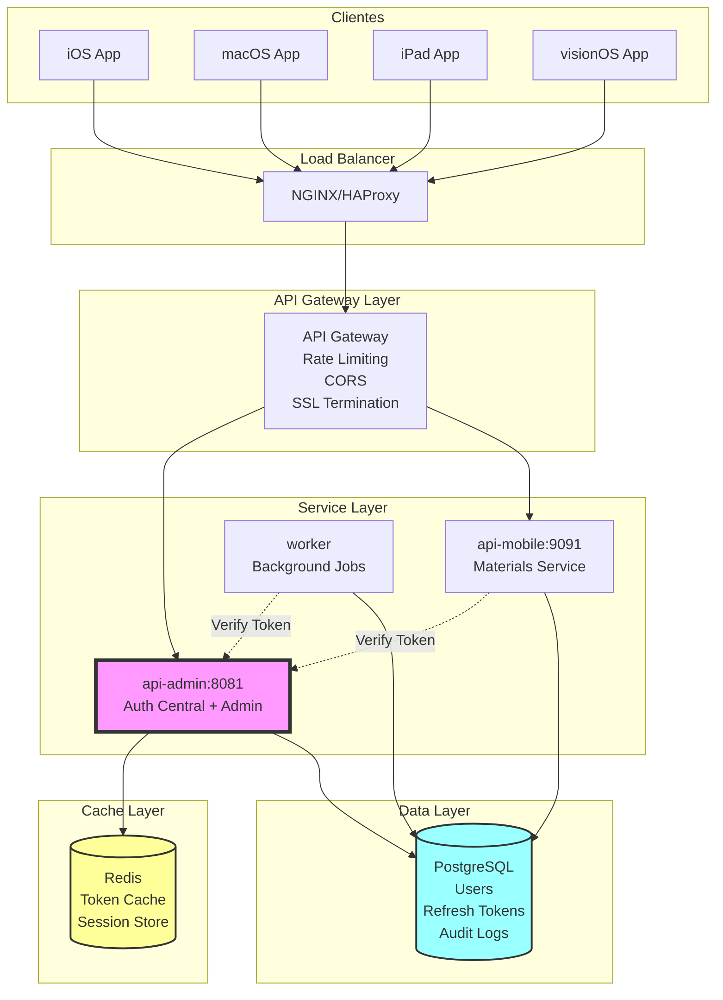

### 1.2 Diagrama de Componentes

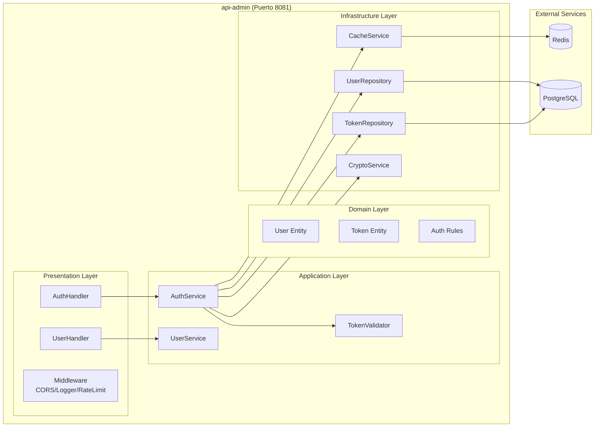

---

## 2. ARQUITECTURA ACTUAL VS PROPUESTA

### 2.1 Comparación Visual

```mermaid
graph TB
    subgraph "ACTUAL - Autenticación Descentralizada"
        C1[Cliente] -->|Login 1| AM1[api-mobile<br/>Auth Module]
        C1 -->|Login 2| AA1[api-admin<br/>Auth Module]
        AM1 -->|Token A| DB1[(PostgreSQL)]
        AA1 -->|Token B| DB1
        
        style AM1 fill:#faa,stroke:#333,stroke-width:2px
        style AA1 fill:#faa,stroke:#333,stroke-width:2px
    end
    
    subgraph "PROPUESTA - Autenticación Centralizada"
        C2[Cliente] -->|Login Único| AA2[api-admin<br/>Auth Central]
        AA2 -->|Token Universal| DB2[(PostgreSQL)]
        AM2[api-mobile] -.->|Verify| AA2
        WK2[worker] -.->|Verify| AA2
        
        style AA2 fill:#afa,stroke:#333,stroke-width:3px
    end
```

### 2.2 Tabla Comparativa Detallada

| Aspecto | Arquitectura Actual | Arquitectura Propuesta | Mejora |
|---------|---------------------|------------------------|---------|
| **Puntos de Auth** | 2 (mobile + admin) | 1 (admin) | -50% |
| **Líneas de Código** | ~2,800 (duplicado) | ~1,400 | -50% |
| **JWT Secrets** | 2 diferentes | 1 unificado | Simplificación |
| **Tokens por Usuario** | 2 no intercambiables | 1 universal | UX mejorada |
| **Mantenimiento** | 2 módulos separados | 1 módulo central | -50% effort |
| **Testing** | Tests duplicados | Tests centralizados | -50% |
| **Consistencia** | Políticas diferentes | Políticas unificadas | +100% |
| **Escalabilidad** | Escalar 2 servicios | Escalar 1 servicio | Eficiencia |
| **Cache** | No implementado | Redis centralizado | +Performance |
| **Auditoría** | 2 logs separados | 1 log centralizado | Visibilidad |

---

## 3. COMPONENTES DEL SISTEMA

### 3.1 API-Admin (Servicio Central de Auth)

#### 3.1.1 Estructura de Módulos

```
api-admin/
├── internal/
│   ├── auth/                      # NUEVO MÓDULO CENTRALIZADO
│   │   ├── handler/
│   │   │   ├── auth_handler.go    # Endpoints de auth
│   │   │   └── verify_handler.go  # Endpoint interno de verificación
│   │   ├── service/
│   │   │   ├── auth_service.go    # Lógica de negocio
│   │   │   ├── token_service.go   # Gestión de tokens
│   │   │   └── session_service.go # Gestión de sesiones
│   │   ├── repository/
│   │   │   ├── user_repository.go
│   │   │   └── token_repository.go
│   │   └── middleware/
│   │       ├── rate_limiter.go    # Rate limiting diferenciado
│   │       └── auth_middleware.go  # Validación JWT
│   │
│   ├── admin/                      # MÓDULO EXISTENTE
│   │   ├── schools/
│   │   ├── units/
│   │   └── memberships/
│   │
│   └── shared/
│       ├── cache/
│       │   └── redis_client.go    # Cliente Redis para cache
│       └── crypto/
│           └── jwt_manager.go     # Gestión JWT unificada
```

#### 3.1.2 Responsabilidades

| Componente | Responsabilidad | Dependencias |
|------------|-----------------|--------------|
| AuthHandler | Exponer endpoints REST de auth | AuthService |
| AuthService | Lógica de login, logout, refresh | Repository, Cache, Crypto |
| TokenService | Generar, validar, revocar tokens | JWTManager, Repository |
| SessionService | Gestionar sesiones activas | Repository, Cache |
| UserRepository | CRUD de usuarios en BD | PostgreSQL |
| TokenRepository | CRUD de refresh tokens | PostgreSQL |
| CacheService | Cache de validaciones | Redis |
| RateLimiter | Prevenir ataques | Redis |

### 3.2 API-Mobile (Consumidor de Auth)

#### 3.2.1 Cambios Estructurales

```diff
api-mobile/
├── internal/
-│   ├── auth/                    # ELIMINAR - Módulo duplicado
-│   │   ├── handler/
-│   │   ├── service/
-│   │   └── repository/
+│   ├── client/                  # NUEVO - Cliente de auth
+│   │   ├── auth_client.go       # Cliente HTTP para api-admin
+│   │   └── auth_cache.go        # Cache local de validaciones
│   │
│   ├── middleware/
-│   │   └── jwt_middleware.go    # MODIFICAR - Validación local
+│   │   └── remote_auth_middleware.go  # NUEVO - Validación remota
│   │
│   └── materials/                # Sin cambios
│       ├── handler/
│       └── service/
```

#### 3.2.2 Cliente de Autenticación

```go
// internal/client/auth_client.go
package client

import (
    "context"
    "time"
    "github.com/sony/gobreaker"
)

type AuthClient struct {
    baseURL        string
    httpClient     *http.Client
    cache          *AuthCache
    circuitBreaker *gobreaker.CircuitBreaker
}

type TokenValidation struct {
    Valid     bool      `json:"valid"`
    UserID    string    `json:"user_id"`
    Email     string    `json:"email"`
    Role      string    `json:"role"`
    ExpiresAt time.Time `json:"expires_at"`
}

func (c *AuthClient) ValidateToken(ctx context.Context, token string) (*TokenValidation, error) {
    // 1. Verificar cache local
    if cached, found := c.cache.Get(token); found {
        return cached, nil
    }
    
    // 2. Llamar a api-admin con circuit breaker
    validation, err := c.circuitBreaker.Execute(func() (interface{}, error) {
        return c.doValidateToken(ctx, token)
    })
    
    if err != nil {
        // 3. Fallback: validación local básica
        return c.fallbackValidation(token)
    }
    
    // 4. Cachear resultado
    c.cache.Set(token, validation.(*TokenValidation), 60*time.Second)
    
    return validation.(*TokenValidation), nil
}
```

### 3.3 Worker (Consumidor de Auth)

Similar a api-mobile pero con autenticación adicional por API Key:

```go
// internal/auth/worker_auth.go
type WorkerAuthClient struct {
    *AuthClient
    apiKey string
}

func (w *WorkerAuthClient) ValidateToken(ctx context.Context, token string) (*TokenValidation, error) {
    // Agregar API Key header para identificar al worker
    ctx = context.WithValue(ctx, "X-Worker-API-Key", w.apiKey)
    return w.AuthClient.ValidateToken(ctx, token)
}
```

### 3.4 Apple-App (Cliente Nativo)

#### 3.4.1 Arquitectura Clean en Swift

```
apple-app/
├── Data/
│   ├── Repositories/
│   │   └── AuthRepositoryImpl.swift     # MODIFICAR - Apuntar a api-admin
│   └── Network/
│       └── Endpoints/
│           └── AuthEndpoints.swift       # NUEVO - Endpoints centralizados
│
├── Domain/
│   ├── UseCases/
│   │   ├── LoginUseCase.swift           # Sin cambios
│   │   ├── RefreshTokenUseCase.swift    # Sin cambios
│   │   └── LogoutUseCase.swift          # Sin cambios
│   └── Entities/
│       └── AuthToken.swift              # Token universal
│
└── Presentation/
    └── ViewModels/
        └── LoginViewModel.swift          # Sin cambios
```

---

## 4. DISEÑO DE API

### 4.1 Endpoints de Autenticación

#### 4.1.1 Endpoints Públicos

```yaml
# OpenAPI 3.0 Specification
paths:
  /v1/auth/login:
    post:
      summary: Authenticate user
      requestBody:
        content:
          application/json:
            schema:
              type: object
              required: [email, password]
              properties:
                email:
                  type: string
                  format: email
                password:
                  type: string
                  minLength: 8
      responses:
        200:
          content:
            application/json:
              schema:
                $ref: '#/components/schemas/LoginResponse'
        401:
          $ref: '#/components/responses/Unauthorized'
        429:
          $ref: '#/components/responses/TooManyRequests'

  /v1/auth/refresh:
    post:
      summary: Refresh access token
      requestBody:
        content:
          application/json:
            schema:
              type: object
              required: [refresh_token]
              properties:
                refresh_token:
                  type: string
                  format: uuid
      responses:
        200:
          content:
            application/json:
              schema:
                $ref: '#/components/schemas/RefreshResponse'

  /v1/auth/logout:
    post:
      summary: Revoke tokens
      security:
        - bearerAuth: []
      requestBody:
        content:
          application/json:
            schema:
              type: object
              required: [refresh_token]
              properties:
                refresh_token:
                  type: string
      responses:
        204:
          description: Successfully logged out

  /v1/auth/me:
    get:
      summary: Get current user info
      security:
        - bearerAuth: []
      responses:
        200:
          content:
            application/json:
              schema:
                $ref: '#/components/schemas/UserInfo'
```

#### 4.1.2 Endpoints Internos (Service-to-Service)

```yaml
paths:
  /v1/auth/verify:
    post:
      summary: Verify token (internal use)
      parameters:
        - in: header
          name: X-Service-API-Key
          schema:
            type: string
          required: false
      requestBody:
        content:
          application/json:
            schema:
              type: object
              required: [token]
              properties:
                token:
                  type: string
      responses:
        200:
          content:
            application/json:
              schema:
                type: object
                properties:
                  valid:
                    type: boolean
                  user_id:
                    type: string
                  email:
                    type: string
                  role:
                    type: string
                  expires_at:
                    type: string
                    format: date-time

  /v1/auth/verify-bulk:
    post:
      summary: Verify multiple tokens
      requestBody:
        content:
          application/json:
            schema:
              type: object
              required: [tokens]
              properties:
                tokens:
                  type: array
                  items:
                    type: string
      responses:
        200:
          content:
            application/json:
              schema:
                type: object
                properties:
                  results:
                    type: object
                    additionalProperties:
                      $ref: '#/components/schemas/TokenValidation'
```

### 4.2 Schemas de Datos

```yaml
components:
  schemas:
    LoginResponse:
      type: object
      properties:
        access_token:
          type: string
          example: "eyJhbGciOiJIUzI1NiIs..."
        refresh_token:
          type: string
          format: uuid
          example: "550e8400-e29b-41d4-a716-446655440000"
        expires_in:
          type: integer
          example: 900
        token_type:
          type: string
          example: "Bearer"
        user:
          $ref: '#/components/schemas/UserInfo'
    
    UserInfo:
      type: object
      properties:
        id:
          type: string
          format: uuid
        email:
          type: string
          format: email
        first_name:
          type: string
        last_name:
          type: string
        role:
          type: string
          enum: [admin, teacher, student, guardian]
        is_active:
          type: boolean
        email_verified:
          type: boolean
```

---

## 5. MODELO DE DATOS

### 5.1 Diagrama ER

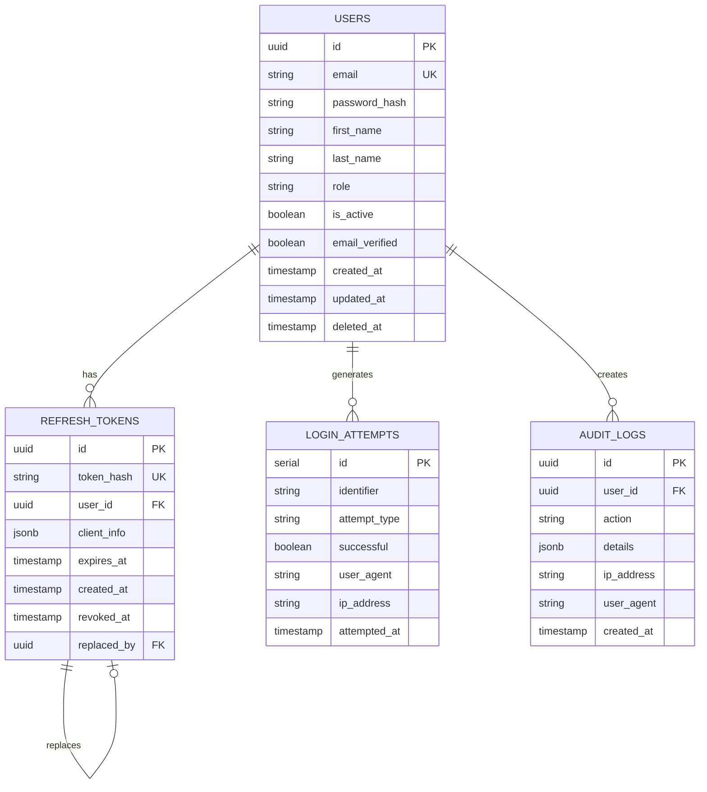

### 5.2 Índices de Base de Datos

```sql
-- Índices para performance
CREATE INDEX idx_users_email ON users(email) WHERE deleted_at IS NULL;
CREATE INDEX idx_users_role ON users(role) WHERE is_active = true;

CREATE INDEX idx_refresh_tokens_user_id ON refresh_tokens(user_id);
CREATE INDEX idx_refresh_tokens_token_hash ON refresh_tokens(token_hash);
CREATE INDEX idx_refresh_tokens_expires_at ON refresh_tokens(expires_at) 
    WHERE revoked_at IS NULL;

CREATE INDEX idx_login_attempts_identifier_time 
    ON login_attempts(identifier, attempted_at DESC);
CREATE INDEX idx_login_attempts_ip_time 
    ON login_attempts(ip_address, attempted_at DESC);

CREATE INDEX idx_audit_logs_user_id_time 
    ON audit_logs(user_id, created_at DESC);
CREATE INDEX idx_audit_logs_action 
    ON audit_logs(action, created_at DESC);
```

### 5.3 Cache Schema (Redis)

```
Key Pattern                          | Type    | TTL     | Description
-------------------------------------|---------|---------|-------------
auth:token:valid:{token_hash}       | String  | 60s     | Token validation cache
auth:user:{user_id}                 | Hash    | 300s    | User info cache
auth:rate:{identifier}               | Counter | 900s    | Rate limit counter
auth:sessions:{user_id}             | Set     | 7d      | Active sessions
auth:blacklist:{token_hash}         | String  | 900s    | Revoked tokens
```

---

## 6. FLUJOS DE AUTENTICACIÓN

### 6.1 Flujo de Login

```mermaid
sequenceDiagram
    participant U as Usuario
    participant A as Apple App
    participant LB as Load Balancer
    participant AA as API-Admin
    participant R as Redis
    participant PG as PostgreSQL
    
    U->>A: Ingresa email/password
    A->>A: Validación básica
    A->>LB: POST /v1/auth/login
    LB->>AA: Forward request
    
    AA->>R: Check rate limit
    alt Rate limit exceeded
        AA-->>A: 429 Too Many Requests
    else Rate limit OK
        AA->>PG: SELECT user WHERE email
        
        alt User not found
            AA-->>A: 401 Unauthorized
        else User found
            AA->>AA: Verify password (bcrypt)
            
            alt Password invalid
                AA->>PG: INSERT login_attempt (failed)
                AA-->>A: 401 Unauthorized
            else Password valid
                AA->>AA: Generate JWT (15 min)
                AA->>AA: Generate refresh token
                AA->>PG: INSERT refresh_token
                AA->>PG: INSERT login_attempt (success)
                AA->>R: Cache user info
                AA-->>A: 200 {tokens, user}
                A->>A: Save in Keychain
                A-->>U: Login exitoso
            end
        end
    end
```

### 6.2 Flujo de Validación de Token

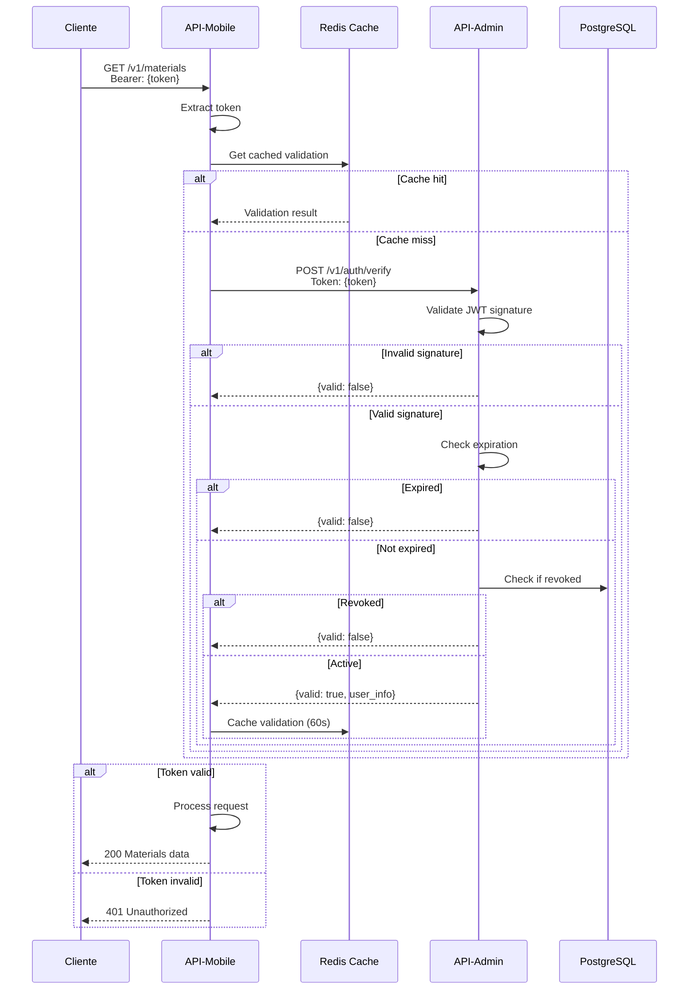

### 6.3 Flujo de Refresh Token

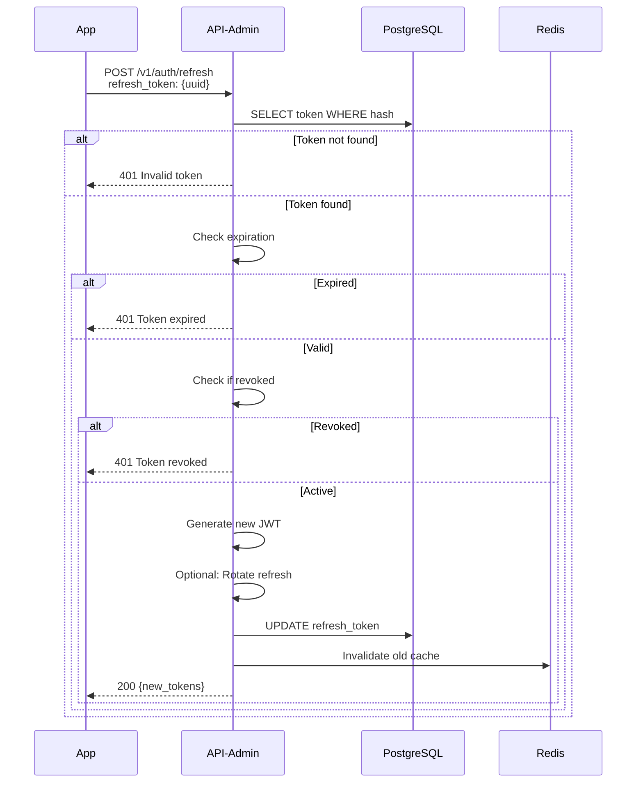

---

## 7. SEGURIDAD

### 7.1 Matriz de Seguridad

| Capa | Control | Implementación | Verificación |
|------|---------|----------------|--------------|
| **Red** | TLS 1.3 | NGINX config | SSL Labs A+ |
| **API** | Rate Limiting | 5 req/15min por IP | Integration test |
| **Auth** | JWT HS256 | 32+ char secret | Unit test |
| **Password** | bcrypt cost 10 | Go crypto/bcrypt | Benchmark |
| **Session** | Token rotation | On refresh | E2E test |
| **Data** | Encryption at rest | PostgreSQL TDE | Config audit |
| **Audit** | Logging | Every auth action | Log analysis |
| **Headers** | Security headers | HSTS, CSP, etc | Security scan |

### 7.2 Configuración de Seguridad

```go
// internal/auth/config/security_config.go
type SecurityConfig struct {
    JWT struct {
        Secret               string        `validate:"min=32"`
        Issuer              string        `default:"edugo-central"`
        AccessTokenDuration  time.Duration `default:"15m"`
        RefreshTokenDuration time.Duration `default:"168h"`
        Algorithm           string        `default:"HS256"`
    }
    
    Password struct {
        MinLength      int    `default:"8"`
        RequireUpper   bool   `default:"true"`
        RequireLower   bool   `default:"true"`
        RequireNumber  bool   `default:"true"`
        RequireSpecial bool   `default:"false"`
        BcryptCost     int    `default:"10"`
    }
    
    RateLimit struct {
        LoginAttempts    int           `default:"5"`
        LoginWindow      time.Duration `default:"15m"`
        LoginBlockTime   time.Duration `default:"1h"`
        TokenValidations int           `default:"1000"`
        ValidationWindow time.Duration `default:"1m"`
    }
    
    Session struct {
        MaxConcurrent    int  `default:"5"`
        RotateOnRefresh  bool `default:"true"`
        RevokeOnPassword bool `default:"true"`
    }
}
```

### 7.3 Validación de JWT

```go
// internal/auth/service/jwt_validator.go
func (v *JWTValidator) ValidateToken(tokenString string) (*Claims, error) {
    // 1. Parse token
    token, err := jwt.ParseWithClaims(tokenString, &Claims{}, func(token *jwt.Token) (interface{}, error) {
        // Verificar algoritmo
        if token.Method != jwt.SigningMethodHS256 {
            return nil, fmt.Errorf("unexpected signing method: %v", token.Header["alg"])
        }
        return []byte(v.secret), nil
    })
    
    if err != nil {
        return nil, fmt.Errorf("parse error: %w", err)
    }
    
    // 2. Validar claims
    claims, ok := token.Claims.(*Claims)
    if !ok || !token.Valid {
        return nil, ErrInvalidToken
    }
    
    // 3. Verificar issuer
    if claims.Issuer != v.expectedIssuer {
        return nil, ErrInvalidIssuer
    }
    
    // 4. Verificar expiración
    if time.Now().Unix() > claims.ExpiresAt.Unix() {
        return nil, ErrTokenExpired
    }
    
    // 5. Verificar blacklist
    if v.isBlacklisted(claims.JTI) {
        return nil, ErrTokenRevoked
    }
    
    return claims, nil
}
```

---

## 8. PERFORMANCE Y ESCALABILIDAD

### 8.1 Estrategia de Cache

```mermaid
graph LR
    subgraph "Cache Hierarchy"
        L1[L1: Local Memory<br/>10ms, 100 items]
        L2[L2: Redis Cache<br/>50ms, 10K items]
        L3[L3: PostgreSQL<br/>100ms, ∞ items]
    end
    
    REQUEST --> L1
    L1 -->|Miss| L2
    L2 -->|Miss| L3
    L3 --> L2
    L2 --> L1
    L1 --> RESPONSE
```

### 8.2 Configuración de Performance

```yaml
# Performance tuning parameters
performance:
  connections:
    api_admin:
      max_idle: 25
      max_open: 100
      conn_lifetime: 5m
    
    redis:
      pool_size: 50
      min_idle: 10
      max_retries: 3
      dial_timeout: 5s
    
    postgres:
      max_connections: 200
      shared_buffers: 256MB
      effective_cache_size: 1GB
  
  cache:
    token_validation:
      ttl: 60s
      max_size: 10000
    
    user_info:
      ttl: 300s
      max_size: 1000
    
    rate_limit:
      ttl: 900s
      max_size: 5000
  
  timeouts:
    http_read: 30s
    http_write: 30s
    db_query: 5s
    redis_command: 1s
    service_call: 3s
```

### 8.3 Métricas de Performance

| Operación | Target p50 | Target p95 | Target p99 | Medición |
|-----------|------------|------------|------------|----------|
| Login | 50ms | 150ms | 200ms | Prometheus |
| Token Validation (cached) | 5ms | 10ms | 20ms | Prometheus |
| Token Validation (uncached) | 20ms | 40ms | 50ms | Prometheus |
| Refresh Token | 30ms | 80ms | 100ms | Prometheus |
| Logout | 20ms | 50ms | 80ms | Prometheus |

### 8.4 Escalabilidad Horizontal

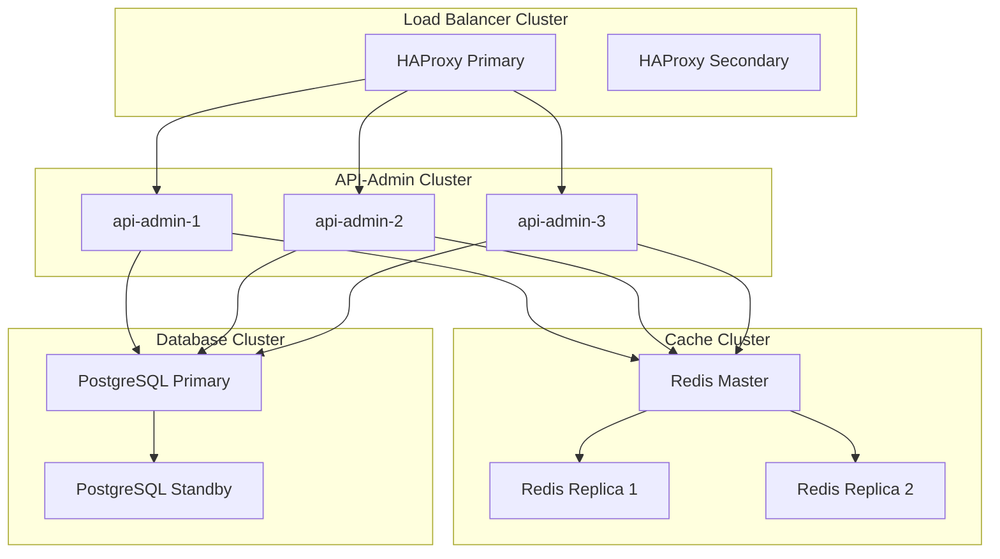

---

## 9. ESTRATEGIA DE MIGRACIÓN

### 9.1 Fases de Migración

```mermaid
gantt
    title Plan de Migración - 4 Semanas
    dateFormat  YYYY-MM-DD
    section Fase 1
    Preparar api-admin           :done, f1, 2025-11-25, 5d
    Implementar /verify endpoint  :done, f2, after f1, 2d
    section Fase 2
    Migrar apple-app             :active, f3, after f2, 3d
    Testing integración          :f4, after f3, 2d
    section Fase 3
    Migrar api-mobile            :f5, after f4, 5d
    Rollout progresivo           :f6, after f5, 2d
    section Fase 4
    Migrar worker                :f7, after f6, 3d
    section Fase 5
    Optimización y limpieza      :f8, after f7, 5d
    Documentación final          :f9, after f8, 2d
```

### 9.2 Estrategia de Rollback

| Fase | Trigger de Rollback | Acción | Tiempo | Responsable |
|------|---------------------|--------|--------|-------------|
| 1 | Tests fallando > 10% | Revertir cambios en api-admin | 5 min | Backend Lead |
| 2 | App no puede autenticar | Apuntar a endpoints antiguos | 10 min | iOS Lead |
| 3 | api-mobile errors > 1% | Feature flag: usar auth local | 5 min | Backend Lead |
| 4 | Worker jobs fallando | Desactivar validación | 5 min | DevOps |
| 5 | Performance degradada | Revertir optimizaciones | 15 min | Tech Lead |

### 9.3 Feature Flags

```go
// Feature flags para migración gradual
type FeatureFlags struct {
    UseRemoteAuth           bool `env:"FF_USE_REMOTE_AUTH" default:"false"`
    EnableTokenCache        bool `env:"FF_ENABLE_TOKEN_CACHE" default:"false"`
    UseCircuitBreaker       bool `env:"FF_USE_CIRCUIT_BREAKER" default:"true"`
    EnableFallbackAuth      bool `env:"FF_ENABLE_FALLBACK_AUTH" default:"true"`
    RotateRefreshTokens     bool `env:"FF_ROTATE_REFRESH_TOKENS" default:"false"`
    EnforceStrongPasswords  bool `env:"FF_ENFORCE_STRONG_PASSWORDS" default:"false"`
}
```

---

## 10. MONITOREO Y OBSERVABILIDAD

### 10.1 Stack de Observabilidad

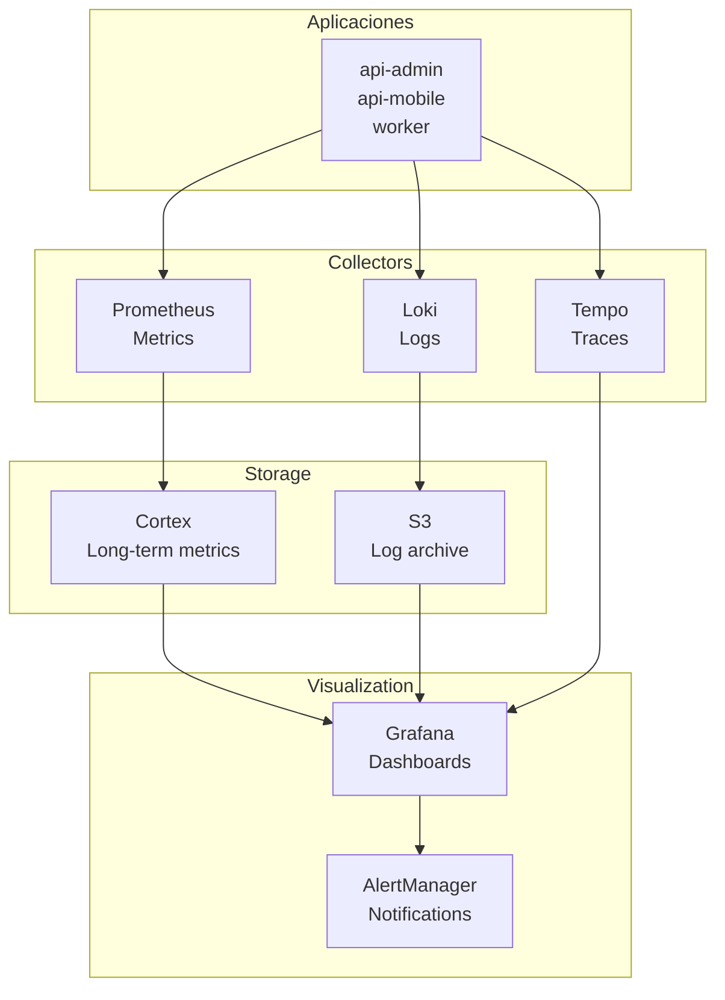

### 10.2 Métricas Clave

```go
// internal/auth/metrics/metrics.go
var (
    // Contadores
    LoginAttempts = prometheus.NewCounterVec(
        prometheus.CounterOpts{
            Name: "auth_login_attempts_total",
            Help: "Total number of login attempts",
        },
        []string{"status", "role"},
    )
    
    TokenValidations = prometheus.NewCounterVec(
        prometheus.CounterOpts{
            Name: "auth_token_validations_total",
            Help: "Total number of token validations",
        },
        []string{"status", "source", "cached"},
    )
    
    // Histogramas
    LoginDuration = prometheus.NewHistogramVec(
        prometheus.HistogramOpts{
            Name:    "auth_login_duration_seconds",
            Help:    "Login request duration",
            Buckets: prometheus.DefBuckets,
        },
        []string{"status"},
    )
    
    ValidationDuration = prometheus.NewHistogramVec(
        prometheus.HistogramOpts{
            Name:    "auth_validation_duration_seconds",
            Help:    "Token validation duration",
            Buckets: []float64{0.001, 0.005, 0.01, 0.025, 0.05, 0.1},
        },
        []string{"cached"},
    )
    
    // Gauges
    ActiveSessions = prometheus.NewGaugeVec(
        prometheus.GaugeOpts{
            Name: "auth_active_sessions",
            Help: "Number of active sessions",
        },
        []string{"role"},
    )
)
```

### 10.3 Dashboards de Grafana

#### Dashboard 1: Auth Overview
- Login rate (successful/failed)
- Token validation rate
- Active sessions by role
- Error rate by endpoint
- p95 latency trends

#### Dashboard 2: Performance
- Request duration histograms
- Cache hit rates
- Database query times
- Redis command latency
- Circuit breaker status

#### Dashboard 3: Security
- Failed login attempts by IP
- Rate limit violations
- Token revocations
- Suspicious activity patterns
- Audit log analysis

### 10.4 Alertas Críticas

| Alerta | Condición | Severidad | Acción |
|--------|-----------|-----------|--------|
| High Error Rate | error_rate > 1% for 5m | Critical | Page on-call |
| Login Failures | failed_logins > 50/min | Warning | Check logs |
| Slow Response | p95_latency > 500ms | Warning | Scale up |
| Database Down | pg_up == 0 | Critical | Failover |
| Redis Down | redis_up == 0 | Warning | Use fallback |
| Certificate Expiry | cert_expiry < 7d | Warning | Renew cert |

---

## 11. ANEXOS

### 11.1 Configuración de NGINX

```nginx
upstream api_admin_backend {
    least_conn;
    server api-admin-1:8081 max_fails=3 fail_timeout=30s;
    server api-admin-2:8081 max_fails=3 fail_timeout=30s;
    server api-admin-3:8081 max_fails=3 fail_timeout=30s;
    keepalive 32;
}

server {
    listen 443 ssl http2;
    server_name api.edugo.com;
    
    # SSL Configuration
    ssl_certificate /etc/nginx/ssl/cert.pem;
    ssl_certificate_key /etc/nginx/ssl/key.pem;
    ssl_protocols TLSv1.3;
    ssl_ciphers HIGH:!aNULL:!MD5;
    
    # Security Headers
    add_header Strict-Transport-Security "max-age=31536000; includeSubDomains" always;
    add_header X-Content-Type-Options "nosniff" always;
    add_header X-Frame-Options "DENY" always;
    
    # Rate Limiting
    limit_req_zone $binary_remote_addr zone=login:10m rate=5r/m;
    limit_req_zone $binary_remote_addr zone=api:10m rate=100r/s;
    
    location /v1/auth/login {
        limit_req zone=login burst=5 nodelay;
        proxy_pass http://api_admin_backend;
        proxy_set_header Host $host;
        proxy_set_header X-Real-IP $remote_addr;
    }
    
    location /v1/auth/ {
        limit_req zone=api burst=50 nodelay;
        proxy_pass http://api_admin_backend;
        proxy_set_header Host $host;
        proxy_set_header X-Real-IP $remote_addr;
    }
}
```

### 11.2 Docker Compose para Desarrollo

```yaml
version: '3.8'

services:
  postgres:
    image: postgres:16-alpine
    environment:
      POSTGRES_DB: edugo
      POSTGRES_USER: edugo_user
      POSTGRES_PASSWORD: edugo_password
    volumes:
      - postgres_data:/var/lib/postgresql/data
      - ./infrastructure/postgres/migrations:/docker-entrypoint-initdb.d
    ports:
      - "5432:5432"
    healthcheck:
      test: ["CMD-SHELL", "pg_isready -U edugo_user"]
      interval: 10s
      timeout: 5s
      retries: 5

  redis:
    image: redis:7-alpine
    command: redis-server --appendonly yes
    volumes:
      - redis_data:/data
    ports:
      - "6379:6379"
    healthcheck:
      test: ["CMD", "redis-cli", "ping"]
      interval: 10s
      timeout: 5s
      retries: 5

  api-admin:
    build:
      context: ./api-admin
      dockerfile: Dockerfile
    environment:
      ENV: development
      DB_HOST: postgres
      REDIS_HOST: redis
      JWT_SECRET_UNIFIED: ${JWT_SECRET_UNIFIED}
    ports:
      - "8081:8081"
    depends_on:
      postgres:
        condition: service_healthy
      redis:
        condition: service_healthy
    volumes:
      - ./api-admin:/app
    command: air -c .air.toml

  api-mobile:
    build:
      context: ./api-mobile
      dockerfile: Dockerfile
    environment:
      ENV: development
      AUTH_SERVICE_URL: http://api-admin:8081
    ports:
      - "9091:9091"
    depends_on:
      - api-admin
    volumes:
      - ./api-mobile:/app

volumes:
  postgres_data:
  redis_data:
```

---

**Fin del Documento de Diseño Técnico**

**Firma de Revisión Técnica**:
- [ ] Arquitecto de Software: _________________ Fecha: _______
- [ ] Tech Lead Backend: _________________ Fecha: _______
- [ ] Tech Lead Frontend: _________________ Fecha: _______
- [ ] DevOps Lead: _________________ Fecha: _______