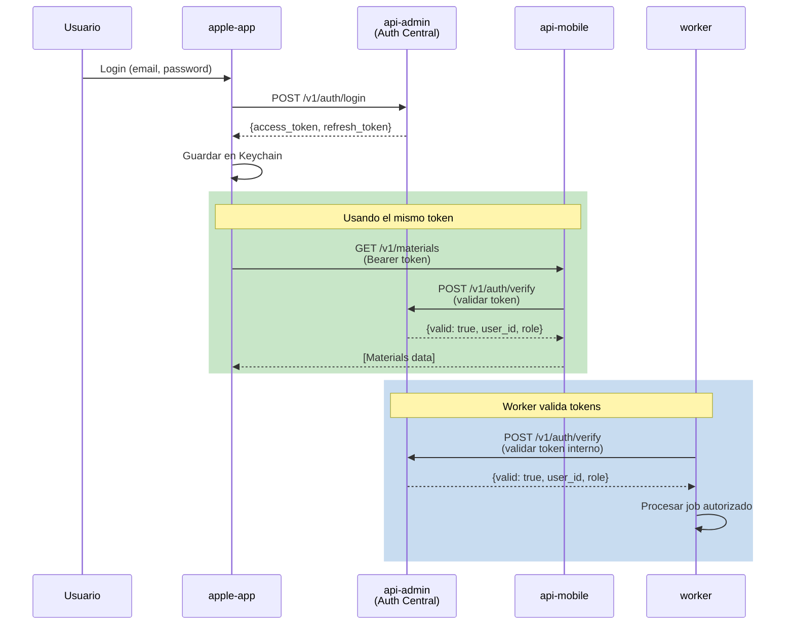

# 🔐 ARQUITECTURA DE AUTENTICACIÓN CENTRALIZADA EN API-ADMIN
## Rediseño del Ecosistema EduGo con api-admin como Servicio Central de Autenticación

**Fecha**: 24 de Noviembre, 2025  
**Proyecto**: EduGo - Sistema Educativo Integral  
**Objetivo**: Centralizar toda la autenticación en api-admin sin crear una nueva API

---

## 🎯 RESUMEN EJECUTIVO

### Problema Actual
- ❌ Código de autenticación **duplicado** entre api-mobile y api-admin (~1400 líneas)
- ❌ Tokens **NO intercambiables** (diferentes JWT_SECRET e issuer)
- ❌ Usuario debe hacer **múltiples logins** para usar diferentes servicios
- ❌ Difícil mantener **consistencia de seguridad**

### Solución Propuesta
✅ **Convertir api-admin en el servicio central de autenticación** para todo el ecosistema EduGo, evitando crear una nueva API y aprovechando la infraestructura existente.

---

## 🏗️ ARQUITECTURA PROPUESTA

### Vista General del Sistema

```
┌─────────────────────────────────────────────────────────────┐
│         edugo-api-administracion (Puerto 8081)              │
│                 SERVICIO CENTRAL DE AUTH                     │
│                                                              │
│  ┌────────────────────────────────────────────────────────┐ │
│  │                  AUTH MODULE (Central)                 │ │
│  │  /v1/auth/login          - Login universal            │ │
│  │  /v1/auth/refresh        - Renovar tokens             │ │
│  │  /v1/auth/logout         - Cerrar sesión              │ │
│  │  /v1/auth/verify         - Verificar token (interno)  │ │
│  │  /v1/auth/me             - Info usuario actual        │ │
│  │  /v1/auth/sessions       - Gestión de sesiones        │ │
│  └────────────────────────────────────────────────────────┘ │
│                                                              │
│  ┌────────────────────────────────────────────────────────┐ │
│  │              ADMIN MODULE (Existente)                  │ │
│  │  /v1/schools/*           - Gestión de escuelas        │ │
│  │  /v1/units/*             - Gestión de unidades        │ │
│  │  /v1/memberships/*       - Gestión de membresías      │ │
│  │  /v1/users/*             - Gestión de usuarios        │ │
│  └────────────────────────────────────────────────────────┘ │
│                                                              │
│  ┌────────────────────────────────────────────────────────┐ │
│  │            PostgreSQL + Redis (Opcional)               │ │
│  │  - users                                               │ │
│  │  - refresh_tokens                                      │ │
│  │  - login_attempts                                      │ │
│  │  - Token cache (Redis)                                 │ │
│  └────────────────────────────────────────────────────────┘ │
└─────────────────────────────────────────────────────────────┘
                              ▲
                              │ HTTP Requests
                              │ (Auth + Verify)
        ┌─────────────────────┼─────────────────────┐
        │                     │                     │
        ▼                     ▼                     ▼
┌───────────────┐    ┌───────────────┐    ┌──────────────┐
│  api-mobile   │    │    worker     │    │  apple-app   │
│ (Puerto 9091) │    │  (Background) │    │ (iOS/macOS)  │
│               │    │               │    │              │
│ - Materials   │    │ - AI Process  │    │ - SwiftUI    │
│ - Progress    │    │ - Async Jobs  │    │ - Keychain   │
│ - Assessment  │    │ - Queues      │    │ - Multi-API  │
│               │    │               │    │              │
│ [Consume Auth │    │ [Consume Auth │    │ [Direct Auth │
│  from Admin]  │    │  from Admin]  │    │  to Admin]   │
└───────────────┘    └───────────────┘    └──────────────┘
```

### Flujo de Autenticación



---

## 🔧 CAMBIOS REQUERIDOS POR SERVICIO

### 1. API-ADMIN (edugo-api-administracion)
**Rol**: Servicio Central de Autenticación + Funcionalidades Admin

#### A. Mantener y Mejorar

```go
// internal/application/service/auth_service.go
type AuthService interface {
    Login(ctx context.Context, email, password string) (*LoginResponse, error)
    Refresh(ctx context.Context, refreshToken string) (*RefreshResponse, error)
    Logout(ctx context.Context, userID, refreshToken string) error
    RevokeAllSessions(ctx context.Context, userID string) error
    VerifyToken(ctx context.Context, accessToken string) (*TokenInfo, error)  // NUEVO
    GetUserInfo(ctx context.Context, userID string) (*UserInfo, error)
}
```

#### B. Nuevo Endpoint Interno de Verificación

```go
// internal/infrastructure/http/handler/auth_handler.go

// VerifyToken - Endpoint interno para que otros servicios validen tokens
// POST /v1/auth/verify
func (h *AuthHandler) VerifyToken(c *gin.Context) {
    // Extraer token del header Authorization
    authHeader := c.GetHeader("Authorization")
    if authHeader == "" {
        c.JSON(401, gin.H{"error": "Missing authorization header"})
        return
    }
    
    // Validar token
    tokenInfo, err := h.authService.VerifyToken(c.Request.Context(), authHeader)
    if err != nil {
        c.JSON(401, gin.H{"error": "Invalid token", "details": err.Error()})
        return
    }
    
    // Retornar info del token
    c.JSON(200, gin.H{
        "valid": true,
        "user_id": tokenInfo.UserID,
        "email": tokenInfo.Email,
        "role": tokenInfo.Role,
        "expires_at": tokenInfo.ExpiresAt,
    })
}
```

#### C. Configuración Unificada

```yaml
# config-local.yaml de api-admin
server:
  port: 8081
  host: "0.0.0.0"

auth:
  jwt:
    secret: "${JWT_SECRET_UNIFIED}"  # MISMO PARA TODOS
    issuer: "edugo-central"          # ISSUER UNIFICADO
    access_token_duration: 15m
    refresh_token_duration: 168h
  
  # Lista blanca de servicios internos (opcional)
  internal_services:
    - name: "api-mobile"
      ip_ranges: ["127.0.0.1/32", "10.0.0.0/8"]
    - name: "worker"
      api_key: "${WORKER_API_KEY}"  # Autenticación adicional para worker

cors:
  allowed_origins:
    - "http://localhost:9091"  # api-mobile
    - "http://localhost:3000"  # frontend web
    - "capacitor://localhost"  # iOS app
    - "http://localhost"       # macOS app
```

#### D. Rate Limiting Diferenciado

```go
// Aplicar rate limiting diferente para servicios internos vs externos
func RateLimitMiddleware() gin.HandlerFunc {
    return func(c *gin.Context) {
        clientIP := c.ClientIP()
        
        // Si es un servicio interno, aplicar límites más altos
        if isInternalService(clientIP) {
            // 1000 requests por minuto para servicios internos
            applyRateLimit(c, 1000, time.Minute)
        } else {
            // 60 requests por minuto para clientes externos
            applyRateLimit(c, 60, time.Minute)
        }
    }
}
```

---

### 2. API-MOBILE (edugo-api-mobile)
**Rol**: API de Materiales y Progreso (delega auth a api-admin)

#### A. Eliminar Código de Auth Local

```bash
# Archivos a eliminar
❌ internal/application/service/auth_service.go
❌ internal/infrastructure/http/handler/auth_handler.go
❌ internal/domain/repository/user_repository.go
❌ internal/domain/repository/refresh_token_repository.go
❌ internal/infrastructure/persistence/postgres/user_repository_impl.go
❌ internal/infrastructure/persistence/postgres/refresh_token_repository_impl.go
```

#### B. Crear Cliente de Auth

```go
// internal/infrastructure/client/auth_client.go
package client

import (
    "bytes"
    "context"
    "encoding/json"
    "fmt"
    "net/http"
    "time"
)

type AuthClient interface {
    VerifyToken(ctx context.Context, bearerToken string) (*TokenInfo, error)
}

type TokenInfo struct {
    Valid     bool      `json:"valid"`
    UserID    string    `json:"user_id"`
    Email     string    `json:"email"`
    Role      string    `json:"role"`
    ExpiresAt time.Time `json:"expires_at"`
}

type adminAuthClient struct {
    baseURL    string
    httpClient *http.Client
}

func NewAdminAuthClient(baseURL string) AuthClient {
    return &adminAuthClient{
        baseURL: baseURL,
        httpClient: &http.Client{
            Timeout: 5 * time.Second,
        },
    }
}

func (c *adminAuthClient) VerifyToken(ctx context.Context, bearerToken string) (*TokenInfo, error) {
    url := fmt.Sprintf("%s/v1/auth/verify", c.baseURL)
    
    req, err := http.NewRequestWithContext(ctx, "POST", url, nil)
    if err != nil {
        return nil, err
    }
    
    req.Header.Set("Authorization", bearerToken)
    req.Header.Set("Content-Type", "application/json")
    
    resp, err := c.httpClient.Do(req)
    if err != nil {
        return nil, fmt.Errorf("failed to verify token: %w", err)
    }
    defer resp.Body.Close()
    
    if resp.StatusCode != http.StatusOK {
        return nil, fmt.Errorf("token validation failed with status: %d", resp.StatusCode)
    }
    
    var tokenInfo TokenInfo
    if err := json.NewDecoder(resp.Body).Decode(&tokenInfo); err != nil {
        return nil, err
    }
    
    return &tokenInfo, nil
}
```

#### C. Nuevo Middleware de Auth Remoto

```go
// internal/infrastructure/http/middleware/remote_auth.go
package middleware

import (
    "github.com/gin-gonic/gin"
    "github.com/EduGoGroup/edugo-api-mobile/internal/infrastructure/client"
)

func RemoteAuthMiddleware(authClient client.AuthClient) gin.HandlerFunc {
    return func(c *gin.Context) {
        // Extraer token del header
        bearerToken := c.GetHeader("Authorization")
        if bearerToken == "" {
            c.JSON(401, gin.H{"error": "Missing authorization header"})
            c.Abort()
            return
        }
        
        // Verificar con api-admin
        tokenInfo, err := authClient.VerifyToken(c.Request.Context(), bearerToken)
        if err != nil || !tokenInfo.Valid {
            c.JSON(401, gin.H{"error": "Invalid or expired token"})
            c.Abort()
            return
        }
        
        // Inyectar info del usuario en el contexto
        c.Set("user_id", tokenInfo.UserID)
        c.Set("email", tokenInfo.Email)
        c.Set("role", tokenInfo.Role)
        
        c.Next()
    }
}
```

#### D. Configuración

```yaml
# config-local.yaml de api-mobile
server:
  port: 9091

# Nueva sección para auth remoto
auth_service:
  base_url: "http://localhost:8081"  # api-admin
  timeout: 5s
  cache_ttl: 60s  # Cache local de validaciones (opcional)

# Eliminar toda la sección auth.jwt (ya no se necesita)
```

#### E. Actualizar Bootstrap

```go
// cmd/main.go o internal/container/container.go

func setupDependencies() {
    // Crear cliente de auth
    authClient := client.NewAdminAuthClient(config.AuthService.BaseURL)
    
    // Registrar middleware
    router.Use(middleware.RemoteAuthMiddleware(authClient))
    
    // Ya NO necesitamos:
    // ❌ jwtManager
    // ❌ authService local
    // ❌ userRepository
    // ❌ refreshTokenRepository
}
```

---

### 3. WORKER (edugo-worker)
**Rol**: Procesamiento asíncrono con IA (necesita validar tokens)

#### A. Cliente de Auth Similar

```go
// internal/client/auth_client.go
// Mismo código que api-mobile
type AuthClient interface {
    VerifyToken(ctx context.Context, bearerToken string) (*TokenInfo, error)
}
```

#### B. Validación en Jobs

```go
// internal/worker/job_processor.go

type JobProcessor struct {
    authClient AuthClient
}

func (p *JobProcessor) ProcessJob(ctx context.Context, job *Job) error {
    // Si el job requiere autenticación
    if job.RequiresAuth {
        tokenInfo, err := p.authClient.VerifyToken(ctx, job.AuthToken)
        if err != nil || !tokenInfo.Valid {
            return fmt.Errorf("invalid auth token for job %s", job.ID)
        }
        
        // Verificar permisos según el rol
        if !p.hasPermission(tokenInfo.Role, job.Type) {
            return fmt.Errorf("insufficient permissions for job %s", job.ID)
        }
    }
    
    // Procesar el job
    return p.execute(ctx, job)
}
```

#### C. Configuración

```yaml
# config-local.yaml del worker
auth_service:
  base_url: "http://localhost:8081"
  timeout: 5s
  api_key: "${WORKER_API_KEY}"  # Autenticación adicional del worker
```

---

### 4. APPLE-APP (iOS/macOS)
**Rol**: Cliente nativo que consume múltiples APIs

#### A. Actualizar AuthRepository

```swift
// Data/Repositories/AuthRepositoryImpl.swift

public final class AuthRepositoryImpl: AuthRepository {
    private let apiClient: APIClient
    private let keychainService: KeychainService
    
    // Cambiar URL base a api-admin
    private let authBaseURL = URL(string: "http://localhost:8081")!
    
    public func login(email: String, password: String) async -> Result<User, AppError> {
        let endpoint = Endpoint(
            path: "/v1/auth/login",
            method: .post,
            body: LoginRequest(email: email, password: password),
            baseURL: authBaseURL  // Usar api-admin
        )
        
        do {
            let response: LoginResponse = try await apiClient.request(endpoint)
            
            // Guardar tokens
            try keychainService.saveToken(response.accessToken, for: .accessToken)
            try keychainService.saveToken(response.refreshToken, for: .refreshToken)
            
            // El mismo token funciona para todas las APIs
            return .success(response.user.toDomain())
        } catch {
            return .failure(AppError.from(error))
        }
    }
    
    public func refresh() async -> Result<String, AppError> {
        // Similar, pero usando api-admin
        let endpoint = Endpoint(
            path: "/v1/auth/refresh",
            method: .post,
            baseURL: authBaseURL
        )
        // ...
    }
}
```

#### B. Configuración Multi-API

```swift
// App/Config/Environment.swift

enum Environment {
    // URL de autenticación centralizada
    static var authAPIBaseURL: URL {
        return URL(string: "http://localhost:8081")!  // api-admin
    }
    
    // URLs de APIs de dominio
    static var mobileAPIBaseURL: URL {
        return URL(string: "http://localhost:9091")!  // api-mobile
    }
    
    static var adminAPIBaseURL: URL {
        return URL(string: "http://localhost:8081")!  // api-admin (misma)
    }
}
```

#### C. Uso del Token Universal

```swift
// Domain/UseCases/GetMaterialsUseCase.swift

final class GetMaterialsUseCase {
    private let apiClient: APIClient
    private let keychainService: KeychainService
    
    func execute() async -> Result<[Material], AppError> {
        // Obtener el token universal
        guard let token = try? keychainService.getToken(for: .accessToken) else {
            return .failure(.unauthorized)
        }
        
        // Usar con api-mobile
        let endpoint = Endpoint(
            path: "/v1/materials",
            method: .get,
            baseURL: Environment.mobileAPIBaseURL
        )
        
        // El token de api-admin funciona en api-mobile
        apiClient.setAuthToken(token)
        
        do {
            let materials: [MaterialDTO] = try await apiClient.request(endpoint)
            return .success(materials.map { $0.toDomain() })
        } catch {
            return .failure(AppError.from(error))
        }
    }
}
```

#### D. Flujo de Usuario

```swift
// 1. Login una sola vez (contra api-admin)
let loginResult = await authRepository.login(email: email, password: password)

// 2. Con el mismo token, acceder a cualquier API
// Materiales (api-mobile)
let materials = await getMaterialsUseCase.execute()

// Escuelas (api-admin)  
let schools = await getSchoolsUseCase.execute()

// Ambos usan el mismo access_token guardado en Keychain ✅
```

---

## 🔄 PLAN DE MIGRACIÓN

### Fase 1: Preparación de api-admin (Sprint 1)
**Duración**: 1 semana

- [ ] Unificar JWT_SECRET en api-admin
- [ ] Cambiar issuer a "edugo-central"
- [ ] Implementar endpoint `/v1/auth/verify`
- [ ] Agregar rate limiting diferenciado
- [ ] Configurar CORS para todos los clientes
- [ ] Tests del módulo de auth
- [ ] Documentar API con OpenAPI/Swagger

### Fase 2: Migración de apple-app (Sprint 2)
**Duración**: 3 días

- [ ] Actualizar AuthRepository para usar api-admin
- [ ] Probar flujo completo de login/refresh
- [ ] Verificar que el token funciona con api-mobile
- [ ] Actualizar Environment.swift con URLs correctas
- [ ] Tests de integración

### Fase 3: Migración de api-mobile (Sprint 3)
**Duración**: 1 semana

- [ ] Crear AuthClient para api-admin
- [ ] Implementar RemoteAuthMiddleware
- [ ] Eliminar código de auth local
- [ ] Actualizar configuración
- [ ] Tests de integración
- [ ] Deploy en paralelo (sin romper compatibilidad)

### Fase 4: Migración de worker (Sprint 4)
**Duración**: 3 días

- [ ] Implementar AuthClient
- [ ] Agregar validación en JobProcessor
- [ ] Configurar api_key adicional
- [ ] Tests de jobs autenticados

### Fase 5: Limpieza y Optimización (Sprint 5)
**Duración**: 1 semana

- [ ] Eliminar código deprecated
- [ ] Implementar cache de tokens (Redis opcional)
- [ ] Optimizar performance de `/v1/auth/verify`
- [ ] Documentación completa
- [ ] Training al equipo

---

## ⚡ OPTIMIZACIONES RECOMENDADAS

### 1. Cache de Validaciones

```go
// Cache local en api-mobile para reducir latencia
type TokenCache struct {
    cache map[string]*CachedToken
    mutex sync.RWMutex
    ttl   time.Duration
}

type CachedToken struct {
    Info      *TokenInfo
    ExpiresAt time.Time
}

func (tc *TokenCache) Get(token string) (*TokenInfo, bool) {
    tc.mutex.RLock()
    defer tc.mutex.RUnlock()
    
    cached, exists := tc.cache[hash(token)]
    if !exists || time.Now().After(cached.ExpiresAt) {
        return nil, false
    }
    
    return cached.Info, true
}
```

### 2. Circuit Breaker

```go
// Protección contra fallas de api-admin
import "github.com/sony/gobreaker"

cb := gobreaker.NewCircuitBreaker(gobreaker.Settings{
    Name:        "auth-service",
    MaxRequests: 3,
    Interval:    time.Minute,
    Timeout:     30 * time.Second,
})

func (c *adminAuthClient) VerifyToken(ctx context.Context, token string) (*TokenInfo, error) {
    result, err := cb.Execute(func() (interface{}, error) {
        return c.doVerifyToken(ctx, token)
    })
    
    if err != nil {
        // Fallback: validar JWT localmente (sin llamar a api-admin)
        return c.fallbackValidation(token)
    }
    
    return result.(*TokenInfo), nil
}
```

### 3. Bulk Validation

```go
// Para worker que procesa múltiples jobs
type BulkValidationRequest struct {
    Tokens []string `json:"tokens"`
}

type BulkValidationResponse struct {
    Results map[string]*TokenInfo `json:"results"`
}

// POST /v1/auth/verify-bulk
func (h *AuthHandler) VerifyTokensBulk(c *gin.Context) {
    // Validar múltiples tokens en una sola llamada
}
```

---

## 🎯 BENEFICIOS DE ESTA ARQUITECTURA

### 1. Simplicidad
- ✅ NO crear una nueva API
- ✅ Reutilizar infraestructura existente
- ✅ Menos servicios que mantener

### 2. Centralización
- ✅ Un solo punto de autenticación
- ✅ Políticas consistentes
- ✅ Auditoría centralizada

### 3. Eficiencia
- ✅ Eliminar ~1400 líneas de código duplicado
- ✅ Mantenimiento más sencillo
- ✅ Deploy más rápido

### 4. Compatibilidad
- ✅ Token universal para todas las APIs
- ✅ Single Sign-On real
- ✅ Mejor experiencia de usuario

### 5. Escalabilidad
- ✅ api-admin puede escalar independiente
- ✅ Cache y optimizaciones posibles
- ✅ Fácil agregar OAuth, 2FA, etc.

---

## ⚠️ CONSIDERACIONES IMPORTANTES

### 1. Alta Disponibilidad de api-admin
**Riesgo**: Si api-admin cae, todo el ecosistema pierde autenticación  
**Mitigación**:
- Deploy con múltiples réplicas
- Load balancer con health checks
- Cache local de validaciones (TTL corto)
- Circuit breaker con fallback

### 2. Latencia de Verificación
**Riesgo**: Cada request a api-mobile requiere validar con api-admin  
**Mitigación**:
- Cache de tokens validados (60 segundos)
- Validación JWT local como fallback
- Connection pooling optimizado

### 3. Migración Sin Downtime
**Estrategia**:
1. Período de transición con ambos sistemas
2. Migrar clientes gradualmente
3. Monitoreo exhaustivo
4. Rollback plan preparado

---

## 📊 MÉTRICAS DE ÉXITO

### KPIs a Monitorear

| Métrica | Objetivo | Medición |
|---------|----------|----------|
| Latencia de auth | < 50ms p99 | Prometheus |
| Disponibilidad | > 99.9% | Uptime monitoring |
| Cache hit ratio | > 80% | Redis stats |
| Tokens válidos | > 95% | Auth logs |
| Errores de auth | < 0.1% | Error tracking |

### Checklist Pre-Producción

- [ ] Load testing con 1000 req/s
- [ ] Failover testing
- [ ] Security audit
- [ ] Documentation review
- [ ] Team training
- [ ] Monitoring setup
- [ ] Backup strategy

---

## 🚀 PRÓXIMOS PASOS

### Inmediatos (Esta Semana)
1. ✅ Revisar y aprobar esta arquitectura
2. ⬜ Configurar JWT_SECRET unificado en api-admin
3. ⬜ Implementar endpoint `/v1/auth/verify`
4. ⬜ Crear branch `feature/centralized-auth`

### Corto Plazo (2 Semanas)
1. ⬜ Completar Fase 1 (api-admin ready)
2. ⬜ Migrar apple-app
3. ⬜ Testing exhaustivo

### Mediano Plazo (1 Mes)
1. ⬜ Migrar api-mobile
2. ⬜ Migrar worker
3. ⬜ Deploy a staging

### Largo Plazo (2 Meses)
1. ⬜ Optimizaciones de performance
2. ⬜ Agregar OAuth 2.0
3. ⬜ Implementar 2FA
4. ⬜ Deploy a producción

---

## 📝 NOTAS FINALES

Esta arquitectura aprovecha la infraestructura existente de api-admin para centralizar la autenticación sin crear una nueva API. Los beneficios incluyen:

1. **Menos complejidad**: No hay que mantener una API adicional
2. **Reutilización máxima**: api-admin ya tiene toda la lógica de auth
3. **Migración más simple**: Solo agregar endpoint de verificación
4. **Costo reducido**: No requiere nueva infraestructura

El plan está diseñado para ser implementado gradualmente sin interrumpir el servicio actual, con múltiples puntos de validación y rollback si es necesario.

---

**Documento preparado por**: Claude + Jhoan Medina  
**Fecha**: 24 de Noviembre, 2025  
**Estado**: ✅ Listo para revisión e implementación  
**Versión**: 1.0.0