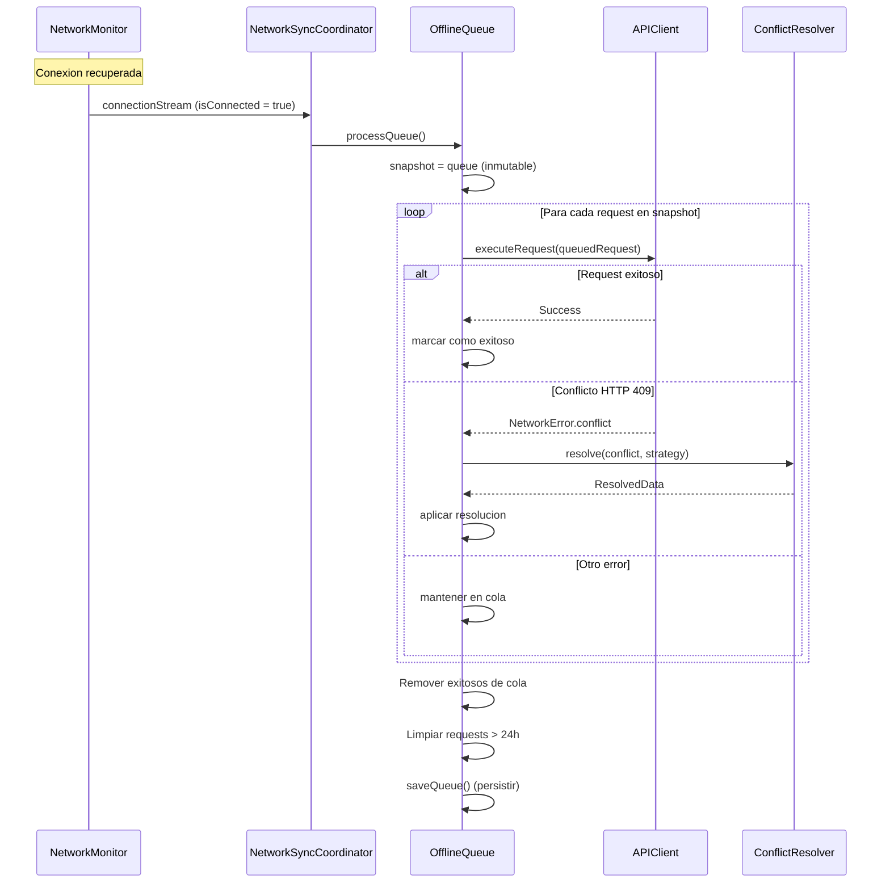

# 02 - Proceso de Datos

> Documentacion tecnica del flujo de datos: fetch API, cache, persistencia local y sincronizacion offline.

---

## Indice

1. [Vision General](#vision-general)
2. [Diagrama de Flujo de Datos](#diagrama-de-flujo-de-datos)
3. [Archivos Involucrados](#archivos-involucrados)
4. [Flujo: Fetch API a UI](#flujo-fetch-api-a-ui)
5. [Flujo: Cache de Responses](#flujo-cache-de-responses)
6. [Flujo: Offline Queue](#flujo-offline-queue)
7. [Flujo: Sincronizacion](#flujo-sincronizacion)
8. [SwiftData Models](#swiftdata-models)
9. [Conflict Resolution](#conflict-resolution)
10. [Manejo de Errores](#manejo-de-errores)
11. [Tests del Proceso](#tests-del-proceso)
12. [Como Agregar Nuevas Funcionalidades](#como-agregar-nuevas-funcionalidades)

---

## Vision General

El sistema de datos de EduGo implementa una arquitectura **Offline-First** con las siguientes caracteristicas:

- **Response Cache**: Cache en memoria con TTL configurable
- **Offline Queue**: Cola persistente de requests fallidos por falta de conexion
- **SwiftData**: Persistencia local para datos criticos
- **Auto-Sync**: Sincronizacion automatica al recuperar conexion
- **Conflict Resolution**: Estrategias para resolver conflictos de sincronizacion

### Arquitectura de Capas

```
Presentation (SwiftUI Views)
    |
    v
Domain (Use Cases + Repository Protocols)
    |
    v
Data Layer
    |
    +-- APIClient (Red)
    |       |
    |       +-- ResponseCache (Cache en memoria)
    |       +-- OfflineQueue (Cola persistente)
    |
    +-- LocalDataSource (SwiftData)
    |
    +-- NetworkSyncCoordinator (Sincronizacion)
```

---

## Diagrama de Flujo de Datos

### Flujo Principal: Request a UI


### Flujo de Sincronizacion Offline



---

## Archivos Involucrados

### Network Layer

| Archivo | Ruta Completa | Responsabilidad |
|---------|---------------|-----------------|
| APIClient.swift | `/Users/jhoanmedina/source/EduGo/EduUI/apple-app/apple-app/Data/Network/APIClient.swift` | Cliente HTTP principal con interceptores |
| ResponseCache.swift | `/Users/jhoanmedina/source/EduGo/EduUI/apple-app/apple-app/Data/Network/ResponseCache.swift` | Cache en memoria con TTL |
| OfflineQueue.swift | `/Users/jhoanmedina/source/EduGo/EduUI/apple-app/apple-app/Data/Network/OfflineQueue.swift` | Cola persistente de requests offline |
| NetworkMonitor.swift | `/Users/jhoanmedina/source/EduGo/EduUI/apple-app/apple-app/Data/Network/NetworkMonitor.swift` | Monitor de estado de red |
| NetworkSyncCoordinator.swift | `/Users/jhoanmedina/source/EduGo/EduUI/apple-app/apple-app/Data/Network/NetworkSyncCoordinator.swift` | Coordinador de sincronizacion automatica |
| Endpoint.swift | `/Users/jhoanmedina/source/EduGo/EduUI/apple-app/apple-app/Data/Network/Endpoint.swift` | Definicion de endpoints |
| HTTPMethod.swift | `/Users/jhoanmedina/source/EduGo/EduUI/apple-app/apple-app/Data/Network/HTTPMethod.swift` | Metodos HTTP |
| RetryPolicy.swift | `/Users/jhoanmedina/source/EduGo/EduUI/apple-app/apple-app/Data/Network/RetryPolicy.swift` | Politica de reintentos |

### Interceptors

| Archivo | Ruta Completa | Responsabilidad |
|---------|---------------|-----------------|
| RequestInterceptor.swift | `/Users/jhoanmedina/source/EduGo/EduUI/apple-app/apple-app/Data/Network/Interceptors/RequestInterceptor.swift` | Protocolo de interceptor de request |
| AuthInterceptor.swift | `/Users/jhoanmedina/source/EduGo/EduUI/apple-app/apple-app/Data/Network/Interceptors/AuthInterceptor.swift` | Inyeccion de token |
| LoggingInterceptor.swift | `/Users/jhoanmedina/source/EduGo/EduUI/apple-app/apple-app/Data/Network/Interceptors/LoggingInterceptor.swift` | Logging de requests/responses |
| SecurityGuardInterceptor.swift | `/Users/jhoanmedina/source/EduGo/EduUI/apple-app/apple-app/Data/Network/Interceptors/SecurityGuardInterceptor.swift` | Validacion de seguridad |

### Data Sources

| Archivo | Ruta Completa | Responsabilidad |
|---------|---------------|-----------------|
| LocalDataSource.swift | `/Users/jhoanmedina/source/EduGo/EduUI/apple-app/apple-app/Data/DataSources/LocalDataSource.swift` | Interfaz de persistencia local |

### SwiftData Models

| Archivo | Ruta Completa | Responsabilidad |
|---------|---------------|-----------------|
| CachedUser.swift | `/Users/jhoanmedina/source/EduGo/EduUI/apple-app/apple-app/Domain/Models/Cache/CachedUser.swift` | Usuario cacheado en SwiftData |
| CachedHTTPResponse.swift | `/Users/jhoanmedina/source/EduGo/EduUI/apple-app/apple-app/Domain/Models/Cache/CachedHTTPResponse.swift` | Response HTTP cacheado |
| SyncQueueItem.swift | `/Users/jhoanmedina/source/EduGo/EduUI/apple-app/apple-app/Domain/Models/Cache/SyncQueueItem.swift` | Item de cola de sincronizacion |
| AppSettings.swift | `/Users/jhoanmedina/source/EduGo/EduUI/apple-app/apple-app/Domain/Models/Cache/AppSettings.swift` | Configuracion local de app |

### Conflict Resolution

| Archivo | Ruta Completa | Responsabilidad |
|---------|---------------|-----------------|
| ConflictResolution.swift | `/Users/jhoanmedina/source/EduGo/EduUI/apple-app/apple-app/Domain/Models/Sync/ConflictResolution.swift` | Estrategias de resolucion de conflictos |

### Repositories

| Archivo | Ruta Completa | Responsabilidad |
|---------|---------------|-----------------|
| AuthRepositoryImpl.swift | `/Users/jhoanmedina/source/EduGo/EduUI/apple-app/apple-app/Data/Repositories/AuthRepositoryImpl.swift` | Repositorio de autenticacion |
| PreferencesRepositoryImpl.swift | `/Users/jhoanmedina/source/EduGo/EduUI/apple-app/apple-app/Data/Repositories/PreferencesRepositoryImpl.swift` | Repositorio de preferencias |

---

## Flujo: Fetch API a UI

### 1. APIClient Ejecuta Request

```swift
// APIClient.swift
@MainActor
final class DefaultAPIClient: APIClient {
    func execute<T: Decodable>(
        endpoint: Endpoint,
        method: HTTPMethod,
        body: (any Encodable)? = nil
    ) async throws -> T {
        let url = endpoint.url(baseURL: baseURL)

        // SPEC-004: Verificar cache para requests GET
        if method == .get, body == nil, let cache = responseCache {
            if let cachedResponse = cache.get(for: url) {
                await logger.debug("Cache hit", metadata: ["url": url.absoluteString])
                return try decoder.decode(T.self, from: cachedResponse.data)
            }
        }

        // Crear request base
        var request = URLRequest(url: url)
        request.httpMethod = method.rawValue
        request.setValue("application/json", forHTTPHeaderField: "Content-Type")

        // Agregar body si existe
        if let body = body {
            request.httpBody = try encoder.encode(AnyEncodable(body))
        }

        // Aplicar interceptors
        for interceptor in requestInterceptors {
            request = try await interceptor.intercept(request)
        }

        // Ejecutar con retry
        return try await executeWithRetry(request: request)
    }
}
```

### 2. Retry con Backoff Exponencial

```swift
// APIClient.swift
private func executeWithRetry<T: Decodable>(request: URLRequest, attempt: Int = 0) async throws -> T {
    do {
        let (data, response) = try await session.data(for: request)

        guard let httpResponse = response as? HTTPURLResponse else {
            throw NetworkError.serverError(0)
        }

        // Aplicar response interceptors
        var processedData = data
        for interceptor in responseInterceptors {
            processedData = try await interceptor.intercept(httpResponse, data: processedData)
        }

        let statusCode = httpResponse.statusCode

        // Retry si es necesario
        if retryPolicy.shouldRetry(statusCode: statusCode, attempt: attempt) {
            let delay = retryPolicy.backoffStrategy.delay(for: attempt)
            try await Task.sleep(nanoseconds: UInt64(delay * 1_000_000_000))
            return try await executeWithRetry(request: request, attempt: attempt + 1)
        }

        // Validar status code
        guard (200..<300).contains(statusCode) else {
            switch statusCode {
            case 401: throw NetworkError.unauthorized
            case 404: throw NetworkError.notFound
            default: throw NetworkError.serverError(statusCode)
            }
        }

        // Decodificar
        let decoded = try decoder.decode(T.self, from: processedData)

        // Cachear response exitoso (solo GET)
        if request.httpMethod == "GET", let url = request.url {
            responseCache?.set(processedData, for: url)
        }

        return decoded
    } catch let error as NetworkError {
        // Encolar si no hay conexion
        if error == .noConnection, let queue = offlineQueue {
            await queue.enqueue(QueuedRequest(...))
        }
        throw error
    }
}
```

---

## Flujo: Cache de Responses

### ResponseCache con TTL

```swift
// ResponseCache.swift
@MainActor
final class ResponseCache {
    private var storage: [String: CachedResponse] = [:]
    private let defaultTTL: TimeInterval
    private let maxEntries: Int
    private let maxTotalSize: Int

    init(
        defaultTTL: TimeInterval = 300,     // 5 minutos
        maxEntries: Int = 100,
        maxTotalSize: Int = 10 * 1024 * 1024  // 10 MB
    ) {
        self.defaultTTL = defaultTTL
        self.maxEntries = maxEntries
        self.maxTotalSize = maxTotalSize
    }

    func get(for url: URL) -> CachedResponse? {
        let key = url.absoluteString

        guard let response = storage[key] else {
            return nil
        }

        // Si expiro, remover
        if response.isExpired {
            storage.removeValue(forKey: key)
            return nil
        }

        return response
    }

    func set(_ data: Data, for url: URL, ttl: TimeInterval? = nil) {
        let expiresIn = ttl ?? defaultTTL

        let response = CachedResponse(
            data: data,
            expiresAt: Date().addingTimeInterval(expiresIn),
            cachedAt: Date()
        )

        // Verificar limites
        if storage.count >= maxEntries {
            evictOldest()
        }

        storage[url.absoluteString] = response

        // Verificar tamano total
        if currentTotalSize > maxTotalSize {
            evictUntilSize(maxTotalSize)
        }
    }

    func invalidate(for url: URL) {
        storage.removeValue(forKey: url.absoluteString)
    }

    func clearAll() {
        storage.removeAll()
    }

    func clearExpired() {
        storage = storage.filter { !$0.value.isExpired }
    }

    private func evictOldest() {
        guard let oldest = storage.min(by: { $0.value.cachedAt < $1.value.cachedAt }) else {
            return
        }
        storage.removeValue(forKey: oldest.key)
    }
}
```

### CachedResponse con Expiracion

```swift
// ResponseCache.swift
struct CachedResponse: Sendable {
    let data: Data
    let expiresAt: Date
    let cachedAt: Date

    var isExpired: Bool {
        Date() >= expiresAt
    }

    var timeRemaining: TimeInterval {
        expiresAt.timeIntervalSinceNow
    }
}
```

---

## Flujo: Offline Queue

### Estructura de QueuedRequest

```swift
// OfflineQueue.swift
struct QueuedRequest: Codable, Sendable {
    let id: UUID
    let url: URL
    let method: String
    let headers: [String: String]
    let body: Data?
    let timestamp: Date

    init(url: URL, method: String, headers: [String: String] = [:], body: Data? = nil) {
        self.id = UUID()
        self.url = url
        self.method = method
        self.headers = headers
        self.body = body
        self.timestamp = Date()
    }
}
```

### OfflineQueue Actor

```swift
// OfflineQueue.swift
actor OfflineQueue {
    private let networkMonitor: NetworkMonitor
    private let conflictResolver: ConflictResolver
    private var queue: [QueuedRequest] = []
    private let storageKey = "offline_requests_queue"

    var executeRequest: ((QueuedRequest) async throws -> Void)?

    func enqueue(_ request: QueuedRequest) async {
        queue.append(request)
        await saveQueue()
    }

    func processQueue() async {
        guard await networkMonitor.isConnected else { return }

        // Snapshot inmutable para evitar race conditions
        let snapshot = queue

        guard !snapshot.isEmpty, let executor = executeRequest else { return }

        var successfulRequests: [UUID] = []

        for request in snapshot {
            let wasSuccessful = await processItem(request, executor: executor)
            if wasSuccessful {
                successfulRequests.append(request.id)
            }
        }

        // Remover exitosos
        queue.removeAll { successfulRequests.contains($0.id) }

        // Limpiar requests > 24h
        let yesterday = Date().addingTimeInterval(-86400)
        queue.removeAll { $0.timestamp < yesterday }

        await saveQueue()
    }

    private func processItem(
        _ request: QueuedRequest,
        executor: @escaping (QueuedRequest) async throws -> Void
    ) async -> Bool {
        do {
            try await executor(request)
            return true
        } catch let error as NetworkError where error.isConflict {
            await handleConflict(for: request, error: error)
            return false
        } catch {
            return false  // Mantener en cola
        }
    }

    // Persistencia en UserDefaults
    private func saveQueue() async {
        guard let encoded = try? JSONEncoder().encode(queue) else { return }
        UserDefaults.standard.set(encoded, forKey: storageKey)
    }

    private func loadQueue() async {
        guard let data = UserDefaults.standard.data(forKey: storageKey),
              let decoded = try? JSONDecoder().decode([QueuedRequest].self, from: data) else {
            return
        }
        queue = decoded
    }
}
```

---

## Flujo: Sincronizacion

### NetworkSyncCoordinator

```swift
// NetworkSyncCoordinator.swift
actor NetworkSyncCoordinator {
    private let networkMonitor: NetworkMonitor
    private let offlineQueue: OfflineQueue
    private var monitoringTask: Task<Void, Never>?
    private var isMonitoring = false

    init(networkMonitor: NetworkMonitor, offlineQueue: OfflineQueue) {
        self.networkMonitor = networkMonitor
        self.offlineQueue = offlineQueue
    }

    func startMonitoring() {
        guard !isMonitoring else { return }
        isMonitoring = true

        monitoringTask = Task { [networkMonitor, offlineQueue] in
            let stream = await MainActor.run {
                networkMonitor.connectionStream()
            }

            for await isConnected in stream where isConnected {
                // Conexion recuperada, procesar cola
                await offlineQueue.processQueue()
            }
        }
    }

    func stopMonitoring() {
        monitoringTask?.cancel()
        monitoringTask = nil
        isMonitoring = false
    }

    func syncNow() async {
        guard await networkMonitor.isConnected else { return }
        await offlineQueue.processQueue()
    }
}
```

### Inicio de Monitoreo en App

```swift
// apple_appApp.swift
init() {
    // ... otras inicializaciones ...

    // SPEC-004: Iniciar monitoreo de red para auto-sync
    Task {
        let syncCoordinator = container.resolve(NetworkSyncCoordinator.self)
        await syncCoordinator.startMonitoring()
    }
}
```

---

## SwiftData Models

### Configuracion de ModelContainer

```swift
// apple_appApp.swift
private let modelContainer: ModelContainer

init() {
    do {
        modelContainer = try ModelContainer(
            for: CachedUser.self,
            CachedHTTPResponse.self,
            SyncQueueItem.self,
            AppSettings.self
        )
    } catch {
        fatalError("Failed to create ModelContainer: \(error)")
    }
}
```

### LocalDataSource con SwiftData

```swift
// LocalDataSource.swift
protocol LocalDataSource: Sendable {
    func saveUser(_ user: User) async throws
    func getUser(id: String) async throws -> User?
    func getCurrentUser() async throws -> User?
    func deleteUser(id: String) async throws
}

@MainActor
final class SwiftDataLocalDataSource: LocalDataSource {
    private let modelContext: ModelContext

    init(modelContext: ModelContext) {
        self.modelContext = modelContext
    }

    func saveUser(_ user: User) async throws {
        let userId = user.id
        let predicate = #Predicate<CachedUser> { $0.id == userId }
        let descriptor = FetchDescriptor(predicate: predicate)

        if let existing = try modelContext.fetch(descriptor).first {
            existing.update(from: user)
        } else {
            let cached = CachedUser.from(user)
            modelContext.insert(cached)
        }

        try modelContext.save()
    }

    func getUser(id: String) async throws -> User? {
        let userId = id
        let predicate = #Predicate<CachedUser> { $0.id == userId }
        let descriptor = FetchDescriptor(predicate: predicate)

        return try modelContext.fetch(descriptor).first?.toDomain()
    }

    func getCurrentUser() async throws -> User? {
        var descriptor = FetchDescriptor<CachedUser>(
            sortBy: [SortDescriptor(\.lastUpdated, order: .reverse)]
        )
        descriptor.fetchLimit = 1

        return try modelContext.fetch(descriptor).first?.toDomain()
    }

    func deleteUser(id: String) async throws {
        let userId = id
        let predicate = #Predicate<CachedUser> { $0.id == userId }
        let descriptor = FetchDescriptor(predicate: predicate)

        let users = try modelContext.fetch(descriptor)
        for user in users {
            modelContext.delete(user)
        }

        try modelContext.save()
    }
}
```

---

## Conflict Resolution

### Estrategias Disponibles

```swift
// ConflictResolution.swift
enum ConflictStrategy: Sendable {
    case serverWins    // Datos del servidor prevalecen
    case clientWins    // Datos locales prevalecen
    case manual        // UI para resolucion manual
    case merge         // Fusion automatica de campos
}

struct SyncConflict: Sendable {
    let localData: Data
    let serverData: Data
    let timestamp: Date
    let endpoint: String
    let metadata: [String: String]
}

protocol ConflictResolver: Sendable {
    func resolve(_ conflict: SyncConflict, strategy: ConflictStrategy) async -> Data
}

struct SimpleConflictResolver: ConflictResolver {
    func resolve(_ conflict: SyncConflict, strategy: ConflictStrategy) async -> Data {
        switch strategy {
        case .serverWins:
            return conflict.serverData
        case .clientWins:
            return conflict.localData
        case .manual, .merge:
            // TODO: Implementar UI y merge
            return conflict.serverData
        }
    }
}
```

### Manejo de Conflictos en OfflineQueue

```swift
// OfflineQueue.swift
private func handleConflict(
    for request: QueuedRequest,
    error: NetworkError
) async {
    let conflict = SyncConflict(
        localData: request.body ?? Data(),
        serverData: Data(),  // TODO: Extraer del error
        timestamp: request.timestamp,
        endpoint: request.url.absoluteString,
        metadata: [:]
    )

    // Por ahora: estrategia simple (server wins)
    _ = await conflictResolver.resolve(conflict, strategy: .serverWins)
}
```

---

## Manejo de Errores

### Errores de Red

```swift
enum NetworkError: Error, Equatable {
    case noConnection
    case timeout
    case unauthorized    // 401
    case notFound        // 404
    case conflict        // 409 (para sync)
    case serverError(Int)
    case decodingError

    var isConflict: Bool {
        if case .conflict = self { return true }
        return false
    }
}
```

### Estrategia de Recuperacion

| Escenario | Accion |
|-----------|--------|
| Sin conexion | Encolar en OfflineQueue |
| Timeout | Retry con backoff exponencial |
| 401 Unauthorized | Refresh token automatico |
| 409 Conflict | Aplicar ConflictResolver |
| 5xx Server Error | Retry (max 3 intentos) |
| Error decodificacion | Log y reportar |

### Retry Policy

```swift
// RetryPolicy.swift
struct RetryPolicy: Sendable {
    let maxAttempts: Int
    let retryableStatusCodes: Set<Int>
    let backoffStrategy: BackoffStrategy

    static let `default` = RetryPolicy(
        maxAttempts: 3,
        retryableStatusCodes: [408, 429, 500, 502, 503, 504],
        backoffStrategy: .exponential(base: 1.0, multiplier: 2.0)
    )

    func shouldRetry(statusCode: Int, attempt: Int) -> Bool {
        attempt < maxAttempts && retryableStatusCodes.contains(statusCode)
    }
}

enum BackoffStrategy: Sendable {
    case fixed(TimeInterval)
    case exponential(base: TimeInterval, multiplier: Double)

    func delay(for attempt: Int) -> TimeInterval {
        switch self {
        case .fixed(let interval):
            return interval
        case .exponential(let base, let multiplier):
            return base * pow(multiplier, Double(attempt))
        }
    }
}
```

---

## Tests del Proceso

### Tests de APIClient

| Archivo | Ruta |
|---------|------|
| APIClientTests.swift | `/Users/jhoanmedina/source/EduGo/EduUI/apple-app/apple-appTests/DataTests/APIClientTests.swift` |

### Tests de Endpoint

| Archivo | Ruta |
|---------|------|
| EndpointTests.swift | `/Users/jhoanmedina/source/EduGo/EduUI/apple-app/apple-appTests/DataTests/EndpointTests.swift` |

### Tests de Conflict Resolution

| Archivo | Ruta |
|---------|------|
| ConflictResolverTests.swift | `/Users/jhoanmedina/source/EduGo/EduUI/apple-app/apple-appTests/Domain/ConflictResolverTests.swift` |

### Tests de Network State

| Archivo | Ruta |
|---------|------|
| NetworkStateTests.swift | `/Users/jhoanmedina/source/EduGo/EduUI/apple-app/apple-appTests/Presentation/NetworkStateTests.swift` |

### Mocks Disponibles

| Mock | Ruta |
|------|------|
| MockAPIClient | `/Users/jhoanmedina/source/EduGo/EduUI/apple-app/apple-appTests/Helpers/MockServices.swift` |
| MockURLProtocol | `/Users/jhoanmedina/source/EduGo/EduUI/apple-app/apple-appTests/Mocks/MockURLProtocol.swift` |

---

## Como Agregar Nuevas Funcionalidades

### Agregar Nuevo Endpoint

1. **En Endpoint.swift**:
   ```swift
   enum Endpoint: Sendable {
       case login
       case materials    // Nuevo
       case progress     // Nuevo

       var path: String {
           switch self {
           case .materials: return "/v1/materials"
           case .progress: return "/v1/progress"
           // ...
           }
       }
   }
   ```

2. **En Repository**:
   ```swift
   func getMaterials() async -> Result<[Material], AppError> {
       do {
           let response: MaterialsResponse = try await apiClient.execute(
               endpoint: .materials,
               method: .get,
               body: nil
           )
           return .success(response.toDomain())
       } catch let error as NetworkError {
           return .failure(.network(error))
       }
   }
   ```

### Agregar Nuevo Modelo SwiftData

1. **Crear modelo**:
   ```swift
   // En Domain/Models/Cache/CachedMaterial.swift
   @Model
   final class CachedMaterial {
       @Attribute(.unique) var id: String
       var title: String
       var content: String
       var lastUpdated: Date

       init(id: String, title: String, content: String) {
           self.id = id
           self.title = title
           self.content = content
           self.lastUpdated = Date()
       }
   }
   ```

2. **Registrar en ModelContainer**:
   ```swift
   // En apple_appApp.swift
   modelContainer = try ModelContainer(
       for: CachedUser.self,
       CachedHTTPResponse.self,
       SyncQueueItem.self,
       AppSettings.self,
       CachedMaterial.self  // Nuevo
   )
   ```

### Agregar Nueva Estrategia de Cache

1. **Modificar ResponseCache**:
   ```swift
   enum CacheStrategy {
       case noCache
       case defaultTTL
       case custom(TimeInterval)
       case untilMidnight
   }

   func set(_ data: Data, for url: URL, strategy: CacheStrategy) {
       let ttl: TimeInterval
       switch strategy {
       case .noCache: return
       case .defaultTTL: ttl = defaultTTL
       case .custom(let interval): ttl = interval
       case .untilMidnight: ttl = timeUntilMidnight()
       }
       // ...
   }
   ```

### Agregar Nuevo Interceptor

1. **Crear interceptor**:
   ```swift
   // En Data/Network/Interceptors/MetricsInterceptor.swift
   @MainActor
   final class MetricsInterceptor: RequestInterceptor, ResponseInterceptor {
       func intercept(_ request: URLRequest) async throws -> URLRequest {
           // Agregar timestamp de inicio
           return request
       }

       func intercept(_ response: HTTPURLResponse, data: Data) async throws -> Data {
           // Calcular duracion, enviar metricas
           return data
       }
   }
   ```

2. **Registrar en DI**:
   ```swift
   // En apple_appApp.swift
   let metricsInterceptor = MetricsInterceptor()

   return DefaultAPIClient(
       baseURL: AppEnvironment.mobileAPIBaseURL,
       requestInterceptors: [
           securityInterceptor,
           authInterceptor,
           metricsInterceptor,  // Nuevo
           loggingInterceptor
       ],
       // ...
   )
   ```

---

## Referencias

- SPEC-004: Network Layer Enhancement
- SPEC-005: SwiftData Integration
- SPEC-013: Offline-First Architecture
- Sprint 2: Ecosistema EduGo
