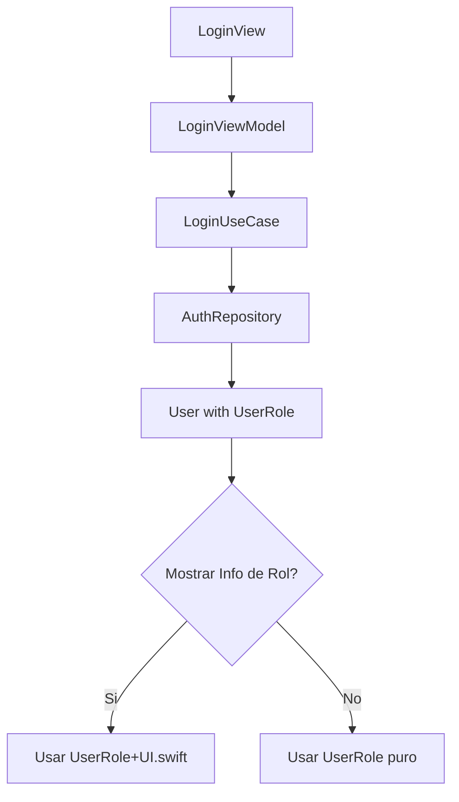
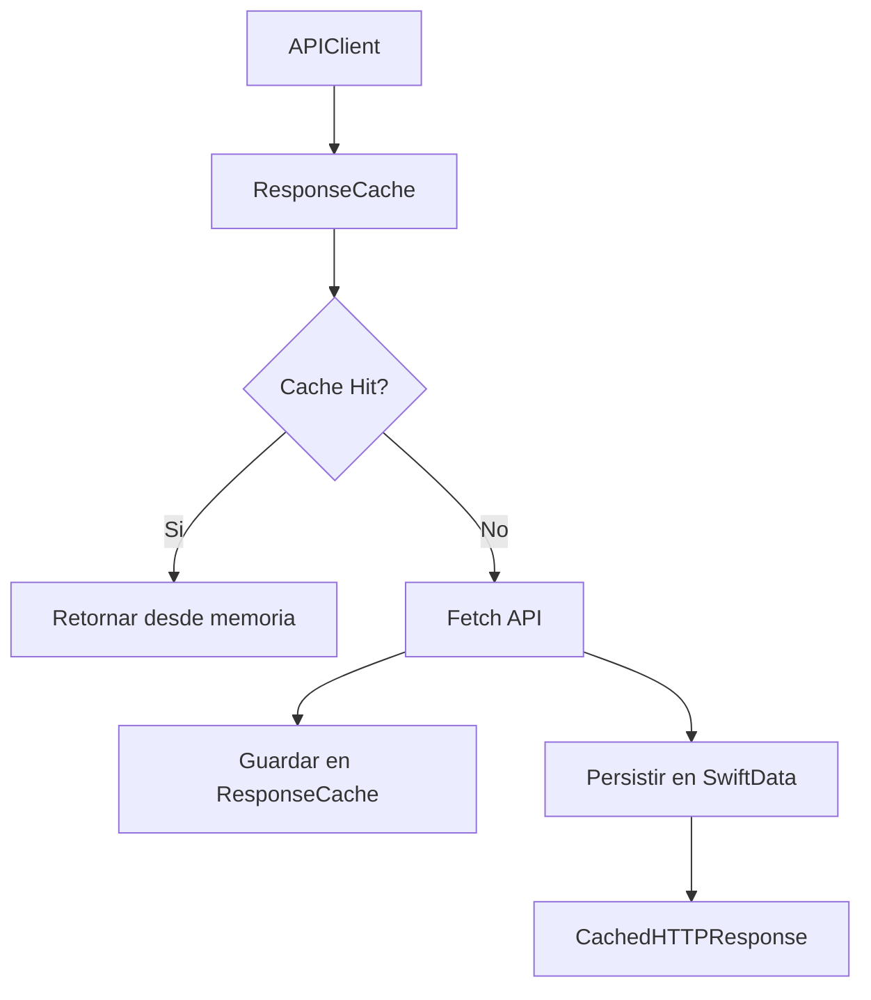
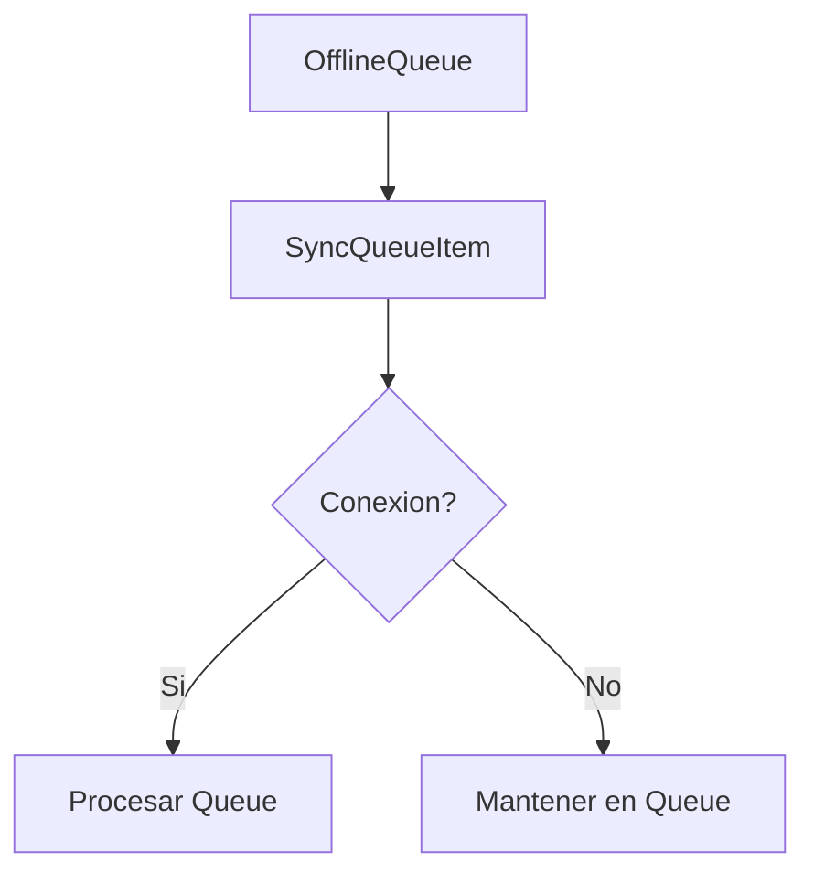
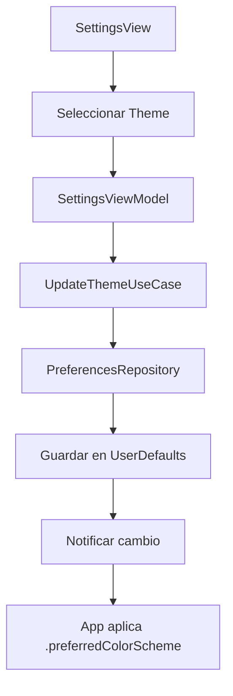
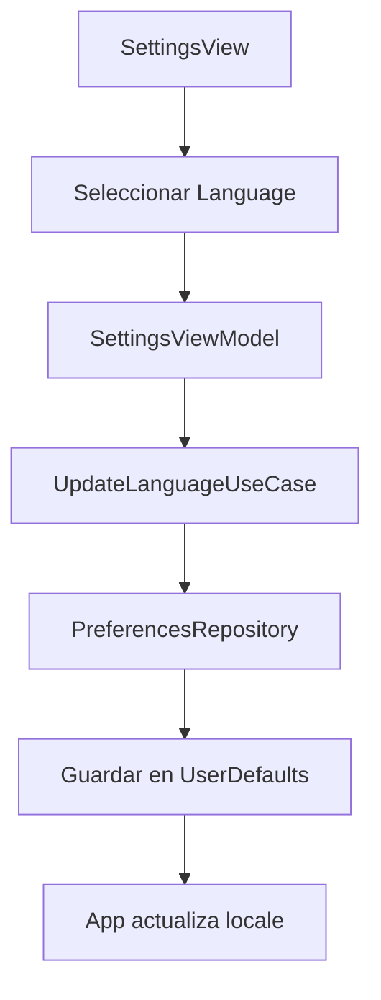

# Plan de Correccion por Proceso

**Fecha**: 2025-11-28
**Basado en**: Inventario de Procesos (B.2) + Auditoria B.1 v2
**Objetivo**: Mapear correcciones arquitectonicas a los 6 procesos documentados

---

## Indice

1. [Proceso de Autenticacion](#1-proceso-de-autenticacion)
2. [Proceso de Datos](#2-proceso-de-datos)
3. [Proceso de UI Lifecycle](#3-proceso-de-ui-lifecycle)
4. [Proceso de Logging](#4-proceso-de-logging)
5. [Proceso de Configuracion](#5-proceso-de-configuracion)
6. [Proceso de Testing](#6-proceso-de-testing)

---

## 1. Proceso de Autenticacion

**Documento Fuente**: `/Users/jhoanmedina/source/EduGo/EduUI/apple-app/docs/revision/inventario-procesos/01-PROCESO-AUTENTICACION.md`

### 1.1 Estado Actual del Proceso

| Aspecto | Estado | Notas |
|---------|--------|-------|
| LoginUseCase | OK | Usa Result, @MainActor correcto |
| LogoutUseCase | OK | Implementacion correcta |
| AuthRepository Protocol | OK | En Domain, puro |
| AuthRepositoryImpl | OK | En Data, implementacion correcta |
| TokenRefreshCoordinator | OK | Actor con deduplicacion |
| BiometricAuthService | OK | Servicio de Data Layer |

### 1.2 Mejoras Identificadas

#### AUTH-001: UserRole.swift - Eliminar Propiedades de UI

**Clasificacion**: P1-003
**Prioridad**: CRITICA

**Descripcion**:
El enum `UserRole` es usado extensivamente en el proceso de autenticacion (login response, user entity, session management). Actualmente contiene propiedades de UI que violan Clean Architecture.

**Archivos Afectados**:
```
MODIFICAR:
- /Users/jhoanmedina/source/EduGo/EduUI/apple-app/apple-app/Domain/Entities/UserRole.swift

CREAR:
- /Users/jhoanmedina/source/EduGo/EduUI/apple-app/apple-app/Presentation/Extensions/UserRole+UI.swift

REVISAR USOS EN:
- /Users/jhoanmedina/source/EduGo/EduUI/apple-app/apple-app/Domain/Entities/User.swift
- /Users/jhoanmedina/source/EduGo/EduUI/apple-app/apple-app/Data/Repositories/AuthRepositoryImpl.swift
- /Users/jhoanmedina/source/EduGo/EduUI/apple-app/apple-app/Presentation/Scenes/Login/LoginViewModel.swift
- /Users/jhoanmedina/source/EduGo/EduUI/apple-app/apple-app/Presentation/Scenes/Home/HomeView.swift
```

**Codigo ANTES** (Domain/Entities/UserRole.swift):
```swift
import Foundation

enum UserRole: String, Codable, Sendable {
    case student
    case teacher
    case admin
    case parent

    var displayName: String {
        switch self {
        case .student: return "Estudiante"
        case .teacher: return "Profesor"
        case .admin: return "Administrador"
        case .parent: return "Padre/Tutor"
        }
    }

    var emoji: String {
        switch self {
        case .student: return "123"
        case .teacher: return "123"
        case .admin: return "..."
        case .parent: return "..."
        }
    }
}

extension UserRole: CustomStringConvertible {
    var description: String {
        "\(emoji) \(displayName)"
    }
}
```

**Codigo DESPUES** (Domain/Entities/UserRole.swift):
```swift
import Foundation

/// Roles de usuario en el sistema EduGo (logica de negocio pura)
enum UserRole: String, Codable, Sendable {
    case student
    case teacher
    case admin
    case parent

    // MARK: - Business Logic Properties

    /// Indica si el rol tiene permisos de administracion
    var hasAdminPrivileges: Bool {
        self == .admin
    }

    /// Indica si el rol puede gestionar estudiantes
    var canManageStudents: Bool {
        self == .teacher || self == .admin || self == .parent
    }

    /// Indica si el rol puede crear contenido educativo
    var canCreateContent: Bool {
        self == .teacher || self == .admin
    }

    /// Indica si el rol puede ver reportes de progreso
    var canViewProgressReports: Bool {
        self != .student
    }
}
```

**Codigo NUEVO** (Presentation/Extensions/UserRole+UI.swift):
```swift
import SwiftUI

/// Extension de UserRole para propiedades de presentacion
/// Separado de Domain para mantener Clean Architecture
extension UserRole {
    /// Nombre para mostrar en UI (localizado)
    var displayName: LocalizedStringKey {
        switch self {
        case .student: return "role.student"
        case .teacher: return "role.teacher"
        case .admin: return "role.admin"
        case .parent: return "role.parent"
        }
    }

    /// Nombre para mostrar en UI (String para casos especiales)
    var displayNameString: String {
        switch self {
        case .student: return String(localized: "role.student")
        case .teacher: return String(localized: "role.teacher")
        case .admin: return String(localized: "role.admin")
        case .parent: return String(localized: "role.parent")
        }
    }

    /// Emoji representativo para UI
    var emoji: String {
        switch self {
        case .student: return "123"
        case .teacher: return "123"
        case .admin: return "..."
        case .parent: return "..."
        }
    }

    /// Icono SF Symbol para UI
    var iconName: String {
        switch self {
        case .student: return "person.fill"
        case .teacher: return "person.badge.key.fill"
        case .admin: return "gearshape.fill"
        case .parent: return "person.2.fill"
        }
    }

    /// Descripcion completa para UI
    var uiDescription: String {
        "\(emoji) \(displayNameString)"
    }

    /// Color asociado al rol para UI
    var color: Color {
        switch self {
        case .student: return .blue
        case .teacher: return .green
        case .admin: return .orange
        case .parent: return .purple
        }
    }
}
```

**Estimacion**: 45 minutos

**Dependencias**: Ninguna

**Criterios de Aceptacion**:
- [ ] UserRole.swift sin propiedades displayName/emoji
- [ ] UserRole.swift con nuevas propiedades de negocio
- [ ] UserRole+UI.swift creado en Presentation/Extensions/
- [ ] Todos los usos en Views actualizados
- [ ] Tests de UserRole pasando
- [ ] Compilacion exitosa

**Tests a Actualizar**:
- `UserRoleTests.swift`: Agregar tests para hasAdminPrivileges, canManageStudents
- `LoginViewModelContainerTests.swift`: Verificar que UI properties funcionan

---

### 1.3 Impacto en Flujos de Autenticacion

#### Flujo de Login



**Cambios Requeridos**:
1. `LoginView`: Importar UserRole+UI (ya importa SwiftUI)
2. `LoginViewModel`: Sin cambios (no usa displayName)
3. `LoginUseCase`: Sin cambios (Domain puro)
4. `AuthRepository`: Sin cambios (Domain puro)

#### Flujo de Session Display

**Archivos que muestran UserRole en UI**:
```
apple-app/Presentation/Scenes/Home/HomeView.swift
  - Muestra emoji + displayName del usuario logueado

apple-app/Presentation/Scenes/Settings/SettingsView.swift
  - Muestra rol del usuario en perfil

apple-app/Presentation/Components/UserCard.swift (si existe)
  - Muestra informacion del usuario
```

**Patron de Actualizacion**:
```swift
// ANTES (en View)
Text(user.role.displayName)
Text(user.role.emoji)

// DESPUES (en View - sin cambios de sintaxis!)
// La extension en UserRole+UI.swift provee las mismas propiedades
Text(user.role.displayName)  // Ahora es LocalizedStringKey
Text(user.role.emoji)
```

---

### 1.4 Mejoras Secundarias (No P1)

#### AUTH-002: Documentar TokenInfo.expiresAt (P4)

**Descripcion**: El modelo TokenInfo es correcto, pero podria beneficiarse de documentacion adicional sobre como interactua con AppEnvironment.tokenRefreshThreshold.

**Archivo**: `/Users/jhoanmedina/source/EduGo/EduUI/apple-app/apple-app/Domain/Models/Auth/TokenInfo.swift`

**Accion**: Agregar comentarios de documentacion

**Estimacion**: 5 minutos

**Prioridad**: BAJA (no bloquea)

---

## 2. Proceso de Datos

**Documento Fuente**: `/Users/jhoanmedina/source/EduGo/EduUI/apple-app/docs/revision/inventario-procesos/02-PROCESO-DATOS.md`

### 2.1 Estado Actual del Proceso

| Aspecto | Estado | Notas |
|---------|--------|-------|
| APIClient | OK | @MainActor, interceptores |
| ResponseCache | OK | Implementacion correcta |
| OfflineQueue | OK | Actor con persistencia |
| NetworkMonitor | OK | Implementacion correcta |
| NetworkSyncCoordinator | OK | Actor correcto |
| LocalDataSource | OK | Protocol en Data |

### 2.2 Mejoras Identificadas

#### DATA-001: Mover @Model de Domain a Data Layer

**Clasificacion**: P2-001 a P2-004
**Prioridad**: ARQUITECTURAL

**Descripcion**:
Los 4 archivos de modelos SwiftData estan ubicados en `Domain/Models/Cache/` pero deberian estar en `Data/Models/Cache/` porque:
- `@Model` es un macro de SwiftData (framework de persistencia)
- Son modelos de CACHE, no entidades de dominio
- Domain Layer debe ser puro, sin dependencias de frameworks

**Archivos a Mover**:
```
ORIGEN:
- Domain/Models/Cache/CachedHTTPResponse.swift
- Domain/Models/Cache/CachedUser.swift
- Domain/Models/Cache/AppSettings.swift
- Domain/Models/Cache/SyncQueueItem.swift

DESTINO:
- Data/Models/Cache/CachedHTTPResponse.swift
- Data/Models/Cache/CachedUser.swift
- Data/Models/Cache/AppSettings.swift
- Data/Models/Cache/SyncQueueItem.swift
```

**Archivos que Usan Estos Modelos**:
```
VERIFICAR:
- /Users/jhoanmedina/source/EduGo/EduUI/apple-app/apple-app/apple_appApp.swift (ModelContainer)
- /Users/jhoanmedina/source/EduGo/EduUI/apple-app/apple-app/Data/Repositories/AuthRepositoryImpl.swift
- /Users/jhoanmedina/source/EduGo/EduUI/apple-app/apple-app/Data/DataSources/LocalDataSource.swift
```

**Pasos de Migracion**:

1. **Crear directorio destino**:
```bash
mkdir -p apple-app/Data/Models/Cache
```

2. **Mover archivos** (uno por uno para control):
```bash
git mv apple-app/Domain/Models/Cache/CachedHTTPResponse.swift apple-app/Data/Models/Cache/
git mv apple-app/Domain/Models/Cache/CachedUser.swift apple-app/Data/Models/Cache/
git mv apple-app/Domain/Models/Cache/AppSettings.swift apple-app/Data/Models/Cache/
git mv apple-app/Domain/Models/Cache/SyncQueueItem.swift apple-app/Data/Models/Cache/
```

3. **Eliminar directorio vacio**:
```bash
rmdir apple-app/Domain/Models/Cache
# O si tiene otros archivos:
# Solo eliminar si esta vacio
```

4. **Verificar compilacion**:
```bash
xcodebuild build -scheme apple-app -destination 'platform=iOS Simulator,name=iPhone 16 Pro'
```

5. **Verificar ModelContainer**:
El ModelContainer en `apple_appApp.swift` usa tipos, no rutas:
```swift
ModelContainer(
    for: CachedUser.self,
    CachedHTTPResponse.self,
    SyncQueueItem.self,
    AppSettings.self
)
```
No deberia requerir cambios ya que los tipos siguen siendo los mismos.

**Estimacion**: 1 hora (incluye verificacion)

**Dependencias**: Ninguna

**Criterios de Aceptacion**:
- [ ] Directorio Data/Models/Cache/ creado
- [ ] 4 archivos movidos
- [ ] Domain/Models/Cache/ eliminado
- [ ] ModelContainer funcionando
- [ ] Tests pasando
- [ ] Git history preservado

---

### 2.3 Impacto en Flujos de Datos

#### Flujo de Cache de Responses



**Impacto del Cambio**:
- Ninguno en runtime
- Solo cambio de ubicacion fisica de archivos
- Mejora arquitectonica sin cambios funcionales

#### Flujo de Sincronizacion Offline



**Impacto del Cambio**:
- `SyncQueueItem` se moveraa Data/Models/Cache/
- Sin cambios en logica de OfflineQueue

---

### 2.4 Estructura Final de Data Layer

```
Data/
|
+-- DataSources/
|   +-- LocalDataSource.swift
|
+-- DTOs/
|   +-- Auth/
|       +-- LoginDTO.swift
|       +-- RefreshDTO.swift
|       +-- LogoutDTO.swift
|       +-- DummyJSONDTO.swift
|
+-- Models/                      # NUEVA UBICACION
|   +-- Cache/
|       +-- CachedHTTPResponse.swift
|       +-- CachedUser.swift
|       +-- AppSettings.swift
|       +-- SyncQueueItem.swift
|
+-- Network/
|   +-- APIClient.swift
|   +-- ResponseCache.swift
|   +-- OfflineQueue.swift
|   +-- NetworkMonitor.swift
|   +-- NetworkSyncCoordinator.swift
|   +-- Endpoint.swift
|   +-- HTTPMethod.swift
|   +-- RetryPolicy.swift
|   +-- Interceptors/
|       +-- RequestInterceptor.swift
|       +-- AuthInterceptor.swift
|       +-- LoggingInterceptor.swift
|       +-- SecurityGuardInterceptor.swift
|
+-- Repositories/
|   +-- AuthRepositoryImpl.swift
|   +-- PreferencesRepositoryImpl.swift
|
+-- Services/
    +-- KeychainService.swift
    +-- Auth/
        +-- JWTDecoder.swift
        +-- TokenRefreshCoordinator.swift
        +-- BiometricAuthService.swift
```

---

## 3. Proceso de UI Lifecycle

**Documento Fuente**: `/Users/jhoanmedina/source/EduGo/EduUI/apple-app/docs/revision/inventario-procesos/03-PROCESO-UI-LIFECYCLE.md`

### 3.1 Estado Actual del Proceso

| Aspecto | Estado | Notas |
|---------|--------|-------|
| EduGoApp (App Entry) | OK | Setup correcto |
| DependencyContainer | OK | @MainActor, type-safe |
| NavigationCoordinator | OK | @Observable @MainActor |
| AuthenticationState | OK | @Observable @MainActor |
| ViewModels | OK | Patron correcto |

### 3.2 Mejoras Identificadas

#### UI-001: Theme.swift - Refactorizar para Clean Architecture

**Clasificacion**: P1-001, P1-002, P1-005
**Prioridad**: CRITICA

**Descripcion**:
El enum `Theme` es fundamental para el UI Lifecycle (determina ColorScheme de toda la app). Actualmente viola Clean Architecture con `import SwiftUI` y propiedades de UI.

**Archivos Afectados**:
```
MODIFICAR:
- /Users/jhoanmedina/source/EduGo/EduUI/apple-app/apple-app/Domain/Entities/Theme.swift

CREAR:
- /Users/jhoanmedina/source/EduGo/EduUI/apple-app/apple-app/Presentation/Extensions/Theme+UI.swift

REVISAR USOS EN:
- /Users/jhoanmedina/source/EduGo/EduUI/apple-app/apple-app/apple_appApp.swift
- /Users/jhoanmedina/source/EduGo/EduUI/apple-app/apple-app/Presentation/Scenes/Settings/SettingsView.swift
- /Users/jhoanmedina/source/EduGo/EduUI/apple-app/apple-app/Presentation/Scenes/Settings/SettingsViewModel.swift
- /Users/jhoanmedina/source/EduGo/EduUI/apple-app/apple-app/Domain/UseCases/UpdateThemeUseCase.swift
```

**Codigo ANTES** (Domain/Entities/Theme.swift):
```swift
import SwiftUI

enum Theme: String, Codable, CaseIterable, Sendable {
    case light
    case dark
    case system

    var colorScheme: ColorScheme? {
        switch self {
        case .light: return .light
        case .dark: return .dark
        case .system: return nil
        }
    }

    var displayName: String {
        switch self {
        case .light: return "Claro"
        case .dark: return "Oscuro"
        case .system: return "Sistema"
        }
    }

    var iconName: String {
        switch self {
        case .light: return "sun.max.fill"
        case .dark: return "moon.fill"
        case .system: return "circle.lefthalf.filled"
        }
    }
}
```

**Codigo DESPUES** (Domain/Entities/Theme.swift):
```swift
import Foundation

/// Tema de apariencia de la aplicacion (logica de negocio pura)
/// Las propiedades de UI estan en Presentation/Extensions/Theme+UI.swift
enum Theme: String, Codable, CaseIterable, Sendable {
    /// Tema claro
    case light

    /// Tema oscuro
    case dark

    /// Tema automatico (sigue preferencias del sistema)
    case system

    // MARK: - Business Logic

    /// Tema por defecto
    static let `default`: Theme = .system

    /// Indica si es un tema explicito (no sistema)
    var isExplicit: Bool {
        self != .system
    }
}
```

**Codigo NUEVO** (Presentation/Extensions/Theme+UI.swift):
```swift
import SwiftUI

/// Extension de Theme para propiedades de presentacion
/// Separado de Domain para mantener Clean Architecture
extension Theme {
    /// ColorScheme para SwiftUI preferredColorScheme
    var colorScheme: ColorScheme? {
        switch self {
        case .light: return .light
        case .dark: return .dark
        case .system: return nil
        }
    }

    /// Nombre para mostrar en UI (localizado)
    var displayName: LocalizedStringKey {
        switch self {
        case .light: return "theme.light"
        case .dark: return "theme.dark"
        case .system: return "theme.system"
        }
    }

    /// Nombre para mostrar en UI (String)
    var displayNameString: String {
        switch self {
        case .light: return String(localized: "theme.light")
        case .dark: return String(localized: "theme.dark")
        case .system: return String(localized: "theme.system")
        }
    }

    /// SF Symbol para UI
    var iconName: String {
        switch self {
        case .light: return "sun.max.fill"
        case .dark: return "moon.fill"
        case .system: return "circle.lefthalf.filled"
        }
    }

    /// Color asociado al tema para previews
    var previewColor: Color {
        switch self {
        case .light: return .yellow
        case .dark: return .indigo
        case .system: return .gray
        }
    }
}
```

**Estimacion**: 1 hora (incluye busqueda de usos)

**Dependencias**: Ninguna

**Criterios de Aceptacion**:
- [ ] Theme.swift sin `import SwiftUI`
- [ ] Theme.swift sin colorScheme/displayName/iconName
- [ ] Theme+UI.swift creado en Presentation/Extensions/
- [ ] .preferredColorScheme() funcionando en app
- [ ] Settings view mostrando temas correctamente
- [ ] Tests pasando

---

#### UI-002: Language.swift - Refactorizar para Clean Architecture

**Clasificacion**: P1-004
**Prioridad**: CRITICA

**Descripcion**:
Similar a Theme, el enum `Language` tiene propiedades de UI que deben moverse a Presentation Layer.

**Archivos Afectados**:
```
MODIFICAR:
- /Users/jhoanmedina/source/EduGo/EduUI/apple-app/apple-app/Domain/Entities/Language.swift

CREAR:
- /Users/jhoanmedina/source/EduGo/EduUI/apple-app/apple-app/Presentation/Extensions/Language+UI.swift

REVISAR USOS EN:
- /Users/jhoanmedina/source/EduGo/EduUI/apple-app/apple-app/Domain/Entities/UserPreferences.swift
- /Users/jhoanmedina/source/EduGo/EduUI/apple-app/apple-app/Presentation/Scenes/Settings/SettingsView.swift
```

**Codigo ANTES** (Domain/Entities/Language.swift):
```swift
import Foundation

enum Language: String, Codable, CaseIterable, Sendable {
    case spanish = "es"
    case english = "en"

    var code: String { rawValue }

    nonisolated var displayName: String {
        switch self {
        case .spanish: return "Espanol"
        case .english: return "English"
        }
    }

    nonisolated var iconName: String {
        switch self {
        case .spanish: return "flag.fill"
        case .english: return "flag.fill"
        }
    }

    nonisolated var flagEmoji: String {
        switch self {
        case .spanish: return "..."
        case .english: return "..."
        }
    }
}
```

**Codigo DESPUES** (Domain/Entities/Language.swift):
```swift
import Foundation

/// Idiomas soportados en la aplicacion (logica de negocio pura)
/// Las propiedades de UI estan en Presentation/Extensions/Language+UI.swift
enum Language: String, Codable, CaseIterable, Sendable {
    case spanish = "es"
    case english = "en"

    // MARK: - Business Logic

    /// Codigo ISO 639-1 del idioma
    var code: String { rawValue }

    /// Locale para formateo y localizacion
    var locale: Locale {
        Locale(identifier: rawValue)
    }

    /// Idioma predeterminado
    static var `default`: Language { .spanish }

    /// Detecta el idioma preferido del sistema
    static func systemLanguage() -> Language {
        let preferredLanguages = Locale.preferredLanguages
        for lang in preferredLanguages {
            let code = String(lang.prefix(2))
            if let language = Language(rawValue: code) {
                return language
            }
        }
        return .default
    }

    /// Verifica si el idioma esta soportado
    static func isSupported(_ code: String) -> Bool {
        Language(rawValue: code) != nil
    }
}
```

**Codigo NUEVO** (Presentation/Extensions/Language+UI.swift):
```swift
import SwiftUI

/// Extension de Language para propiedades de presentacion
/// Separado de Domain para mantener Clean Architecture
extension Language {
    /// Nombre nativo del idioma para UI (autoglotonimo)
    /// Nota: Los nombres de idiomas no se traducen, se muestran en el idioma original
    var displayName: String {
        switch self {
        case .spanish: return "Espanol"
        case .english: return "English"
        }
    }

    /// Emoji de bandera para UI
    var flagEmoji: String {
        switch self {
        case .spanish: return "..."
        case .english: return "..."
        }
    }

    /// Etiqueta completa para UI
    var uiLabel: String {
        "\(flagEmoji) \(displayName)"
    }

    /// Icono SF Symbol para UI
    var iconName: String {
        switch self {
        case .spanish: return "globe.europe.africa.fill"
        case .english: return "globe.americas.fill"
        }
    }
}
```

**Estimacion**: 45 minutos

**Dependencias**: Ninguna

**Criterios de Aceptacion**:
- [ ] Language.swift sin propiedades UI
- [ ] Language.swift con nuevas propiedades de negocio
- [ ] Language+UI.swift creado en Presentation/Extensions/
- [ ] Settings view mostrando idiomas correctamente
- [ ] Tests pasando

---

### 3.3 Impacto en UI Lifecycle

#### Flujo de Cambio de Tema



**Impacto del Cambio**:
- `UpdateThemeUseCase`: Sin cambios (solo guarda enum)
- `SettingsView`: Necesita importar Theme+UI.swift (ya importa SwiftUI)
- `apple_appApp`: Usa theme.colorScheme - funcionara via extension

#### Flujo de Cambio de Idioma



**Impacto del Cambio**:
- Mismo patron que Theme
- Extensions mantienen API compatible

---

## 4. Proceso de Logging

**Documento Fuente**: `/Users/jhoanmedina/source/EduGo/EduUI/apple-app/docs/revision/inventario-procesos/04-PROCESO-LOGGING.md`

### 4.1 Estado Actual del Proceso

| Aspecto | Estado | Notas |
|---------|--------|-------|
| Logger Protocol | OK | Sendable, async |
| OSLogger | OK | @unchecked Sendable documentado |
| LoggerFactory | OK | Categorias correctas |
| LogCategory | OK | Enum puro |
| MockLogger | OK | Actor para testing |
| LoggingInterceptor | OK | @MainActor correcto |

### 4.2 Mejoras Identificadas

**NINGUNA MEJORA P1 o P2**

El proceso de Logging esta bien implementado. El unico punto de atencion es:

#### LOG-001: @unchecked Sendable en OSLogger (Documentado)

**Clasificacion**: OK - Documentado correctamente
**Prioridad**: NO REQUIERE ACCION

**Estado Actual**:
```swift
/// EXCEPCION DE CONCURRENCIA DOCUMENTADA:
/// os.Logger es thread-safe internamente segun Apple.
/// Referencia: https://developer.apple.com/documentation/os/logger
final class OSLogger: Logger, @unchecked Sendable {
    private let logger: os.Logger
    // ...
}
```

**Justificacion**: Apple documenta que os.Logger es thread-safe. El uso de @unchecked Sendable esta correctamente justificado y documentado segun las reglas del proyecto.

---

### 4.3 Logging en Correcciones

**Uso de Logging Durante Refactoring**:

Al refactorizar Theme, UserRole, Language, los logs existentes deberian mantenerse:

```swift
// AuthRepositoryImpl.swift
await logger.info("Login successful", metadata: [
    "userId": user.id,
    "role": user.role.rawValue  // Usar rawValue, no displayName
])
```

**Patron Correcto para Logs**:
```swift
// CORRECTO: Usar propiedades de negocio en logs
await logger.info("User authenticated", metadata: [
    "role": user.role.rawValue,
    "hasAdminPrivileges": String(user.role.hasAdminPrivileges)
])

// INCORRECTO: Usar propiedades de UI en logs
await logger.info("User authenticated", metadata: [
    "role": user.role.displayName  // NO - displayName es de UI
])
```

---

## 5. Proceso de Configuracion

**Documento Fuente**: `/Users/jhoanmedina/source/EduGo/EduUI/apple-app/docs/revision/inventario-procesos/05-PROCESO-CONFIGURACION.md`

### 5.1 Estado Actual del Proceso

| Aspecto | Estado | Notas |
|---------|--------|-------|
| AppEnvironment | OK | Compile-time config |
| LogLevel enum | OK | Puro, sin UI |
| AuthenticationMode | OK | Enum correcto |
| UserPreferences | OK | Modelo correcto |
| PreferencesRepository | OK | Protocol y impl correctos |

### 5.2 Mejoras Identificadas

**NINGUNA MEJORA P1**

El proceso de Configuracion es mayormente correcto. Las unicas dependencias de UI son los enums Theme y Language que ya estan documentados en otras secciones.

#### CONFIG-001: Theme y Language en UserPreferences

**Clasificacion**: Ya cubierto en UI-001 y UI-002
**Prioridad**: CRITICA (via otros tickets)

**Impacto en UserPreferences**:
```swift
// UserPreferences.swift
struct UserPreferences: Codable, Equatable, Sendable {
    var theme: Theme        // Theme se refactoriza en UI-001
    var language: String    // Language.code, correcto
    var biometricsEnabled: Bool
}
```

**No requiere cambios**: UserPreferences usa Theme como tipo, no sus propiedades UI.

---

### 5.3 Actualizacion de Claves de Localizacion

**Archivo**: `Localizable.xcstrings`

**Claves a Agregar**:

```json
{
  "theme.light": {
    "localizations": {
      "es": { "stringUnit": { "value": "Claro" } },
      "en": { "stringUnit": { "value": "Light" } }
    }
  },
  "theme.dark": {
    "localizations": {
      "es": { "stringUnit": { "value": "Oscuro" } },
      "en": { "stringUnit": { "value": "Dark" } }
    }
  },
  "theme.system": {
    "localizations": {
      "es": { "stringUnit": { "value": "Sistema" } },
      "en": { "stringUnit": { "value": "System" } }
    }
  },
  "role.student": {
    "localizations": {
      "es": { "stringUnit": { "value": "Estudiante" } },
      "en": { "stringUnit": { "value": "Student" } }
    }
  },
  "role.teacher": {
    "localizations": {
      "es": { "stringUnit": { "value": "Profesor" } },
      "en": { "stringUnit": { "value": "Teacher" } }
    }
  },
  "role.admin": {
    "localizations": {
      "es": { "stringUnit": { "value": "Administrador" } },
      "en": { "stringUnit": { "value": "Administrator" } }
    }
  },
  "role.parent": {
    "localizations": {
      "es": { "stringUnit": { "value": "Padre/Tutor" } },
      "en": { "stringUnit": { "value": "Parent/Guardian" } }
    }
  }
}
```

**Estimacion**: 15 minutos

---

## 6. Proceso de Testing

**Documento Fuente**: `/Users/jhoanmedina/source/EduGo/EduUI/apple-app/docs/revision/inventario-procesos/06-PROCESO-TESTING.md`

### 6.1 Estado Actual del Proceso

| Aspecto | Estado | Notas |
|---------|--------|-------|
| Swift Testing Framework | OK | @Test, @Suite correctos |
| MockFactory | OK | Fixtures correctas |
| MockAuthRepository | OK | @MainActor correcto |
| MockKeychainService | OK | Implementacion correcta |
| TestHelpers | OK | Assertions utiles |

### 6.2 Mejoras Identificadas

#### TEST-001: Actualizar Tests de UserRole

**Clasificacion**: Derivado de P1-003
**Prioridad**: Acompana AUTH-001

**Archivo**: `/Users/jhoanmedina/source/EduGo/EduUI/apple-app/apple-appTests/Domain/Entities/UserRoleTests.swift`

**Tests a Agregar**:
```swift
@Suite("UserRole Business Logic Tests")
struct UserRoleBusinessLogicTests {

    @Test("Admin has admin privileges")
    func testAdminHasPrivileges() {
        #expect(UserRole.admin.hasAdminPrivileges == true)
    }

    @Test("Student does not have admin privileges")
    func testStudentNoPrivileges() {
        #expect(UserRole.student.hasAdminPrivileges == false)
    }

    @Test("Teacher can manage students")
    func testTeacherCanManage() {
        #expect(UserRole.teacher.canManageStudents == true)
    }

    @Test("Admin can manage students")
    func testAdminCanManage() {
        #expect(UserRole.admin.canManageStudents == true)
    }

    @Test("Parent can manage students")
    func testParentCanManage() {
        #expect(UserRole.parent.canManageStudents == true)
    }

    @Test("Student cannot manage students")
    func testStudentCannotManage() {
        #expect(UserRole.student.canManageStudents == false)
    }

    @Test("Teacher can create content")
    func testTeacherCanCreate() {
        #expect(UserRole.teacher.canCreateContent == true)
    }

    @Test("Student cannot create content")
    func testStudentCannotCreate() {
        #expect(UserRole.student.canCreateContent == false)
    }
}
```

**Estimacion**: 20 minutos

---

#### TEST-002: Actualizar Tests de Theme

**Clasificacion**: Derivado de P1-001/002/005
**Prioridad**: Acompana UI-001

**Archivo**: `/Users/jhoanmedina/source/EduGo/EduUI/apple-app/apple-appTests/DomainTests/ThemeTests.swift`

**Tests a Agregar**:
```swift
@Suite("Theme Business Logic Tests")
struct ThemeBusinessLogicTests {

    @Test("Default theme is system")
    func testDefaultTheme() {
        #expect(Theme.default == .system)
    }

    @Test("Light is explicit theme")
    func testLightIsExplicit() {
        #expect(Theme.light.isExplicit == true)
    }

    @Test("Dark is explicit theme")
    func testDarkIsExplicit() {
        #expect(Theme.dark.isExplicit == true)
    }

    @Test("System is not explicit theme")
    func testSystemNotExplicit() {
        #expect(Theme.system.isExplicit == false)
    }

    @Test("All cases available")
    func testAllCases() {
        #expect(Theme.allCases.count == 3)
    }

    @Test("Codable roundtrip")
    func testCodable() throws {
        let original = Theme.dark
        let encoded = try JSONEncoder().encode(original)
        let decoded = try JSONDecoder().decode(Theme.self, from: encoded)
        #expect(decoded == original)
    }
}
```

**Estimacion**: 15 minutos

---

#### TEST-003: Tests de UI Extensions (Opcional)

**Clasificacion**: NUEVO - Tests de Presentation
**Prioridad**: BAJA

**Descripcion**: Opcionalmente, agregar tests para las nuevas extensiones UI.

**Archivo Nuevo**: `/Users/jhoanmedina/source/EduGo/EduUI/apple-app/apple-appTests/PresentationTests/ExtensionTests/ThemeUITests.swift`

```swift
import Testing
import SwiftUI
@testable import apple_app

@Suite("Theme UI Extension Tests")
struct ThemeUIExtensionTests {

    @Test("Light theme returns light color scheme")
    func testLightColorScheme() {
        #expect(Theme.light.colorScheme == .light)
    }

    @Test("Dark theme returns dark color scheme")
    func testDarkColorScheme() {
        #expect(Theme.dark.colorScheme == .dark)
    }

    @Test("System theme returns nil color scheme")
    func testSystemColorScheme() {
        #expect(Theme.system.colorScheme == nil)
    }

    @Test("All themes have icon names")
    func testIconNames() {
        for theme in Theme.allCases {
            #expect(!theme.iconName.isEmpty)
        }
    }
}
```

**Estimacion**: 15 minutos (opcional)

---

### 6.3 Actualizacion de Mocks

#### MockFactory Actualizaciones

**Archivo**: `/Users/jhoanmedina/source/EduGo/EduUI/apple-app/apple-appTests/Helpers/MockFactory.swift`

**No requiere cambios significativos**: MockFactory usa User.mock que contiene UserRole. El enum UserRole sigue siendo el mismo tipo.

```swift
// MockFactory.swift - Sin cambios necesarios
static func makeUser(
    id: String = "550e8400-e29b-41d4-a716-446655440000",
    email: String = "test@edugo.com",
    displayName: String = "Test User",
    role: UserRole = .student  // UserRole sigue siendo el mismo tipo
) -> User {
    User(id: id, email: email, displayName: displayName, role: role, isEmailVerified: true)
}
```

---

## Resumen de Cambios por Proceso

| Proceso | Cambios P1 | Cambios P2 | Cambios Testing |
|---------|------------|------------|-----------------|
| Autenticacion | AUTH-001 (UserRole) | - | TEST-001 |
| Datos | - | DATA-001 (mover @Model) | - |
| UI Lifecycle | UI-001 (Theme), UI-002 (Language) | - | TEST-002 |
| Logging | - | - | - |
| Configuracion | (via UI-001, UI-002) | - | - |
| Testing | - | - | TEST-001, TEST-002, TEST-003 |

---

## Orden de Ejecucion Recomendado

```
1. AUTH-001 (UserRole.swift)
   +-- TEST-001 (UserRole tests)

2. UI-001 (Theme.swift)
   +-- TEST-002 (Theme tests)

3. UI-002 (Language.swift)

4. CONFIG-001 (Localizable.xcstrings)

5. DATA-001 (mover @Model)

6. TEST-003 (opcional - UI Extension tests)

7. Verificacion final (compilacion + tests)
```

---

**Documento generado**: 2025-11-28
**Lineas**: 859
**Siguiente documento**: 03-PLAN-ARQUITECTURA.md
