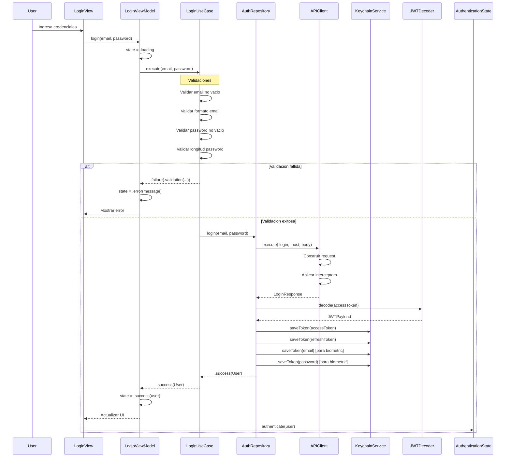
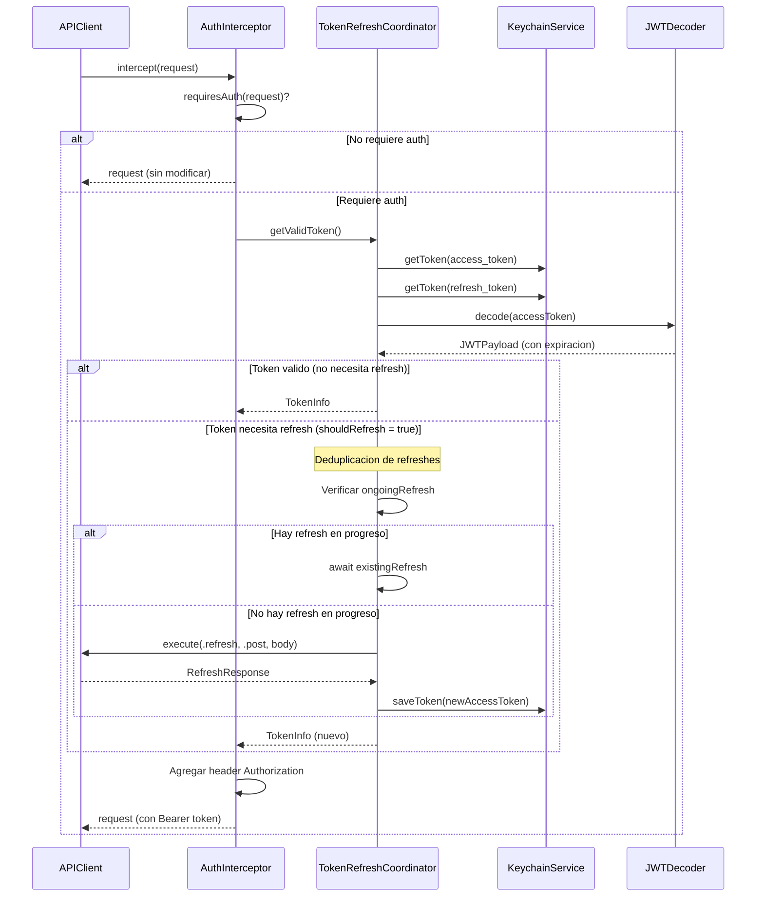
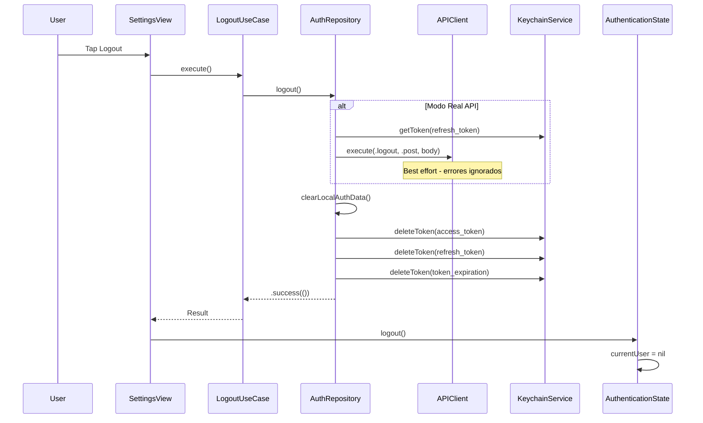

# 01 - Proceso de Autenticacion

> Documentacion tecnica del flujo completo de autenticacion en EduGo Apple App.

---

## Indice

1. [Vision General](#vision-general)
2. [Diagrama de Secuencia](#diagrama-de-secuencia)
3. [Archivos Involucrados](#archivos-involucrados)
4. [Flujo Detallado: Login](#flujo-detallado-login)
5. [Flujo Detallado: Token Refresh](#flujo-detallado-token-refresh)
6. [Flujo Detallado: Logout](#flujo-detallado-logout)
7. [Flujo Detallado: Biometric Login](#flujo-detallado-biometric-login)
8. [Manejo de Errores](#manejo-de-errores)
9. [Tests del Proceso](#tests-del-proceso)
10. [Como Agregar Nuevas Funcionalidades](#como-agregar-nuevas-funcionalidades)

---

## Vision General

El sistema de autenticacion de EduGo sigue una arquitectura Clean Architecture con separacion clara de responsabilidades:

- **Presentation Layer**: LoginView + LoginViewModel
- **Domain Layer**: LoginUseCase (validaciones) + AuthRepository (protocolo)
- **Data Layer**: AuthRepositoryImpl + KeychainService + APIClient

### Caracteristicas Principales

- Autenticacion centralizada via `api-admin` (Puerto 8081)
- JWT tokens con refresh automatico
- Almacenamiento seguro en Keychain
- Soporte para autenticacion biometrica (Face ID / Touch ID)
- Modo dual: DummyJSON (desarrollo) y Real API (produccion)

---

## Diagrama de Secuencia

### Login Flow



### Token Refresh Flow



### Logout Flow



---

## Archivos Involucrados

### Domain Layer (Capa Pura)

| Archivo | Ruta Completa | Responsabilidad |
|---------|---------------|-----------------|
| AuthRepository.swift | `/Users/jhoanmedina/source/EduGo/EduUI/apple-app/apple-app/Domain/Repositories/AuthRepository.swift` | Protocolo que define contrato de autenticacion |
| LoginUseCase.swift | `/Users/jhoanmedina/source/EduGo/EduUI/apple-app/apple-app/Domain/UseCases/LoginUseCase.swift` | Caso de uso con validaciones de login |
| LogoutUseCase.swift | `/Users/jhoanmedina/source/EduGo/EduUI/apple-app/apple-app/Domain/UseCases/LogoutUseCase.swift` | Caso de uso de logout |
| LoginWithBiometricsUseCase.swift | `/Users/jhoanmedina/source/EduGo/EduUI/apple-app/apple-app/Domain/UseCases/Auth/LoginWithBiometricsUseCase.swift` | Caso de uso login biometrico |
| GetCurrentUserUseCase.swift | `/Users/jhoanmedina/source/EduGo/EduUI/apple-app/apple-app/Domain/UseCases/GetCurrentUserUseCase.swift` | Obtener usuario actual |
| User.swift | `/Users/jhoanmedina/source/EduGo/EduUI/apple-app/apple-app/Domain/Entities/User.swift` | Entidad de usuario |
| TokenInfo.swift | `/Users/jhoanmedina/source/EduGo/EduUI/apple-app/apple-app/Domain/Models/Auth/TokenInfo.swift` | Modelo de tokens con expiracion |
| AppError.swift | `/Users/jhoanmedina/source/EduGo/EduUI/apple-app/apple-app/Domain/Errors/AppError.swift` | Errores de dominio |
| ValidationError.swift | `/Users/jhoanmedina/source/EduGo/EduUI/apple-app/apple-app/Domain/Errors/ValidationError.swift` | Errores de validacion |
| NetworkError.swift | `/Users/jhoanmedina/source/EduGo/EduUI/apple-app/apple-app/Domain/Errors/NetworkError.swift` | Errores de red |

### Data Layer (Implementaciones)

| Archivo | Ruta Completa | Responsabilidad |
|---------|---------------|-----------------|
| AuthRepositoryImpl.swift | `/Users/jhoanmedina/source/EduGo/EduUI/apple-app/apple-app/Data/Repositories/AuthRepositoryImpl.swift` | Implementacion del repositorio de auth |
| KeychainService.swift | `/Users/jhoanmedina/source/EduGo/EduUI/apple-app/apple-app/Data/Services/KeychainService.swift` | Almacenamiento seguro de tokens |
| JWTDecoder.swift | `/Users/jhoanmedina/source/EduGo/EduUI/apple-app/apple-app/Data/Services/Auth/JWTDecoder.swift` | Decodificacion de tokens JWT |
| TokenRefreshCoordinator.swift | `/Users/jhoanmedina/source/EduGo/EduUI/apple-app/apple-app/Data/Services/Auth/TokenRefreshCoordinator.swift` | Coordinador de refresh con deduplicacion |
| BiometricAuthService.swift | `/Users/jhoanmedina/source/EduGo/EduUI/apple-app/apple-app/Data/Services/Auth/BiometricAuthService.swift` | Servicio de autenticacion biometrica |
| APIClient.swift | `/Users/jhoanmedina/source/EduGo/EduUI/apple-app/apple-app/Data/Network/APIClient.swift` | Cliente HTTP principal |
| AuthInterceptor.swift | `/Users/jhoanmedina/source/EduGo/EduUI/apple-app/apple-app/Data/Network/Interceptors/AuthInterceptor.swift` | Interceptor de inyeccion de token |
| AuthEndpoints.swift | `/Users/jhoanmedina/source/EduGo/EduUI/apple-app/apple-app/Data/Network/Endpoints/AuthEndpoints.swift` | Endpoints de autenticacion |
| Endpoint.swift | `/Users/jhoanmedina/source/EduGo/EduUI/apple-app/apple-app/Data/Network/Endpoint.swift` | Definicion de endpoints |
| LoginDTO.swift | `/Users/jhoanmedina/source/EduGo/EduUI/apple-app/apple-app/Data/DTOs/Auth/LoginDTO.swift` | DTOs de login |
| RefreshDTO.swift | `/Users/jhoanmedina/source/EduGo/EduUI/apple-app/apple-app/Data/DTOs/Auth/RefreshDTO.swift` | DTOs de refresh |
| LogoutDTO.swift | `/Users/jhoanmedina/source/EduGo/EduUI/apple-app/apple-app/Data/DTOs/Auth/LogoutDTO.swift` | DTOs de logout |
| DummyJSONDTO.swift | `/Users/jhoanmedina/source/EduGo/EduUI/apple-app/apple-app/Data/DTOs/Auth/DummyJSONDTO.swift` | DTOs para DummyJSON API |

### Presentation Layer (UI)

| Archivo | Ruta Completa | Responsabilidad |
|---------|---------------|-----------------|
| LoginView.swift | `/Users/jhoanmedina/source/EduGo/EduUI/apple-app/apple-app/Presentation/Scenes/Login/LoginView.swift` | Vista de login |
| LoginViewModel.swift | `/Users/jhoanmedina/source/EduGo/EduUI/apple-app/apple-app/Presentation/Scenes/Login/LoginViewModel.swift` | ViewModel de login |
| AuthenticationState.swift | `/Users/jhoanmedina/source/EduGo/EduUI/apple-app/apple-app/Presentation/Navigation/AuthenticationState.swift` | Estado global de autenticacion |

### Configuracion

| Archivo | Ruta Completa | Responsabilidad |
|---------|---------------|-----------------|
| Environment.swift | `/Users/jhoanmedina/source/EduGo/EduUI/apple-app/apple-app/App/Environment.swift` | URLs de API y configuracion |
| apple_appApp.swift | `/Users/jhoanmedina/source/EduGo/EduUI/apple-app/apple-app/apple_appApp.swift` | Setup de dependencias |

---

## Flujo Detallado: Login

### 1. Entrada del Usuario (Presentation Layer)

```swift
// LoginView.swift
struct LoginView: View {
    @State private var viewModel: LoginViewModel
    @State private var email = ""
    @State private var password = ""
    @Environment(AuthenticationState.self) private var authState

    var body: some View {
        // UI con DSTextField para email y password
        DSButton(title: "Login", style: .primary, isLoading: viewModel.isLoading) {
            Task {
                await viewModel.login(email: email, password: password)
            }
        }
    }
}
```

### 2. ViewModel Coordina (Presentation Layer)

```swift
// LoginViewModel.swift
@Observable
@MainActor
final class LoginViewModel {
    enum State: Equatable {
        case idle
        case loading
        case success(User)
        case error(String)
    }

    func login(email: String, password: String) async {
        state = .loading

        let result = await loginUseCase.execute(email: email, password: password)

        switch result {
        case .success(let user):
            state = .success(user)
        case .failure(let error):
            state = .error(error.userMessage)
        }
    }
}
```

### 3. Use Case Valida (Domain Layer)

```swift
// LoginUseCase.swift
@MainActor
final class DefaultLoginUseCase: LoginUseCase {
    func execute(email: String, password: String) async -> Result<User, AppError> {
        // Validacion: Email vacio
        guard !email.isEmpty else {
            return .failure(.validation(.emptyEmail))
        }

        // Validacion: Formato de email
        guard validator.isValidEmail(email) else {
            return .failure(.validation(.invalidEmailFormat))
        }

        // Validacion: Password vacio
        guard !password.isEmpty else {
            return .failure(.validation(.emptyPassword))
        }

        // Validacion: Longitud de password
        guard validator.isValidPassword(password) else {
            return .failure(.validation(.passwordTooShort))
        }

        // Delegacion al repositorio
        return await authRepository.login(email: email, password: password)
    }
}
```

### 4. Repositorio Ejecuta (Data Layer)

```swift
// AuthRepositoryImpl.swift
@MainActor
final class AuthRepositoryImpl: AuthRepository {
    func login(email: String, password: String) async -> Result<User, AppError> {
        await logger.info("Login attempt started")

        do {
            let user: User
            let tokenInfo: TokenInfo

            switch authMode {
            case .dummyJSON:
                (user, tokenInfo) = try await loginWithDummyJSON(email: email, password: password)
            case .realAPI:
                (user, tokenInfo) = try await loginWithRealAPI(email: email, password: password)
            }

            // Guardar tokens en Keychain
            await saveTokens(tokenInfo)

            // Guardar credenciales para biometric login
            try? await keychainService.saveToken(email, for: storedEmailKey)
            try? await keychainService.saveToken(password, for: storedPasswordKey)

            return .success(user)
        } catch let error as NetworkError {
            return .failure(.network(error))
        } catch {
            return .failure(.system(.system(error.localizedDescription)))
        }
    }
}
```

---

## Flujo Detallado: Token Refresh

### Estrategia de Refresh Proactivo

El sistema usa refresh proactivo basado en `shouldRefresh`:

```swift
// TokenInfo.swift
struct TokenInfo {
    var shouldRefresh: Bool {
        let threshold = AppEnvironment.tokenRefreshThreshold  // Default: 2 minutos
        return Date() >= expiresAt.addingTimeInterval(-threshold)
    }
}
```

### TokenRefreshCoordinator con Deduplicacion

```swift
// TokenRefreshCoordinator.swift
@MainActor
final class TokenRefreshCoordinator {
    // Task para deduplicar refreshes concurrentes
    private var ongoingRefresh: Task<TokenInfo, Error>?

    func getValidToken() async throws -> TokenInfo {
        let currentToken = try await getCurrentTokenInfo()

        // Si valido, retornar
        if !currentToken.shouldRefresh {
            return currentToken
        }

        // Si hay refresh en progreso, esperar
        if let existingRefresh = ongoingRefresh {
            return try await existingRefresh.value
        }

        // Iniciar nuevo refresh y deduplicar
        let refreshTask = Task {
            defer { self.ongoingRefresh = nil }
            return try await self.performRefresh(currentToken.refreshToken)
        }

        ongoingRefresh = refreshTask
        return try await refreshTask.value
    }
}
```

### Inyeccion Automatica via AuthInterceptor

```swift
// AuthInterceptor.swift
@MainActor
final class AuthInterceptor: RequestInterceptor {
    func intercept(_ request: URLRequest) async throws -> URLRequest {
        guard requiresAuth(request) else {
            return request
        }

        let tokenInfo = try await tokenCoordinator.getValidToken()

        var mutableRequest = request
        mutableRequest.setValue(
            "Bearer \(tokenInfo.accessToken)",
            forHTTPHeaderField: "Authorization"
        )

        return mutableRequest
    }

    private func requiresAuth(_ request: URLRequest) -> Bool {
        let publicPaths = [
            "/auth/login",
            "/v1/auth/login",
            "/auth/refresh",
            "/v1/auth/refresh",
            "/health"
        ]
        return !publicPaths.contains(where: { request.url?.path.contains($0) ?? false })
    }
}
```

---

## Flujo Detallado: Logout

```swift
// AuthRepositoryImpl.swift
func logout() async -> Result<Void, AppError> {
    await logger.info("Logout attempt started")

    // Llamar API de logout solo en modo Real API
    if authMode == .realAPI {
        if let refreshToken = try? await keychainService.getToken(for: refreshTokenKey) {
            // Best effort - ignorar errores
            let _: String? = try? await apiClient.execute(
                endpoint: .logout,
                method: .post,
                body: LogoutRequest(refreshToken: refreshToken)
            )
        }
    }

    // Limpiar datos locales siempre
    await clearLocalAuthData()

    return .success(())
}

func clearLocalAuthData() async {
    await tokenStore.setTokens(nil)
    try? await keychainService.deleteToken(for: accessTokenKey)
    try? await keychainService.deleteToken(for: refreshTokenKey)
    try? await keychainService.deleteToken(for: tokenExpirationKey)
}
```

---

## Flujo Detallado: Biometric Login

```swift
// AuthRepositoryImpl.swift
func loginWithBiometrics() async -> Result<User, AppError> {
    await logger.info("Biometric login attempt")

    // 1. Verificar disponibilidad
    guard await biometricService.isAvailable else {
        return .failure(.system(.system("Autenticacion biometrica no disponible")))
    }

    // 2. Autenticar con Face ID / Touch ID
    do {
        let authenticated = try await biometricService.authenticate(
            reason: "Iniciar sesion en EduGo"
        )

        guard authenticated else {
            return .failure(.system(.cancelled))
        }

        // 3. Leer credenciales guardadas del Keychain
        guard let email = try? await keychainService.getToken(for: storedEmailKey),
              let password = try? await keychainService.getToken(for: storedPasswordKey) else {
            return .failure(.system(.system("No hay credenciales guardadas")))
        }

        // 4. Login normal con credenciales
        return await login(email: email, password: password)
    } catch {
        return .failure(.system(.system(error.localizedDescription)))
    }
}
```

---

## Manejo de Errores

### Jerarquia de Errores

```swift
enum AppError: Error, Equatable {
    case validation(ValidationError)  // Errores de validacion de input
    case network(NetworkError)        // Errores de red
    case business(BusinessError)      // Errores de logica de negocio
    case system(SystemError)          // Errores del sistema
}

enum ValidationError: Error {
    case emptyEmail
    case invalidEmailFormat
    case emptyPassword
    case passwordTooShort
}

enum NetworkError: Error {
    case noConnection
    case timeout
    case unauthorized        // 401
    case notFound           // 404
    case serverError(Int)   // 5xx
    case decodingError
}

enum BusinessError: Error {
    case invalidCredentials
    case userNotFound
    case sessionExpired
}
```

### Puntos de Fallo y Recuperacion

| Punto de Fallo | Error | Recuperacion |
|----------------|-------|--------------|
| Email vacio | `.validation(.emptyEmail)` | Mostrar mensaje, usuario corrige |
| Email invalido | `.validation(.invalidEmailFormat)` | Mostrar mensaje, usuario corrige |
| Password vacio | `.validation(.emptyPassword)` | Mostrar mensaje, usuario corrige |
| Password corto | `.validation(.passwordTooShort)` | Mostrar mensaje, usuario corrige |
| Sin conexion | `.network(.noConnection)` | Mostrar banner offline |
| Credenciales invalidas | `.business(.invalidCredentials)` | Mostrar error, usuario reintenta |
| Token expirado | `.network(.unauthorized)` | Refresh automatico via TokenRefreshCoordinator |
| Refresh falla | `.network(.unauthorized)` | Limpiar sesion, redirigir a login |
| Error servidor | `.network(.serverError(code))` | Retry con backoff exponencial |

---

## Tests del Proceso

### Tests de LoginUseCase

| Archivo | Ruta |
|---------|------|
| LoginUseCaseTests.swift | `/Users/jhoanmedina/source/EduGo/EduUI/apple-app/apple-appTests/DomainTests/LoginUseCaseTests.swift` |

```swift
@Suite("LoginUseCase Tests")
struct LoginUseCaseTests {
    @Test("Login with valid credentials should succeed")
    func testLoginWithValidCredentials() async throws {
        let mockRepository = MockAuthRepository()
        mockRepository.loginResult = .success(User.mock)
        let sut = DefaultLoginUseCase(authRepository: mockRepository)

        let result = await sut.execute(email: "test@test.com", password: "123456")

        #expect(result == .success(User.mock))
        #expect(mockRepository.loginCallCount == 1)
    }

    @Test("Login with empty email should fail")
    func testLoginWithEmptyEmail() async throws {
        let sut = DefaultLoginUseCase(authRepository: MockAuthRepository())
        let result = await sut.execute(email: "", password: "123456")
        #expect(result == .failure(.validation(.emptyEmail)))
    }

    @Test("Login with invalid email format should fail")
    func testLoginWithInvalidEmailFormat() async throws {
        let sut = DefaultLoginUseCase(authRepository: MockAuthRepository())
        let result = await sut.execute(email: "invalid-email", password: "123456")
        #expect(result == .failure(.validation(.invalidEmailFormat)))
    }
}
```

### Tests de AuthRepository

| Archivo | Ruta |
|---------|------|
| AuthRepositoryTests.swift | `/Users/jhoanmedina/source/EduGo/EduUI/apple-app/apple-appTests/DomainTests/AuthRepositoryTests.swift` |

### Tests de JWT

| Archivo | Ruta |
|---------|------|
| JWTDecoderTests.swift | `/Users/jhoanmedina/source/EduGo/EduUI/apple-app/apple-appTests/Data/Services/JWTDecoderTests.swift` |

### Tests de TokenRefreshCoordinator

| Archivo | Ruta |
|---------|------|
| TokenRefreshCoordinatorTests.swift | `/Users/jhoanmedina/source/EduGo/EduUI/apple-app/apple-appTests/Data/Services/TokenRefreshCoordinatorTests.swift` |

### Tests de Integracion

| Archivo | Ruta |
|---------|------|
| AuthFlowIntegrationTests.swift | `/Users/jhoanmedina/source/EduGo/EduUI/apple-app/apple-appTests/Integration/AuthFlowIntegrationTests.swift` |

### Mocks Disponibles

| Mock | Ruta |
|------|------|
| MockAuthRepository | `/Users/jhoanmedina/source/EduGo/EduUI/apple-app/apple-appTests/Mocks/MockAuthRepository.swift` |
| MockKeychainService | `/Users/jhoanmedina/source/EduGo/EduUI/apple-app/apple-appTests/Helpers/MockServices.swift` |
| MockAPIClient | `/Users/jhoanmedina/source/EduGo/EduUI/apple-app/apple-appTests/Helpers/MockServices.swift` |
| MockJWTDecoder | `/Users/jhoanmedina/source/EduGo/EduUI/apple-app/apple-app/Data/Services/Auth/JWTDecoder.swift` (en #if DEBUG) |
| MockTokenRefreshCoordinator | `/Users/jhoanmedina/source/EduGo/EduUI/apple-app/apple-app/Data/Services/Auth/TokenRefreshCoordinator.swift` (en #if DEBUG) |

---

## Como Agregar Nuevas Funcionalidades

### Agregar Nuevo Metodo de Autenticacion (ej: Social Login)

1. **Domain Layer**:
   ```swift
   // En AuthRepository.swift
   func loginWithGoogle() async -> Result<User, AppError>
   ```

2. **Data Layer**:
   ```swift
   // En AuthRepositoryImpl.swift
   func loginWithGoogle() async -> Result<User, AppError> {
       // Implementacion con Google SDK
   }
   ```

3. **Presentation Layer**:
   ```swift
   // En LoginViewModel.swift
   func loginWithGoogle() async {
       // Llamar use case
   }
   ```

### Agregar Validacion Adicional

1. **En InputValidator.swift**:
   ```swift
   func isValidPasswordStrength(_ password: String) -> Bool {
       // Logica de validacion
   }
   ```

2. **En LoginUseCase.swift**:
   ```swift
   guard validator.isValidPasswordStrength(password) else {
       return .failure(.validation(.weakPassword))
   }
   ```

3. **En ValidationError.swift**:
   ```swift
   case weakPassword
   ```

### Agregar Nuevo Endpoint de Auth

1. **En Endpoint.swift**:
   ```swift
   case verifyEmail
   case resetPassword
   ```

2. **En AuthRepositoryImpl.swift**:
   ```swift
   func verifyEmail(token: String) async -> Result<Void, AppError> {
       // Implementacion
   }
   ```

---

## Configuracion de Ambientes

### URLs de Autenticacion

```swift
// Environment.swift
static var authAPIBaseURL: URL {
    #if DEBUG
    return makeURL("http://localhost:8081")
    #elseif STAGING
    return makeURL("https://staging-api-admin.edugo.com")
    #else
    return makeURL("https://api-admin.edugo.com")
    #endif
}

// Modo de autenticacion
static var authMode: AuthenticationMode {
    #if DEBUG
    return .realAPI    // En desarrollo usa API real
    #else
    return .realAPI    // En produccion usa API real
    #endif
}
```

### Configuracion JWT

```swift
// Environment.swift
static var jwtIssuer: String {
    "edugo-central"
}

static var accessTokenDuration: TimeInterval {
    15 * 60  // 15 minutos
}

static var tokenRefreshThreshold: TimeInterval {
    2 * 60  // Refresh 2 minutos antes de expirar
}
```

---

## Referencias

- SPEC-003: Authentication Real API Migration
- SPEC-004: Network Layer Enhancement
- SPEC-008: Security Services Integration
- Sprint 2: Auth Centralizada con api-admin
