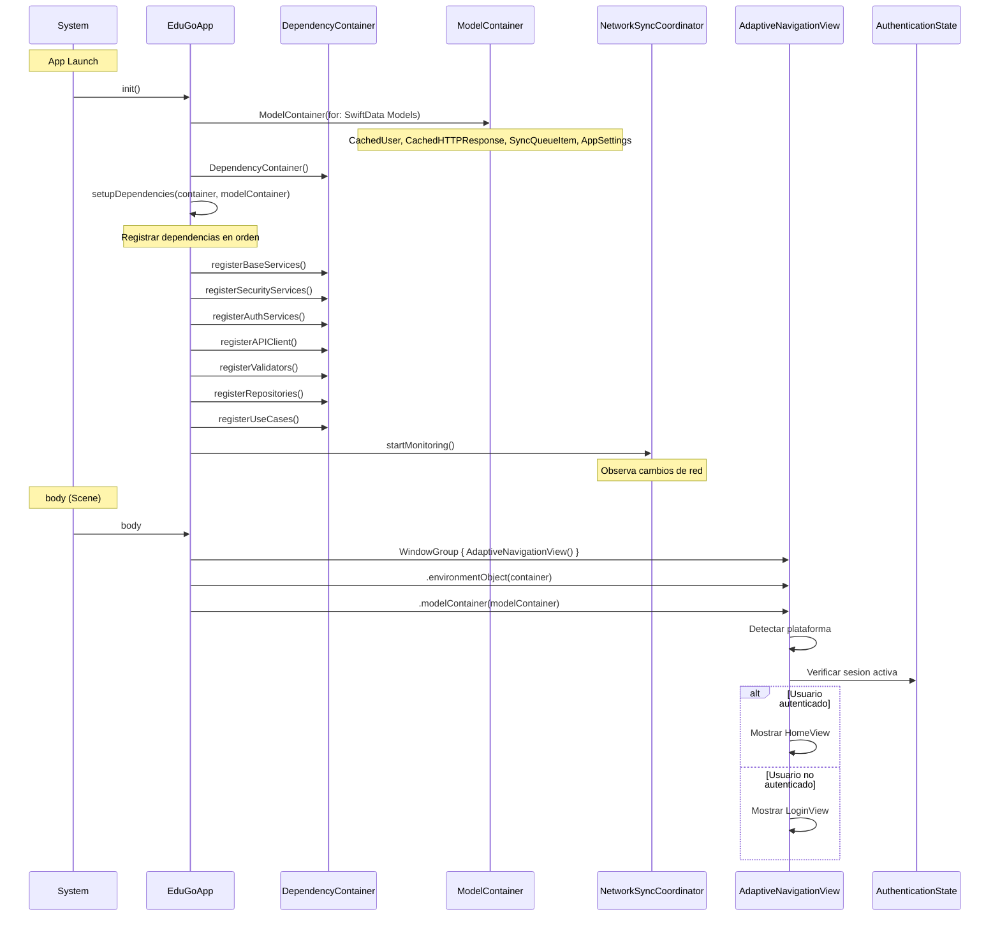

# 03 - Proceso UI Lifecycle

> Documentacion tecnica del ciclo de vida de la UI: App launch, view hierarchy, navigation y state management.

---

## Indice

1. [Vision General](#vision-general)
2. [Diagrama de App Launch](#diagrama-de-app-launch)
3. [Archivos Involucrados](#archivos-involucrados)
4. [App Launch Sequence](#app-launch-sequence)
5. [View Hierarchy](#view-hierarchy)
6. [Navigation Flow](#navigation-flow)
7. [State Management](#state-management)
8. [Dependency Injection](#dependency-injection)
9. [Platform Adaptation](#platform-adaptation)
10. [Como Agregar Nuevas Funcionalidades](#como-agregar-nuevas-funcionalidades)

---

## Vision General

La arquitectura UI de EduGo sigue estos principios:

- **SwiftUI puro** con @Observable (no ObservableObject)
- **@MainActor** para todos los ViewModels
- **Navigation programatica** con NavigationPath
- **State Management** via Environment y @State
- **Platform Adaptation** con SPEC-006 (iPhone, iPad, macOS, visionOS)

### Patron MVVM + Clean Architecture

```
View (SwiftUI)
    |
    v
ViewModel (@Observable @MainActor)
    |
    v
Use Case (Domain)
    |
    v
Repository (Data)
```

---

## Diagrama de App Launch



---

## Archivos Involucrados

### App Entry Point

| Archivo | Ruta Completa | Responsabilidad |
|---------|---------------|-----------------|
| apple_appApp.swift | `/Users/jhoanmedina/source/EduGo/EduUI/apple-app/apple-app/apple_appApp.swift` | Entry point, setup DI, SwiftData |

### Core

| Archivo | Ruta Completa | Responsabilidad |
|---------|---------------|-----------------|
| DependencyContainer.swift | `/Users/jhoanmedina/source/EduGo/EduUI/apple-app/apple-app/Core/DI/DependencyContainer.swift` | Container DI type-safe |
| DependencyScope.swift | `/Users/jhoanmedina/source/EduGo/EduUI/apple-app/apple-app/Core/DI/DependencyScope.swift` | Scopes (singleton, factory) |
| View+Injection.swift | `/Users/jhoanmedina/source/EduGo/EduUI/apple-app/apple-app/Core/Extensions/View+Injection.swift` | Extension para inyeccion en Views |

### Navigation

| Archivo | Ruta Completa | Responsabilidad |
|---------|---------------|-----------------|
| NavigationCoordinator.swift | `/Users/jhoanmedina/source/EduGo/EduUI/apple-app/apple-app/Presentation/Navigation/NavigationCoordinator.swift` | Coordinador de navegacion |
| AuthenticationState.swift | `/Users/jhoanmedina/source/EduGo/EduUI/apple-app/apple-app/Presentation/Navigation/AuthenticationState.swift` | Estado global de auth |
| Route.swift | `/Users/jhoanmedina/source/EduGo/EduUI/apple-app/apple-app/Presentation/Navigation/Route.swift` | Rutas de navegacion |

### Views

| Archivo | Ruta Completa | Responsabilidad |
|---------|---------------|-----------------|
| ContentView.swift | `/Users/jhoanmedina/source/EduGo/EduUI/apple-app/apple-app/ContentView.swift` | Vista principal con offline UI |
| LoginView.swift | `/Users/jhoanmedina/source/EduGo/EduUI/apple-app/apple-app/Presentation/Scenes/Login/LoginView.swift` | Vista de login |
| HomeView.swift | `/Users/jhoanmedina/source/EduGo/EduUI/apple-app/apple-app/Presentation/Scenes/Home/HomeView.swift` | Vista principal post-login |
| SettingsView.swift | `/Users/jhoanmedina/source/EduGo/EduUI/apple-app/apple-app/Presentation/Scenes/Settings/SettingsView.swift` | Vista de configuracion |
| SplashView.swift | `/Users/jhoanmedina/source/EduGo/EduUI/apple-app/apple-app/Presentation/Scenes/Splash/SplashView.swift` | Vista de splash inicial |

### ViewModels

| Archivo | Ruta Completa | Responsabilidad |
|---------|---------------|-----------------|
| LoginViewModel.swift | `/Users/jhoanmedina/source/EduGo/EduUI/apple-app/apple-app/Presentation/Scenes/Login/LoginViewModel.swift` | ViewModel de login |
| HomeViewModel.swift | `/Users/jhoanmedina/source/EduGo/EduUI/apple-app/apple-app/Presentation/Scenes/Home/HomeViewModel.swift` | ViewModel de home |
| SettingsViewModel.swift | `/Users/jhoanmedina/source/EduGo/EduUI/apple-app/apple-app/Presentation/Scenes/Settings/SettingsViewModel.swift` | ViewModel de settings |
| SplashViewModel.swift | `/Users/jhoanmedina/source/EduGo/EduUI/apple-app/apple-app/Presentation/Scenes/Splash/SplashViewModel.swift` | ViewModel de splash |

### Components

| Archivo | Ruta Completa | Responsabilidad |
|---------|---------------|-----------------|
| OfflineBanner.swift | `/Users/jhoanmedina/source/EduGo/EduUI/apple-app/apple-app/Presentation/Components/OfflineBanner.swift` | Banner de estado offline |
| SyncIndicator.swift | `/Users/jhoanmedina/source/EduGo/EduUI/apple-app/apple-app/Presentation/Components/SyncIndicator.swift` | Indicador de sincronizacion |

---

## App Launch Sequence

### 1. Entry Point (EduGoApp)

```swift
// apple_appApp.swift
@main
struct EduGoApp: App {
    @StateObject private var container: DependencyContainer
    private let modelContainer: ModelContainer

    init() {
        // 1. Configurar SwiftData
        do {
            modelContainer = try ModelContainer(
                for: CachedUser.self,
                CachedHTTPResponse.self,
                SyncQueueItem.self,
                AppSettings.self
            )
        } catch {
            fatalError("Failed to create ModelContainer: \(error)")
        }

        // 2. Crear DI container
        let container = DependencyContainer()
        _container = StateObject(wrappedValue: container)

        // 3. Configurar dependencias
        Self.setupDependencies(in: container, modelContainer: modelContainer)

        // 4. Iniciar monitoreo de red
        Task {
            let syncCoordinator = container.resolve(NetworkSyncCoordinator.self)
            await syncCoordinator.startMonitoring()
        }
    }

    var body: some Scene {
        WindowGroup {
            AdaptiveNavigationView()
                .environmentObject(container)
                .modelContainer(modelContainer)
        }
        .commands {
            appCommands
        }
        #if os(macOS)
        .defaultSize(width: 1000, height: 700)
        #endif
    }
}
```

### 2. Orden de Registro de Dependencias

```swift
// apple_appApp.swift
private static func setupDependencies(in container: DependencyContainer, modelContainer: ModelContainer) {
    // 1. Servicios base (sin dependencias externas)
    registerBaseServices(in: container, modelContainer: modelContainer)
    // KeychainService, NetworkMonitor, LocalDataSource, OfflineQueue, ResponseCache

    // 2. Servicios de seguridad (depende de base)
    registerSecurityServices(in: container)
    // CertificatePinner, SecurityValidator

    // 3. Servicios de auth (depende de seguridad)
    registerAuthServices(in: container)
    // JWTDecoder, BiometricAuthService, TokenRefreshCoordinator

    // 4. APIClient (depende de auth y seguridad)
    registerAPIClient(in: container)
    // DefaultAPIClient con interceptores

    // 5. Validadores (independiente)
    registerValidators(in: container)
    // InputValidator

    // 6. Repositorios (depende de APIClient)
    registerRepositories(in: container)
    // AuthRepository, PreferencesRepository

    // 7. Use Cases (depende de repositorios)
    registerUseCases(in: container)
    // LoginUseCase, LogoutUseCase, GetCurrentUserUseCase, etc.
}
```

---

## View Hierarchy

### Estructura de Vistas

```
App
|
+-- WindowGroup
    |
    +-- AdaptiveNavigationView (detecta plataforma)
        |
        +-- (iPhone) TabView
        |   |
        |   +-- HomeView
        |   +-- SettingsView
        |
        +-- (iPad) NavigationSplitView
        |   |
        |   +-- Sidebar
        |   +-- Detail (HomeView o SettingsView)
        |
        +-- (macOS) NavigationSplitView
        |   |
        |   +-- Sidebar (250px)
        |   +-- Detail
        |   +-- Commands (Menu Bar)
        |
        +-- (visionOS) Spatial Layout
            |
            +-- Ornaments (top/bottom)
            +-- 3-column layout
```

### Vista Condicional por Auth State

```swift
// AdaptiveNavigationView.swift (conceptual)
struct AdaptiveNavigationView: View {
    @Environment(AuthenticationState.self) private var authState
    @EnvironmentObject private var container: DependencyContainer

    var body: some View {
        Group {
            if authState.isAuthenticated {
                authenticatedView
            } else {
                LoginView(loginUseCase: container.resolve(LoginUseCase.self))
            }
        }
        .environment(authState)
    }

    @ViewBuilder
    private var authenticatedView: some View {
        switch PlatformCapabilities.recommendedNavigationStyle {
        case .tabs:
            iPhoneLayout
        case .sidebar:
            sidebarLayout
        case .spatial:
            visionOSLayout
        }
    }
}
```

---

## Navigation Flow

### NavigationCoordinator

```swift
// NavigationCoordinator.swift
@Observable
@MainActor
final class NavigationCoordinator {
    var path = NavigationPath()

    func navigate(to route: Route) {
        path.append(route)
    }

    func back() {
        guard !path.isEmpty else { return }
        path.removeLast()
    }

    func popToRoot() {
        path = NavigationPath()
    }

    func replacePath(with route: Route) {
        path = NavigationPath()
        path.append(route)
    }
}
```

### Route Definition

```swift
// Route.swift
enum Route: Hashable {
    case home
    case settings
    case profile
    case materialDetail(id: String)
    case course(id: String)
}
```

### Uso en View

```swift
// En una vista
struct SomeView: View {
    @Environment(NavigationCoordinator.self) private var coordinator

    var body: some View {
        NavigationStack(path: $coordinator.path) {
            // Contenido
        }
        .navigationDestination(for: Route.self) { route in
            switch route {
            case .home:
                HomeView(...)
            case .settings:
                SettingsView(...)
            case .profile:
                ProfileView(...)
            case .materialDetail(let id):
                MaterialDetailView(id: id)
            case .course(let id):
                CourseView(id: id)
            }
        }
    }
}
```

---

## State Management

### AuthenticationState (Global)

```swift
// AuthenticationState.swift
@Observable
@MainActor
final class AuthenticationState {
    var currentUser: User?

    var isAuthenticated: Bool {
        currentUser != nil
    }

    func authenticate(user: User) {
        currentUser = user
    }

    func logout() {
        currentUser = nil
    }
}
```

### ViewModel State Pattern

```swift
// Patron estandar para ViewModels
@Observable
@MainActor
final class SomeViewModel {
    // Estado de la vista
    enum State: Equatable {
        case idle
        case loading
        case success(SomeData)
        case error(String)
    }

    private(set) var state: State = .idle

    // Dependencias
    private let someUseCase: SomeUseCase

    // Init con nonisolated para SwiftUI
    nonisolated init(someUseCase: SomeUseCase) {
        self.someUseCase = someUseCase
    }

    // Acciones
    func loadData() async {
        state = .loading

        let result = await someUseCase.execute()

        switch result {
        case .success(let data):
            state = .success(data)
        case .failure(let error):
            state = .error(error.userMessage)
        }
    }
}
```

### Uso de @State en Views

```swift
// LoginView.swift
struct LoginView: View {
    // ViewModel como @State
    @State private var viewModel: LoginViewModel

    // Estado local de la vista
    @State private var email = ""
    @State private var password = ""

    // Estado global via Environment
    @Environment(AuthenticationState.self) private var authState

    init(loginUseCase: LoginUseCase) {
        self._viewModel = State(initialValue: LoginViewModel(
            loginUseCase: loginUseCase
        ))
    }

    var body: some View {
        // UI que reacciona a viewModel.state
    }
}
```

### Environment vs EnvironmentObject

| Tipo | Uso | Ejemplo |
|------|-----|---------|
| `@Environment` | Valores @Observable | `AuthenticationState`, `NavigationCoordinator` |
| `@EnvironmentObject` | ObservableObject (legacy) | `DependencyContainer` |
| `@State` | Estado local de vista | `email`, `password`, `viewModel` |
| `@Binding` | Two-way binding | `$email` en TextField |

---

## Dependency Injection

### DependencyContainer

```swift
// DependencyContainer.swift
@MainActor
public class DependencyContainer: ObservableObject {
    private var factories: [String: Any] = [:]
    private var singletons: [String: Any] = [:]
    private var scopes: [String: DependencyScope] = [:]

    public func register<T>(
        _ type: T.Type,
        scope: DependencyScope = .factory,
        factory: @escaping () -> T
    ) {
        let key = String(describing: type)
        factories[key] = factory
        scopes[key] = scope
    }

    public func resolve<T>(_ type: T.Type) -> T {
        let key = String(describing: type)

        guard let factory = factories[key] as? () -> T else {
            fatalError("No registro para '\(key)'")
        }

        let scope = scopes[key] ?? .factory

        switch scope {
        case .singleton:
            if let singleton = singletons[key] as? T {
                return singleton
            }
            let instance = factory()
            singletons[key] = instance
            return instance

        case .factory, .transient:
            return factory()
        }
    }
}
```

### DependencyScope

```swift
// DependencyScope.swift
public enum DependencyScope {
    case singleton   // Una instancia compartida
    case factory     // Nueva instancia cada vez
    case transient   // Alias de factory
}
```

### Inyeccion en Views

```swift
// View+Injection.swift
extension View {
    func inject<T>(_ type: T.Type, from container: DependencyContainer) -> T {
        container.resolve(type)
    }
}

// Uso en View
struct MyView: View {
    @EnvironmentObject private var container: DependencyContainer

    var body: some View {
        let useCase = container.resolve(SomeUseCase.self)
        // Usar useCase
    }
}
```

---

## Platform Adaptation

### PlatformCapabilities (SPEC-006)

```swift
// Deteccion de plataforma centralizada
enum PlatformCapabilities {
    static var isIPhone: Bool {
        #if os(iOS)
        return UIDevice.current.userInterfaceIdiom == .phone
        #else
        return false
        #endif
    }

    static var isIPad: Bool {
        #if os(iOS)
        return UIDevice.current.userInterfaceIdiom == .pad
        #else
        return false
        #endif
    }

    static var isMac: Bool {
        #if os(macOS)
        return true
        #else
        return false
        #endif
    }

    static var isVisionOS: Bool {
        #if os(visionOS)
        return true
        #else
        return false
        #endif
    }

    enum NavigationStyle {
        case tabs
        case sidebar
        case spatial
    }

    static var recommendedNavigationStyle: NavigationStyle {
        if isVisionOS { return .spatial }
        if isMac || isIPad { return .sidebar }
        return .tabs
    }
}
```

### Layout por Plataforma

```swift
// iPhone: TabView
struct iPhoneHomeView: View {
    var body: some View {
        TabView {
            HomeTab()
                .tabItem { Label("Inicio", systemImage: "house") }

            SettingsTab()
                .tabItem { Label("Ajustes", systemImage: "gear") }
        }
    }
}

// iPad/macOS: NavigationSplitView
struct SidebarHomeView: View {
    @State private var selection: Route?

    var body: some View {
        NavigationSplitView {
            List(selection: $selection) {
                NavigationLink(value: Route.home) {
                    Label("Inicio", systemImage: "house")
                }
                NavigationLink(value: Route.settings) {
                    Label("Ajustes", systemImage: "gear")
                }
            }
            .navigationSplitViewColumnWidth(ideal: 250)
        } detail: {
            switch selection {
            case .home, .none:
                HomeView(...)
            case .settings:
                SettingsView(...)
            default:
                EmptyView()
            }
        }
    }
}
```

### macOS Commands

```swift
// Menu bar commands para macOS
#if os(macOS)
struct MacOSMenuCommands: Commands {
    var body: some Commands {
        CommandGroup(replacing: .newItem) {
            // Comandos personalizados
        }

        CommandMenu("Navegacion") {
            Button("Inicio") {
                // Navegar a inicio
            }
            .keyboardShortcut("1", modifiers: .command)

            Button("Ajustes") {
                // Navegar a ajustes
            }
            .keyboardShortcut(",", modifiers: .command)
        }
    }
}
#endif
```

---

## Como Agregar Nuevas Funcionalidades

### Agregar Nueva Scene (Pantalla)

1. **Crear View**:
   ```swift
   // Presentation/Scenes/NewFeature/NewFeatureView.swift
   struct NewFeatureView: View {
       @State private var viewModel: NewFeatureViewModel

       init(useCase: NewFeatureUseCase) {
           self._viewModel = State(initialValue: NewFeatureViewModel(useCase: useCase))
       }

       var body: some View {
           // UI
       }
   }
   ```

2. **Crear ViewModel**:
   ```swift
   // Presentation/Scenes/NewFeature/NewFeatureViewModel.swift
   @Observable
   @MainActor
   final class NewFeatureViewModel {
       enum State: Equatable {
           case idle
           case loading
           case success(Data)
           case error(String)
       }

       private(set) var state: State = .idle
       private let useCase: NewFeatureUseCase

       nonisolated init(useCase: NewFeatureUseCase) {
           self.useCase = useCase
       }

       func load() async {
           state = .loading
           let result = await useCase.execute()
           // ...
       }
   }
   ```

3. **Agregar Route**:
   ```swift
   // Route.swift
   enum Route: Hashable {
       // ... existentes
       case newFeature
   }
   ```

4. **Registrar Use Case**:
   ```swift
   // apple_appApp.swift
   container.register(NewFeatureUseCase.self, scope: .factory) {
       DefaultNewFeatureUseCase(repository: container.resolve(SomeRepository.self))
   }
   ```

5. **Agregar a Navigation**:
   ```swift
   .navigationDestination(for: Route.self) { route in
       switch route {
       // ... existentes
       case .newFeature:
           NewFeatureView(useCase: container.resolve(NewFeatureUseCase.self))
       }
   }
   ```

### Agregar Nuevo Estado Global

1. **Crear Estado**:
   ```swift
   // Presentation/Navigation/SomeGlobalState.swift
   @Observable
   @MainActor
   final class SomeGlobalState {
       var someValue: SomeType

       func update(_ value: SomeType) {
           someValue = value
       }
   }
   ```

2. **Inyectar en Scene**:
   ```swift
   // apple_appApp.swift
   var body: some Scene {
       WindowGroup {
           AdaptiveNavigationView()
               .environment(SomeGlobalState())
       }
   }
   ```

3. **Usar en Views**:
   ```swift
   struct MyView: View {
       @Environment(SomeGlobalState.self) private var globalState

       var body: some View {
           Text(globalState.someValue.description)
       }
   }
   ```

### Agregar Soporte para Nueva Plataforma

1. **Actualizar PlatformCapabilities**:
   ```swift
   static var isNewPlatform: Bool {
       #if os(newOS)
       return true
       #else
       return false
       #endif
   }
   ```

2. **Crear Layouts Especificos**:
   ```swift
   #if os(newOS)
   struct NewPlatformHomeView: View {
       var body: some View {
           // Layout especifico
       }
   }
   #endif
   ```

3. **Actualizar AdaptiveNavigationView**:
   ```swift
   @ViewBuilder
   private var authenticatedView: some View {
       #if os(newOS)
       NewPlatformHomeView()
       #elseif os(visionOS)
       VisionOSHomeView()
       // ...
       #endif
   }
   ```

---

## Referencias

- SPEC-006: Platform Optimization
- Swift 6.2: Approachable Concurrency
- SwiftUI App Lifecycle
- Navigation Stack y Path
