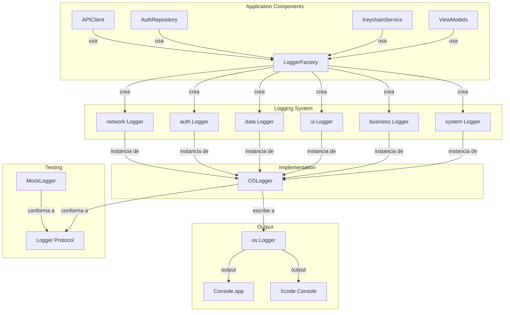

# 04 - Proceso de Logging

> Documentacion tecnica del sistema de logging profesional basado en OSLog.

---

## Indice

1. [Vision General](#vision-general)
2. [Diagrama de Arquitectura](#diagrama-de-arquitectura)
3. [Archivos Involucrados](#archivos-involucrados)
4. [Logger Protocol](#logger-protocol)
5. [OSLogger Implementation](#oslogger-implementation)
6. [LogCategory System](#logcategory-system)
7. [LoggerFactory](#loggerfactory)
8. [Privacy y Redaction](#privacy-y-redaction)
9. [Interceptores con Logging](#interceptores-con-logging)
10. [MockLogger para Testing](#mocklogger-para-testing)
11. [Console.app Integration](#consoleapp-integration)
12. [Como Agregar Nuevo Logging](#como-agregar-nuevo-logging)

---

## Vision General

El sistema de logging de EduGo (SPEC-002) proporciona:

- **OSLog nativo** de Apple con performance < 1ms
- **Categorias semanticas** para filtrado facil
- **Privacy redaction** automatica para datos sensibles
- **6 niveles de severidad**: debug, info, notice, warning, error, critical
- **Integracion con Console.app** para debugging
- **MockLogger** para testing sin efectos secundarios

### Beneficios de OSLog

- Performance optimizado por Apple
- Integracion directa con Console.app
- Filtrado por subsystem y category
- Privacy redaction built-in
- Persistencia inteligente (solo errores en produccion)

---

## Diagrama de Arquitectura



---

## Archivos Involucrados

### Core Logging

| Archivo | Ruta Completa | Responsabilidad |
|---------|---------------|-----------------|
| Logger.swift | `/Users/jhoanmedina/source/EduGo/EduUI/apple-app/apple-app/Core/Logging/Logger.swift` | Protocolo base de logging |
| OSLogger.swift | `/Users/jhoanmedina/source/EduGo/EduUI/apple-app/apple-app/Core/Logging/OSLogger.swift` | Implementacion con OSLog |
| LoggerFactory.swift | `/Users/jhoanmedina/source/EduGo/EduUI/apple-app/apple-app/Core/Logging/LoggerFactory.swift` | Factory de loggers por categoria |
| LogCategory.swift | `/Users/jhoanmedina/source/EduGo/EduUI/apple-app/apple-app/Core/Logging/LogCategory.swift` | Categorias de logging |
| LoggerExtensions.swift | `/Users/jhoanmedina/source/EduGo/EduUI/apple-app/apple-app/Core/Logging/LoggerExtensions.swift` | Extensiones de conveniencia |
| MockLogger.swift | `/Users/jhoanmedina/source/EduGo/EduUI/apple-app/apple-app/Core/Logging/MockLogger.swift` | Mock para testing |

### Interceptores con Logging

| Archivo | Ruta Completa | Responsabilidad |
|---------|---------------|-----------------|
| LoggingInterceptor.swift | `/Users/jhoanmedina/source/EduGo/EduUI/apple-app/apple-app/Data/Network/Interceptors/LoggingInterceptor.swift` | Log de HTTP requests/responses |

### Tests

| Archivo | Ruta Completa | Responsabilidad |
|---------|---------------|-----------------|
| LoggerTests.swift | `/Users/jhoanmedina/source/EduGo/EduUI/apple-app/apple-appTests/Core/LoggingTests/LoggerTests.swift` | Tests del logger |
| PrivacyTests.swift | `/Users/jhoanmedina/source/EduGo/EduUI/apple-app/apple-appTests/Core/LoggingTests/PrivacyTests.swift` | Tests de privacy redaction |

---

## Logger Protocol

### Definicion del Protocolo

```swift
// Logger.swift
/// Protocol para logging estructurado y type-safe
protocol Logger: Sendable {
    /// Log mensaje de debug (solo para desarrollo)
    func debug(
        _ message: String,
        metadata: [String: String]?,
        file: String,
        function: String,
        line: Int
    ) async

    /// Log mensaje informativo
    func info(
        _ message: String,
        metadata: [String: String]?,
        file: String,
        function: String,
        line: Int
    ) async

    /// Log mensaje de notificacion
    func notice(
        _ message: String,
        metadata: [String: String]?,
        file: String,
        function: String,
        line: Int
    ) async

    /// Log advertencia
    func warning(
        _ message: String,
        metadata: [String: String]?,
        file: String,
        function: String,
        line: Int
    ) async

    /// Log error
    func error(
        _ message: String,
        metadata: [String: String]?,
        file: String,
        function: String,
        line: Int
    ) async

    /// Log critico
    func critical(
        _ message: String,
        metadata: [String: String]?,
        file: String,
        function: String,
        line: Int
    ) async
}
```

### Extensiones de Conveniencia

```swift
// Logger.swift
extension Logger {
    /// Log debug con parametros por defecto
    func debug(
        _ message: String,
        metadata: [String: String]? = nil,
        file: String = #file,
        function: String = #function,
        line: Int = #line
    ) async {
        await debug(message, metadata: metadata, file: file, function: function, line: line)
    }

    /// Log info con parametros por defecto
    func info(
        _ message: String,
        metadata: [String: String]? = nil,
        file: String = #file,
        function: String = #function,
        line: Int = #line
    ) async {
        await info(message, metadata: metadata, file: file, function: function, line: line)
    }

    // ... similar para notice, warning, error, critical
}
```

---

## OSLogger Implementation

```swift
// OSLogger.swift
/// Implementation de Logger usando OSLog
///
/// EXCEPCION DE CONCURRENCIA DOCUMENTADA:
/// os.Logger es thread-safe internamente segun Apple.
/// Referencia: https://developer.apple.com/documentation/os/logger
final class OSLogger: Logger, @unchecked Sendable {
    private let logger: os.Logger
    private let category: LogCategory

    init(subsystem: String, category: LogCategory) {
        self.logger = os.Logger(subsystem: subsystem, category: category.rawValue)
        self.category = category
    }

    func debug(
        _ message: String,
        metadata: [String: String]?,
        file: String,
        function: String,
        line: Int
    ) {
        #if DEBUG
        let formattedMessage = formatMessage(message, metadata: metadata, file: file, function: function, line: line)
        logger.debug("\(formattedMessage)")
        #endif
    }

    func info(
        _ message: String,
        metadata: [String: String]?,
        file: String,
        function: String,
        line: Int
    ) {
        let formattedMessage = formatMessage(message, metadata: metadata, file: file, function: function, line: line)
        logger.info("\(formattedMessage)")
    }

    func notice(
        _ message: String,
        metadata: [String: String]?,
        file: String,
        function: String,
        line: Int
    ) {
        let formattedMessage = formatMessage(message, metadata: metadata, file: file, function: function, line: line)
        logger.notice("\(formattedMessage)")
    }

    func warning(
        _ message: String,
        metadata: [String: String]?,
        file: String,
        function: String,
        line: Int
    ) {
        let formattedMessage = formatMessage(message, metadata: metadata, file: file, function: function, line: line)
        logger.warning("\(formattedMessage)")
    }

    func error(
        _ message: String,
        metadata: [String: String]?,
        file: String,
        function: String,
        line: Int
    ) {
        let formattedMessage = formatMessage(message, metadata: metadata, file: file, function: function, line: line)
        logger.error("\(formattedMessage)")
    }

    func critical(
        _ message: String,
        metadata: [String: String]?,
        file: String,
        function: String,
        line: Int
    ) {
        let formattedMessage = formatMessage(message, metadata: metadata, file: file, function: function, line: line)
        logger.critical("\(formattedMessage)")
    }

    private func formatMessage(
        _ message: String,
        metadata: [String: String]?,
        file: String,
        function: String,
        line: Int
    ) -> String {
        let filename = (file as NSString).lastPathComponent
        var formatted = "[\(filename):\(line)] \(function) - \(message)"

        if let metadata = metadata, !metadata.isEmpty {
            let metadataString = metadata
                .sorted(by: { $0.key < $1.key })
                .map { "\($0.key)=\($0.value)" }
                .joined(separator: ", ")
            formatted += " | \(metadataString)"
        }

        return formatted
    }
}
```

---

## LogCategory System

### Categorias Disponibles

```swift
// LogCategory.swift
/// Categorias de logging para organizar y filtrar logs
enum LogCategory: String, Sendable {
    /// Logs de networking (HTTP requests, responses, errors)
    /// Ejemplos:
    /// - "Request started: GET /api/users"
    /// - "Response received: 200 OK"
    /// - "Network error: timeout"
    case network

    /// Logs de autenticacion y autorizacion
    /// Ejemplos:
    /// - "Login attempt started"
    /// - "Token refreshed successfully"
    /// - "Biometric authentication failed"
    case auth

    /// Logs de persistencia (Keychain, UserDefaults, Database)
    /// Ejemplos:
    /// - "Token saved to Keychain"
    /// - "Preferences updated"
    /// - "Database migration completed"
    case data

    /// Logs de UI y user interactions
    /// Ejemplos:
    /// - "LoginView appeared"
    /// - "Button tapped: Login"
    /// - "Navigation: Home -> Settings"
    case ui

    /// Logs de business logic (Use Cases)
    /// Ejemplos:
    /// - "LoginUseCase: Validating input"
    /// - "GetUserUseCase: Fetching user data"
    /// - "UpdateThemeUseCase: Theme changed"
    case business

    /// Logs del sistema (App lifecycle, memory, crashes)
    /// Ejemplos:
    /// - "App launched"
    /// - "Memory warning received"
    /// - "App entering background"
    case system
}
```

### Uso Recomendado por Categoria

| Categoria | Usar En | Ejemplos |
|-----------|---------|----------|
| `network` | APIClient, NetworkService | Request/response, errores de red |
| `auth` | AuthRepository, BiometricService, TokenManager | Login, logout, refresh |
| `data` | KeychainService, UserDefaults, SwiftData | Save, get, delete |
| `ui` | Views, ViewModels, NavigationCoordinator | Lifecycle, user actions |
| `business` | Use Cases | Logica de negocio |
| `system` | App lifecycle, memory | Launch, background, warnings |

---

## LoggerFactory

```swift
// LoggerFactory.swift
/// Factory para crear loggers pre-configurados por categoria
enum LoggerFactory {
    /// Identificador del subsystem (bundle identifier)
    private static let subsystem = Bundle.main.bundleIdentifier ?? "com.edugo.apple-app"

    // MARK: - Pre-configured Loggers

    /// Logger para networking
    static let network: Logger = make(category: .network)

    /// Logger para autenticacion
    static let auth: Logger = make(category: .auth)

    /// Logger para persistencia
    static let data: Logger = make(category: .data)

    /// Logger para UI
    static let ui: Logger = make(category: .ui)

    /// Logger para business logic
    static let business: Logger = make(category: .business)

    /// Logger para sistema
    static let system: Logger = make(category: .system)

    // MARK: - Factory Method

    private static func make(category: LogCategory) -> Logger {
        OSLogger(subsystem: subsystem, category: category)
    }
}
```

### Uso en Componentes

```swift
// AuthRepositoryImpl.swift
@MainActor
final class AuthRepositoryImpl: AuthRepository {
    private let logger = LoggerFactory.auth

    func login(email: String, password: String) async -> Result<User, AppError> {
        await logger.info("Login attempt started")
        await logger.logEmail(email)  // Privacy redaction

        // ... implementacion

        await logger.info("Login successful", metadata: ["userId": user.id])
    }
}

// APIClient.swift
@MainActor
final class DefaultAPIClient: APIClient {
    private let logger: any Logger

    init(logger: any Logger = LoggerFactory.network) {
        self.logger = logger
    }

    func execute<T: Decodable>(...) async throws -> T {
        await logger.debug("Request started", metadata: ["url": url.absoluteString])
        // ...
    }
}

// KeychainService.swift
final class DefaultKeychainService: KeychainService {
    private let logger = LoggerFactory.data

    func saveToken(_ token: String, for key: String) async throws {
        await logger.debug("Saving token to Keychain", metadata: ["key": key])
        // ...
        await logger.info("Token saved successfully", metadata: ["key": key])
    }
}
```

---

## Privacy y Redaction

### Extensiones de Privacidad

```swift
// LoggerExtensions.swift
extension Logger {
    /// Log email con redaccion parcial
    func logEmail(_ email: String) async {
        let redacted = redactEmail(email)
        await info("Email", metadata: ["email": redacted])
    }

    /// Log token con redaccion
    func logToken(_ token: String) async {
        let redacted = "\(token.prefix(10))..."
        await debug("Token", metadata: ["token": redacted])
    }

    /// Log user ID (sin redaccion, es ID no PII)
    func logUserId(_ userId: String) async {
        await info("User", metadata: ["userId": userId])
    }

    private func redactEmail(_ email: String) -> String {
        guard let atIndex = email.firstIndex(of: "@") else {
            return "***"
        }

        let localPart = email[..<atIndex]
        let domain = email[atIndex...]

        if localPart.count <= 2 {
            return "**\(domain)"
        }

        let visibleChars = localPart.prefix(2)
        let hiddenCount = localPart.count - 2
        return "\(visibleChars)\(String(repeating: "*", count: hiddenCount))\(domain)"
    }
}
```

### Niveles de Privacidad OSLog

| Nivel | Visibilidad | Uso |
|-------|-------------|-----|
| `.public` | Siempre visible | IDs, status codes |
| `.private` | Redactado por defecto | Emails, nombres |
| `.sensitive` | Siempre redactado | Passwords, tokens |

### Ejemplo de Uso

```swift
// Datos publicos (no PII)
await logger.info("Request completed", metadata: [
    "statusCode": "200",        // Publico
    "endpoint": "/api/users"    // Publico
])

// Datos privados (usar helper)
await logger.logEmail(user.email)  // Redactado: "jo***@email.com"

// NUNCA loggear
// - Passwords
// - Tokens completos
// - Datos de tarjeta
// - Ubicacion precisa
```

---

## Interceptores con Logging

### LoggingInterceptor

```swift
// LoggingInterceptor.swift
@MainActor
final class LoggingInterceptor: RequestInterceptor, ResponseInterceptor {
    private let logger = LoggerFactory.network

    // MARK: - RequestInterceptor

    func intercept(_ request: URLRequest) async throws -> URLRequest {
        guard let url = request.url else { return request }

        await logger.info("HTTP Request", metadata: [
            "method": request.httpMethod ?? "GET",
            "url": url.absoluteString,
            "path": url.path
        ])

        return request
    }

    // MARK: - ResponseInterceptor

    func intercept(_ response: HTTPURLResponse, data: Data) async throws -> Data {
        guard let url = response.url else { return data }

        let statusCode = response.statusCode

        switch statusCode {
        case 200..<300:
            await logger.info("HTTP Response", metadata: [
                "url": url.path,
                "status": statusCode.description,
                "size": data.count.description
            ])
        case 400..<500:
            await logger.warning("HTTP Response - Client Error", metadata: [
                "url": url.path,
                "status": statusCode.description
            ])
        case 500..<600:
            await logger.error("HTTP Response - Server Error", metadata: [
                "url": url.path,
                "status": statusCode.description
            ])
        default:
            await logger.debug("HTTP Response", metadata: [
                "url": url.path,
                "status": statusCode.description
            ])
        }

        return data
    }
}
```

---

## MockLogger para Testing

```swift
// MockLogger.swift
/// Mock logger para testing sin efectos secundarios
actor MockLogger: Logger {
    struct LogEntry: Equatable {
        let level: LogLevel
        let message: String
        let metadata: [String: String]?
        let file: String
        let function: String
        let line: Int
    }

    enum LogLevel: String {
        case debug, info, notice, warning, error, critical
    }

    private(set) var entries: [LogEntry] = []

    func debug(_ message: String, metadata: [String: String]?, file: String, function: String, line: Int) async {
        entries.append(LogEntry(level: .debug, message: message, metadata: metadata, file: file, function: function, line: line))
    }

    func info(_ message: String, metadata: [String: String]?, file: String, function: String, line: Int) async {
        entries.append(LogEntry(level: .info, message: message, metadata: metadata, file: file, function: function, line: line))
    }

    func notice(_ message: String, metadata: [String: String]?, file: String, function: String, line: Int) async {
        entries.append(LogEntry(level: .notice, message: message, metadata: metadata, file: file, function: function, line: line))
    }

    func warning(_ message: String, metadata: [String: String]?, file: String, function: String, line: Int) async {
        entries.append(LogEntry(level: .warning, message: message, metadata: metadata, file: file, function: function, line: line))
    }

    func error(_ message: String, metadata: [String: String]?, file: String, function: String, line: Int) async {
        entries.append(LogEntry(level: .error, message: message, metadata: metadata, file: file, function: function, line: line))
    }

    func critical(_ message: String, metadata: [String: String]?, file: String, function: String, line: Int) async {
        entries.append(LogEntry(level: .critical, message: message, metadata: metadata, file: file, function: function, line: line))
    }

    // Helpers para tests
    func reset() {
        entries.removeAll()
    }

    func hasEntry(level: LogLevel, containing message: String) -> Bool {
        entries.contains { $0.level == level && $0.message.contains(message) }
    }

    func entriesCount(for level: LogLevel) -> Int {
        entries.filter { $0.level == level }.count
    }
}
```

### Uso en Tests

```swift
@Test("Login logs attempt and success")
func testLoginLogging() async {
    let mockLogger = MockLogger()
    let sut = AuthRepositoryImpl(logger: mockLogger, ...)

    _ = await sut.login(email: "test@test.com", password: "123456")

    #expect(await mockLogger.hasEntry(level: .info, containing: "Login attempt"))
    #expect(await mockLogger.hasEntry(level: .info, containing: "Login successful"))
}
```

---

## Console.app Integration

### Filtrado en Console.app

```
# Filtrar por subsystem (todos los logs de la app)
subsystem:com.edugo.apple-app

# Filtrar por categoria
subsystem:com.edugo.apple-app AND category:network
subsystem:com.edugo.apple-app AND category:auth

# Filtrar por nivel
subsystem:com.edugo.apple-app AND level:error
subsystem:com.edugo.apple-app AND level:fault

# Combinaciones
subsystem:com.edugo.apple-app AND category:auth AND level:error
```

### Pasos para Debug con Console.app

1. Abrir Console.app
2. Seleccionar dispositivo (Mac o dispositivo conectado)
3. En la barra de busqueda, escribir: `subsystem:com.edugo.apple-app`
4. Filtrar por categoria si es necesario: `AND category:network`
5. Usar los filtros de nivel (Info, Debug, Error, Fault)

### Niveles de Persistencia

| Nivel | Persistencia | Visible por Defecto |
|-------|--------------|---------------------|
| debug | Solo durante sesion | No (requiere configurar) |
| info | Corto plazo | Si |
| notice | Largo plazo | Si |
| warning | Largo plazo | Si |
| error | Persistente | Si |
| critical (fault) | Persistente + stacktrace | Si |

---

## Como Agregar Nuevo Logging

### 1. Agregar Nueva Categoria

```swift
// LogCategory.swift
enum LogCategory: String, Sendable {
    // ... existentes
    case analytics    // Nueva categoria
    case performance  // Nueva categoria
}
```

### 2. Agregar Logger en Factory

```swift
// LoggerFactory.swift
enum LoggerFactory {
    // ... existentes
    static let analytics: Logger = make(category: .analytics)
    static let performance: Logger = make(category: .performance)
}
```

### 3. Usar en Componente

```swift
// AnalyticsService.swift
final class AnalyticsService {
    private let logger = LoggerFactory.analytics

    func trackEvent(_ name: String, properties: [String: Any]) async {
        await logger.info("Event tracked", metadata: [
            "name": name,
            "count": properties.count.description
        ])
    }
}
```

### 4. Agregar Extension de Privacidad (si necesario)

```swift
// LoggerExtensions.swift
extension Logger {
    func logAnalyticsEvent(_ name: String) async {
        // Redactar si contiene PII
        await info("Analytics", metadata: ["event": name])
    }
}
```

### 5. Agregar Tests

```swift
// AnalyticsLoggingTests.swift
@Test("Analytics logs events correctly")
func testAnalyticsLogging() async {
    let mockLogger = MockLogger()
    let sut = AnalyticsService(logger: mockLogger)

    await sut.trackEvent("button_tap", properties: ["screen": "home"])

    #expect(await mockLogger.hasEntry(level: .info, containing: "Event tracked"))
}
```

---

## Best Practices

### Que Loggear

| Si Loggear | No Loggear |
|------------|------------|
| Inicio de operaciones | Passwords |
| Fin de operaciones (exito/error) | Tokens completos |
| Errores con contexto | Datos de tarjeta |
| IDs de recursos | PII sin redaccion |
| Metricas de performance | Datos sensibles de salud |

### Niveles Recomendados

| Situacion | Nivel |
|-----------|-------|
| Debugging detallado | debug |
| Operaciones normales | info |
| Eventos significativos | notice |
| Potenciales problemas | warning |
| Errores recuperables | error |
| Fallos criticos | critical |

### Formato de Metadata

```swift
// Bien: Claves claras, valores simples
await logger.info("Request", metadata: [
    "method": "POST",
    "url": "/api/users",
    "status": "200"
])

// Mal: Claves ambiguas, valores complejos
await logger.info("Request", metadata: [
    "m": "POST",
    "data": jsonString  // Demasiado largo
])
```

---

## Referencias

- SPEC-002: Professional Logging System
- Apple OSLog Documentation
- WWDC 2020: Explore Logging in Swift
