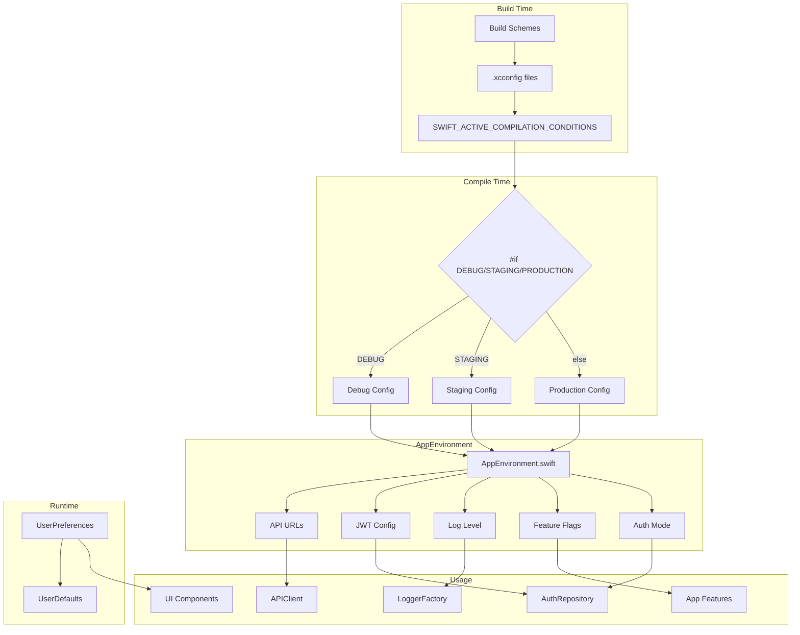

# 05 - Proceso de Configuracion

> Documentacion tecnica del sistema de configuracion: ambientes, feature flags, preferencias y build schemes.

---

## Indice

1. [Vision General](#vision-general)
2. [Diagrama de Configuracion](#diagrama-de-configuracion)
3. [Archivos Involucrados](#archivos-involucrados)
4. [Environment Configuration](#environment-configuration)
5. [Feature Flags Compile-Time](#feature-flags-compile-time)
6. [User Preferences](#user-preferences)
7. [Build Schemes](#build-schemes)
8. [JWT Configuration](#jwt-configuration)
9. [API URLs del Ecosistema](#api-urls-del-ecosistema)
10. [Como Agregar Nueva Configuracion](#como-agregar-nueva-configuracion)

---

## Vision General

El sistema de configuracion de EduGo (SPEC-001) usa un enfoque moderno con:

- **Conditional Compilation** (#if DEBUG, STAGING, PRODUCTION)
- **Constantes compile-time** (type-safe, sin runtime overhead)
- **SWIFT_ACTIVE_COMPILATION_CONDITIONS** en .xcconfig
- **Sin crashes por variables faltantes**

### Beneficios del Approach Moderno

| Caracteristica | Beneficio |
|----------------|-----------|
| Type-safe | Errores en compile-time |
| Sin runtime overhead | Performance optimo |
| Funciona en todos los contextos | CI/CD, TestFlight, desarrollo |
| Facil de debuggear | Valores hardcoded, predecibles |

---

## Diagrama de Configuracion



---

## Archivos Involucrados

### Configuracion de Ambiente

| Archivo | Ruta Completa | Responsabilidad |
|---------|---------------|-----------------|
| Environment.swift | `/Users/jhoanmedina/source/EduGo/EduUI/apple-app/apple-app/App/Environment.swift` | Configuracion principal de ambientes |

### Preferencias de Usuario

| Archivo | Ruta Completa | Responsabilidad |
|---------|---------------|-----------------|
| UserPreferences.swift | `/Users/jhoanmedina/source/EduGo/EduUI/apple-app/apple-app/Domain/Entities/UserPreferences.swift` | Modelo de preferencias |
| Theme.swift | `/Users/jhoanmedina/source/EduGo/EduUI/apple-app/apple-app/Domain/Entities/Theme.swift` | Enum de temas |
| Language.swift | `/Users/jhoanmedina/source/EduGo/EduUI/apple-app/apple-app/Domain/Entities/Language.swift` | Enum de idiomas |
| PreferencesRepository.swift | `/Users/jhoanmedina/source/EduGo/EduUI/apple-app/apple-app/Domain/Repositories/PreferencesRepository.swift` | Protocolo de preferencias |
| PreferencesRepositoryImpl.swift | `/Users/jhoanmedina/source/EduGo/EduUI/apple-app/apple-app/Data/Repositories/PreferencesRepositoryImpl.swift` | Implementacion |

### Token Configuration

| Archivo | Ruta Completa | Responsabilidad |
|---------|---------------|-----------------|
| TokenInfo.swift | `/Users/jhoanmedina/source/EduGo/EduUI/apple-app/apple-app/Domain/Models/Auth/TokenInfo.swift` | Modelo de tokens con config |

### Tests

| Archivo | Ruta Completa | Responsabilidad |
|---------|---------------|-----------------|
| EnvironmentTests.swift | `/Users/jhoanmedina/source/EduGo/EduUI/apple-app/apple-appTests/Core/EnvironmentTests.swift` | Tests de configuracion |
| UserPreferencesTests.swift | `/Users/jhoanmedina/source/EduGo/EduUI/apple-app/apple-appTests/DomainTests/UserPreferencesTests.swift` | Tests de preferencias |

---

## Environment Configuration

### AppEnvironment Enum

```swift
// Environment.swift
enum AppEnvironment {
    // MARK: - Environment Type

    enum EnvironmentType: String, Sendable, CaseIterable {
        case development = "Development"
        case staging = "Staging"
        case production = "Production"

        var displayName: String { rawValue }
        var isProduction: Bool { self == .production }
        var isDevelopment: Bool { self == .development }
        var isStaging: Bool { self == .staging }
    }

    // MARK: - Current Environment (Compile-Time)

    static var current: EnvironmentType {
        #if DEBUG
        return .development
        #elseif STAGING
        return .staging
        #else
        return .production
        #endif
    }

    // MARK: - Convenience Properties

    static var isProduction: Bool { current.isProduction }
    static var isDevelopment: Bool { current.isDevelopment }
    static var isStaging: Bool { current.isStaging }
    static var displayName: String { current.displayName }
}
```

### Log Level Configuration

```swift
// Environment.swift
enum LogLevel: String, Sendable, CaseIterable {
    case debug, info, notice, warning, error, critical

    var osLogType: OSLogType {
        switch self {
        case .debug: return .debug
        case .info: return .info
        case .notice: return .default
        case .warning: return .default
        case .error: return .error
        case .critical: return .fault
        }
    }
}

static var logLevel: LogLevel {
    #if DEBUG
    return .debug       // Desarrollo: maximo detalle
    #elseif STAGING
    return .info        // Staging: info y superior
    #else
    return .warning     // Produccion: solo problemas
    #endif
}
```

---

## Feature Flags Compile-Time

### Flags Actuales

```swift
// Environment.swift
/// Analytics habilitado
static var analyticsEnabled: Bool {
    #if DEBUG
    return false    // Desarrollo: deshabilitado
    #elseif STAGING
    return true     // Staging: habilitado para testing
    #else
    return true     // Produccion: habilitado
    #endif
}

/// Crashlytics habilitado
static var crashlyticsEnabled: Bool {
    #if DEBUG
    return false
    #elseif STAGING
    return true
    #else
    return true
    #endif
}
```

### Authentication Mode

```swift
// Environment.swift
enum AuthenticationMode: Sendable, Equatable {
    case dummyJSON  // DummyJSON API (desarrollo/testing)
    case realAPI    // API Real EduGo (staging/production)
}

static var authMode: AuthenticationMode {
    #if DEBUG
    return .realAPI    // Desarrollo: API real centralizada
    #elseif STAGING
    return .realAPI
    #else
    return .realAPI
    #endif
}
```

### Uso de Feature Flags

```swift
// En cualquier componente
if AppEnvironment.analyticsEnabled {
    analyticsService.trackEvent("login_success")
}

if AppEnvironment.crashlyticsEnabled {
    Crashlytics.configure()
}

// Conditional compilation para codigo completo
#if DEBUG
Button("Debug Info") {
    AppEnvironment.printDebugInfo()
}
#endif
```

---

## User Preferences

### Modelo de Preferencias

```swift
// UserPreferences.swift
struct UserPreferences: Codable, Equatable, Sendable {
    /// Tema de apariencia seleccionado
    var theme: Theme

    /// Codigo de idioma (ej: "es", "en")
    var language: String

    /// Autenticacion biometrica habilitada
    var biometricsEnabled: Bool

    /// Configuracion por defecto
    static let `default` = UserPreferences(
        theme: .system,
        language: "es",
        biometricsEnabled: false
    )

    /// Helper para obtener idioma como enum
    var languageEnum: Language {
        Language(rawValue: language) ?? .default
    }
}
```

### Theme Enum

```swift
// Theme.swift
enum Theme: String, Codable, CaseIterable, Sendable {
    case light
    case dark
    case system

    var displayName: String {
        switch self {
        case .light: return "Claro"
        case .dark: return "Oscuro"
        case .system: return "Sistema"
        }
    }

    var colorScheme: ColorScheme? {
        switch self {
        case .light: return .light
        case .dark: return .dark
        case .system: return nil
        }
    }
}
```

### Language Enum

```swift
// Language.swift
enum Language: String, Codable, CaseIterable, Sendable {
    case spanish = "es"
    case english = "en"

    static let `default`: Language = .spanish

    var displayName: String {
        switch self {
        case .spanish: return "Espanol"
        case .english: return "English"
        }
    }

    var locale: Locale {
        Locale(identifier: rawValue)
    }
}
```

### PreferencesRepository

```swift
// PreferencesRepository.swift
@MainActor
protocol PreferencesRepository: Sendable {
    func getPreferences() async -> UserPreferences
    func updatePreferences(_ preferences: UserPreferences) async -> Result<Void, AppError>
    func updateTheme(_ theme: Theme) async -> Result<Void, AppError>
    func updateLanguage(_ language: String) async -> Result<Void, AppError>
    func setBiometricsEnabled(_ enabled: Bool) async -> Result<Void, AppError>
    func resetToDefaults() async -> Result<Void, AppError>
}

// PreferencesRepositoryImpl.swift
@MainActor
final class PreferencesRepositoryImpl: PreferencesRepository {
    private let userDefaults: UserDefaults
    private let preferencesKey = "user_preferences"

    init(userDefaults: UserDefaults = .standard) {
        self.userDefaults = userDefaults
    }

    func getPreferences() async -> UserPreferences {
        guard let data = userDefaults.data(forKey: preferencesKey),
              let preferences = try? JSONDecoder().decode(UserPreferences.self, from: data) else {
            return .default
        }
        return preferences
    }

    func updatePreferences(_ preferences: UserPreferences) async -> Result<Void, AppError> {
        do {
            let data = try JSONEncoder().encode(preferences)
            userDefaults.set(data, forKey: preferencesKey)
            return .success(())
        } catch {
            return .failure(.system(.unknown))
        }
    }

    // ... otros metodos
}
```

---

## Build Schemes

### Esquemas Disponibles

| Scheme | Ambiente | Uso |
|--------|----------|-----|
| apple-app (Debug) | Development | Desarrollo local |
| apple-app (Staging) | Staging | Testing pre-produccion |
| apple-app (Release) | Production | App Store / TestFlight |

### Configuracion en .xcconfig

```xcconfig
// Debug.xcconfig
SWIFT_ACTIVE_COMPILATION_CONDITIONS = DEBUG
OTHER_SWIFT_FLAGS = -DDEBUG

// Staging.xcconfig
SWIFT_ACTIVE_COMPILATION_CONDITIONS = STAGING
OTHER_SWIFT_FLAGS = -DSTAGING

// Release.xcconfig
// Sin flags especiales = Production por defecto
```

### Seleccion de Scheme en Xcode

1. En Xcode, seleccionar **Product > Scheme > Edit Scheme**
2. En **Build Configuration**, seleccionar:
   - `Debug` para desarrollo
   - `Staging` para staging
   - `Release` para produccion
3. Las configuraciones se aplican automaticamente via `#if`

---

## JWT Configuration

```swift
// Environment.swift
/// Issuer esperado en tokens JWT
static var jwtIssuer: String {
    "edugo-central"
}

/// Duracion del access token (15 minutos)
static var accessTokenDuration: TimeInterval {
    15 * 60
}

/// Tiempo antes de expiracion para refresh automatico (2 minutos)
static var tokenRefreshThreshold: TimeInterval {
    2 * 60
}
```

### Uso en TokenInfo

```swift
// TokenInfo.swift
struct TokenInfo {
    /// Indica si el token necesita refresh
    var shouldRefresh: Bool {
        let threshold = AppEnvironment.tokenRefreshThreshold
        return Date() >= expiresAt.addingTimeInterval(-threshold)
    }

    /// Porcentaje de vida util restante
    var remainingLifePercentage: Double {
        guard !isExpired else { return 0.0 }
        let totalLife = AppEnvironment.accessTokenDuration
        let remaining = timeRemaining
        return max(0.0, min(1.0, remaining / totalLife))
    }
}
```

---

## API URLs del Ecosistema

### URLs por Servicio

```swift
// Environment.swift
/// URL base para autenticacion (api-admin)
/// Endpoints: /v1/auth/login, /v1/auth/refresh, /v1/auth/logout
static var authAPIBaseURL: URL {
    #if DEBUG
    return makeURL("http://localhost:8081")
    #elseif STAGING
    return makeURL("https://staging-api-admin.edugo.com")
    #else
    return makeURL("https://api-admin.edugo.com")
    #endif
}

/// URL base para API movil (api-mobile)
/// Endpoints: /v1/materials, /v1/progress
static var mobileAPIBaseURL: URL {
    #if DEBUG
    return makeURL("http://localhost:9091")
    #elseif STAGING
    return makeURL("https://staging-api-mobile.edugo.com")
    #else
    return makeURL("https://api-mobile.edugo.com")
    #endif
}

/// URL base para administracion (api-admin)
/// Endpoints: /v1/schools, /v1/units
static var adminAPIBaseURL: URL {
    #if DEBUG
    return makeURL("http://localhost:8081")
    #elseif STAGING
    return makeURL("https://staging-api-admin.edugo.com")
    #else
    return makeURL("https://api-admin.edugo.com")
    #endif
}
```

### Timeout Configuration

```swift
// Environment.swift
static var apiTimeout: TimeInterval {
    #if DEBUG
    return 60   // Desarrollo: permite debugging
    #elseif STAGING
    return 45   // Staging
    #else
    return 30   // Produccion
    #endif
}
```

### Debug Info Helper

```swift
// Environment.swift
static func printDebugInfo() {
    #if DEBUG
    print("""

    EduGo Environment Configuration
    ================================================
    Environment:      \(current.rawValue)

    API URLs:
    - Auth API:       \(authAPIBaseURL.absoluteString)
    - Mobile API:     \(mobileAPIBaseURL.absoluteString)
    - Admin API:      \(adminAPIBaseURL.absoluteString)

    JWT Configuration:
    - Issuer:         \(jwtIssuer)
    - Token Duration: \(Int(accessTokenDuration / 60)) min
    - Refresh at:     \(Int(tokenRefreshThreshold / 60)) min before expiry

    Settings:
    - Timeout:        \(Int(apiTimeout))s
    - Log Level:      \(logLevel.rawValue)
    - Auth Mode:      \(authMode == .dummyJSON ? "DummyJSON" : "Real API")
    - Analytics:      \(analyticsEnabled ? "Enabled" : "Disabled")
    - Crashlytics:    \(crashlyticsEnabled ? "Enabled" : "Disabled")
    ================================================

    """)
    #endif
}
```

---

## Como Agregar Nueva Configuracion

### 1. Agregar Variable de Ambiente

```swift
// Environment.swift
/// Nueva configuracion
static var newFeatureEnabled: Bool {
    #if DEBUG
    return true     // Habilitado en desarrollo
    #elseif STAGING
    return true     // Habilitado en staging
    #else
    return false    // Deshabilitado en produccion (feature flag)
    #endif
}
```

### 2. Agregar Nueva URL

```swift
// Environment.swift
/// URL para nuevo servicio
static var newServiceBaseURL: URL {
    #if DEBUG
    return makeURL("http://localhost:8082")
    #elseif STAGING
    return makeURL("https://staging-new-service.edugo.com")
    #else
    return makeURL("https://new-service.edugo.com")
    #endif
}
```

### 3. Agregar Nueva Preferencia de Usuario

1. **Agregar propiedad a UserPreferences**:
   ```swift
   // UserPreferences.swift
   struct UserPreferences {
       // ... existentes
       var notificationsEnabled: Bool

       static let `default` = UserPreferences(
           // ... existentes
           notificationsEnabled: true
       )
   }
   ```

2. **Agregar metodo al repositorio**:
   ```swift
   // PreferencesRepository.swift
   func setNotificationsEnabled(_ enabled: Bool) async -> Result<Void, AppError>

   // PreferencesRepositoryImpl.swift
   func setNotificationsEnabled(_ enabled: Bool) async -> Result<Void, AppError> {
       var preferences = await getPreferences()
       preferences.notificationsEnabled = enabled
       return await updatePreferences(preferences)
   }
   ```

3. **Agregar Use Case (opcional)**:
   ```swift
   // UpdateNotificationsUseCase.swift
   @MainActor
   protocol UpdateNotificationsUseCase: Sendable {
       func execute(enabled: Bool) async -> Result<Void, AppError>
   }
   ```

### 4. Agregar Nuevo Enum de Configuracion

```swift
// En nuevo archivo o existente
enum NotificationFrequency: String, Codable, CaseIterable, Sendable {
    case realTime = "real_time"
    case hourly = "hourly"
    case daily = "daily"
    case weekly = "weekly"

    var displayName: String {
        switch self {
        case .realTime: return "Tiempo real"
        case .hourly: return "Cada hora"
        case .daily: return "Diario"
        case .weekly: return "Semanal"
        }
    }
}
```

### 5. Agregar Tests

```swift
// EnvironmentTests.swift
@Test("New feature flag is correct for environment")
func testNewFeatureFlag() {
    #if DEBUG
    #expect(AppEnvironment.newFeatureEnabled == true)
    #else
    #expect(AppEnvironment.newFeatureEnabled == false)
    #endif
}

// UserPreferencesTests.swift
@Test("Default notifications is enabled")
func testDefaultNotifications() {
    let prefs = UserPreferences.default
    #expect(prefs.notificationsEnabled == true)
}
```

---

## Matriz de Configuracion por Ambiente

| Configuracion | Development | Staging | Production |
|---------------|-------------|---------|------------|
| authAPIBaseURL | localhost:8081 | staging-api-admin | api-admin |
| mobileAPIBaseURL | localhost:9091 | staging-api-mobile | api-mobile |
| apiTimeout | 60s | 45s | 30s |
| logLevel | debug | info | warning |
| authMode | realAPI | realAPI | realAPI |
| analyticsEnabled | false | true | true |
| crashlyticsEnabled | false | true | true |
| jwtIssuer | edugo-central | edugo-central | edugo-central |
| tokenRefreshThreshold | 2 min | 2 min | 2 min |

---

## Referencias

- SPEC-001: Environment Configuration System
- Sprint 2: Ecosistema EduGo URLs
- Xcode Build Configuration
