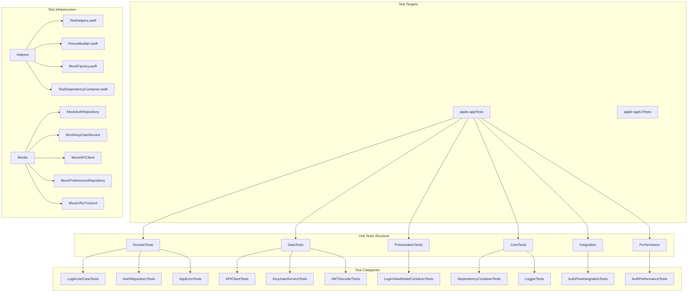

# 06 - Proceso de Testing

> Documentacion tecnica de la infraestructura de testing: estructura, mocks, fixtures y patrones.

---

## Indice

1. [Vision General](#vision-general)
2. [Diagrama de Testing](#diagrama-de-testing)
3. [Estructura de Tests](#estructura-de-tests)
4. [Archivos Involucrados](#archivos-involucrados)
5. [Mocks Disponibles](#mocks-disponibles)
6. [Fixtures y Builders](#fixtures-y-builders)
7. [Test Helpers](#test-helpers)
8. [Patrones de Testing](#patrones-de-testing)
9. [Como Correr Tests](#como-correr-tests)
10. [Coverage Actual](#coverage-actual)
11. [Como Agregar Nuevos Tests](#como-agregar-nuevos-tests)

---

## Vision General

El sistema de testing de EduGo (SPEC-007) usa:

- **Swift Testing Framework** (nuevo en Swift 5.9+)
- **@Test** y **@Suite** macros
- **#expect** para assertions
- **MockFactory** para crear fixtures
- **FixtureBuilder** pattern para datos de test

### Caracteristicas del Framework

| Caracteristica | Beneficio |
|----------------|-----------|
| @Test macro | Declarativo, facil de leer |
| @Suite para grupos | Organizacion clara |
| #expect | Mensajes de error informativos |
| async/await nativo | Testing de concurrencia |
| Parametrized tests | Multiples casos de prueba |

---

## Diagrama de Testing



---

## Estructura de Tests

```
apple-appTests/
|
+-- Core/
|   +-- EnvironmentTests.swift
|   +-- LoggingTests/
|       +-- LoggerTests.swift
|       +-- PrivacyTests.swift
|
+-- CoreTests/
|   +-- DependencyContainerTests.swift
|   +-- LocalizationManagerTests.swift
|   +-- TestDependencyContainerTests.swift
|
+-- Data/
|   +-- DTOs/
|   |   +-- LoginDTOTests.swift
|   |   +-- RefreshDTOTests.swift
|   +-- Services/
|       +-- BiometricAuthServiceTests.swift
|       +-- JWTDecoderTests.swift
|       +-- TokenRefreshCoordinatorTests.swift
|
+-- DataTests/
|   +-- APIClientTests.swift
|   +-- EndpointTests.swift
|   +-- HTTPMethodTests.swift
|   +-- KeychainServiceTests.swift
|
+-- Domain/
|   +-- ConflictResolverTests.swift
|   +-- Entities/
|   |   +-- UserRoleTests.swift
|   |   +-- UserTests.swift
|   +-- Models/
|       +-- TokenInfoTests.swift
|
+-- DomainTests/
|   +-- AppErrorTests.swift
|   +-- AuthRepositoryTests.swift
|   +-- GetCurrentUserUseCaseTests.swift
|   +-- InputValidatorTests.swift
|   +-- LoginUseCaseTests.swift
|   +-- LogoutUseCaseTests.swift
|   +-- NetworkErrorTests.swift
|   +-- PreferencesRepositoryTests.swift
|   +-- ThemeTests.swift
|   +-- UpdateThemeUseCaseTests.swift
|   +-- UserPreferencesTests.swift
|   +-- ValidationErrorTests.swift
|
+-- Helpers/
|   +-- FixtureBuilder.swift
|   +-- MockFactory.swift
|   +-- MockServices.swift
|   +-- TestDependencyContainer.swift
|   +-- TestHelpers.swift
|
+-- Integration/
|   +-- AuthFlowIntegrationTests.swift
|   +-- IntegrationTestCase.swift
|
+-- Mocks/
|   +-- MockAuthRepository.swift
|   +-- MockPreferencesRepository.swift
|   +-- MockURLProtocol.swift
|
+-- Performance/
|   +-- AuthPerformanceTests.swift
|
+-- Presentation/
|   +-- NetworkStateTests.swift
|
+-- PresentationTests/
|   +-- LoginViewModelContainerTests.swift
|
+-- apple_appTests.swift
```

---

## Archivos Involucrados

### Test Helpers

| Archivo | Ruta Completa | Responsabilidad |
|---------|---------------|-----------------|
| TestHelpers.swift | `/Users/jhoanmedina/source/EduGo/EduUI/apple-app/apple-appTests/Helpers/TestHelpers.swift` | Custom assertions y helpers |
| FixtureBuilder.swift | `/Users/jhoanmedina/source/EduGo/EduUI/apple-app/apple-appTests/Helpers/FixtureBuilder.swift` | Builder pattern para fixtures |
| MockFactory.swift | `/Users/jhoanmedina/source/EduGo/EduUI/apple-app/apple-appTests/Helpers/MockFactory.swift` | Factory centralizado de mocks |
| MockServices.swift | `/Users/jhoanmedina/source/EduGo/EduUI/apple-app/apple-appTests/Helpers/MockServices.swift` | MockKeychainService, MockAPIClient |
| TestDependencyContainer.swift | `/Users/jhoanmedina/source/EduGo/EduUI/apple-app/apple-appTests/Helpers/TestDependencyContainer.swift` | Container de DI para tests |

### Mocks

| Archivo | Ruta Completa | Responsabilidad |
|---------|---------------|-----------------|
| MockAuthRepository.swift | `/Users/jhoanmedina/source/EduGo/EduUI/apple-app/apple-appTests/Mocks/MockAuthRepository.swift` | Mock completo de AuthRepository |
| MockPreferencesRepository.swift | `/Users/jhoanmedina/source/EduGo/EduUI/apple-app/apple-appTests/Mocks/MockPreferencesRepository.swift` | Mock de PreferencesRepository |
| MockURLProtocol.swift | `/Users/jhoanmedina/source/EduGo/EduUI/apple-app/apple-appTests/Mocks/MockURLProtocol.swift` | Mock de URLSession para networking |

### Tests de Domain

| Archivo | Ruta Completa | Tests |
|---------|---------------|-------|
| LoginUseCaseTests.swift | `/Users/jhoanmedina/source/EduGo/EduUI/apple-app/apple-appTests/DomainTests/LoginUseCaseTests.swift` | Login validations, success, failure |
| LogoutUseCaseTests.swift | `/Users/jhoanmedina/source/EduGo/EduUI/apple-app/apple-appTests/DomainTests/LogoutUseCaseTests.swift` | Logout flow |
| GetCurrentUserUseCaseTests.swift | `/Users/jhoanmedina/source/EduGo/EduUI/apple-app/apple-appTests/DomainTests/GetCurrentUserUseCaseTests.swift` | Get user tests |
| AuthRepositoryTests.swift | `/Users/jhoanmedina/source/EduGo/EduUI/apple-app/apple-appTests/DomainTests/AuthRepositoryTests.swift` | Repository behavior |
| InputValidatorTests.swift | `/Users/jhoanmedina/source/EduGo/EduUI/apple-app/apple-appTests/DomainTests/InputValidatorTests.swift` | Email/password validation |

### Tests de Data

| Archivo | Ruta Completa | Tests |
|---------|---------------|-------|
| APIClientTests.swift | `/Users/jhoanmedina/source/EduGo/EduUI/apple-app/apple-appTests/DataTests/APIClientTests.swift` | HTTP client tests |
| KeychainServiceTests.swift | `/Users/jhoanmedina/source/EduGo/EduUI/apple-app/apple-appTests/DataTests/KeychainServiceTests.swift` | Keychain operations |
| JWTDecoderTests.swift | `/Users/jhoanmedina/source/EduGo/EduUI/apple-app/apple-appTests/Data/Services/JWTDecoderTests.swift` | JWT parsing tests |

### Tests de Integration

| Archivo | Ruta Completa | Tests |
|---------|---------------|-------|
| AuthFlowIntegrationTests.swift | `/Users/jhoanmedina/source/EduGo/EduUI/apple-app/apple-appTests/Integration/AuthFlowIntegrationTests.swift` | Full auth flow |
| IntegrationTestCase.swift | `/Users/jhoanmedina/source/EduGo/EduUI/apple-app/apple-appTests/Integration/IntegrationTestCase.swift` | Base class for integration |

### UI Tests

| Archivo | Ruta Completa | Tests |
|---------|---------------|-------|
| LoginUITests.swift | `/Users/jhoanmedina/source/EduGo/EduUI/apple-app/apple-appUITests/LoginUITests.swift` | Login UI automation |
| NavigationUITests.swift | `/Users/jhoanmedina/source/EduGo/EduUI/apple-app/apple-appUITests/NavigationUITests.swift` | Navigation flows |
| ThemeUITests.swift | `/Users/jhoanmedina/source/EduGo/EduUI/apple-app/apple-appUITests/ThemeUITests.swift` | Theme switching |
| OfflineUITests.swift | `/Users/jhoanmedina/source/EduGo/EduUI/apple-app/apple-appUITests/OfflineUITests.swift` | Offline behavior |
| LocalizationUITests.swift | `/Users/jhoanmedina/source/EduGo/EduUI/apple-app/apple-appUITests/LocalizationUITests.swift` | Localization verification |

---

## Mocks Disponibles

### MockAuthRepository

```swift
// MockAuthRepository.swift
@MainActor
final class MockAuthRepository: AuthRepository {
    // Resultados configurables
    var loginResult: Result<User, AppError> = .failure(.system(.unknown))
    var logoutResult: Result<Void, AppError> = .success(())
    var getCurrentUserResult: Result<User, AppError> = .failure(.business(.userNotFound))
    var refreshTokenResult: Result<AuthTokens, AppError> = .failure(.system(.unknown))
    var loginWithBiometricsResult: Result<User, AppError> = .failure(.system(.unknown))

    // Tracking de llamadas
    var loginCallCount = 0
    var logoutCallCount = 0
    var lastLoginEmail: String?
    var lastLoginPassword: String?

    func login(email: String, password: String) async -> Result<User, AppError> {
        loginCallCount += 1
        lastLoginEmail = email
        lastLoginPassword = password
        return loginResult
    }

    // Convenience setters
    func setAuthenticatedUser(_ user: User, tokens: TokenInfo? = nil) {
        loginResult = .success(user)
        getCurrentUserResult = .success(user)
        hasActiveSessionResult = true
    }

    func reset() {
        loginCallCount = 0
        logoutCallCount = 0
        lastLoginEmail = nil
        lastLoginPassword = nil
    }
}
```

### MockKeychainService

```swift
// MockServices.swift
final class MockKeychainService: KeychainService {
    var tokens: [String: String] = [:]
    var shouldThrowError = false

    func saveToken(_ token: String, for key: String) throws {
        if shouldThrowError { throw KeychainError.unableToSave }
        tokens[key] = token
    }

    func getToken(for key: String) throws -> String? {
        if shouldThrowError { throw KeychainError.unableToRetrieve }
        return tokens[key]
    }

    func deleteToken(for key: String) throws {
        if shouldThrowError { throw KeychainError.unableToDelete }
        tokens.removeValue(forKey: key)
    }
}
```

### MockAPIClient

```swift
// MockServices.swift
@MainActor
final class MockAPIClient: APIClient {
    var mockResponse: Any?
    var errorToThrow: Error?
    var executeCallCount = 0
    var lastEndpoint: Endpoint?
    var delay: TimeInterval = 0

    func execute<T: Decodable>(
        endpoint: Endpoint,
        method: HTTPMethod,
        body: (any Encodable)?
    ) async throws -> T {
        executeCallCount += 1
        lastEndpoint = endpoint

        if delay > 0 {
            try await Task.sleep(nanoseconds: UInt64(delay * 1_000_000_000))
        }

        if let error = errorToThrow { throw error }

        guard let response = mockResponse as? T else {
            throw NetworkError.decodingError
        }

        return response
    }
}
```

### MockPreferencesRepository

```swift
// MockPreferencesRepository.swift
@MainActor
final class MockPreferencesRepository: PreferencesRepository {
    var preferences: UserPreferences = .default
    var updatePreferencesCallCount = 0
    var shouldFail = false

    func getPreferences() async -> UserPreferences {
        preferences
    }

    func updatePreferences(_ newPreferences: UserPreferences) async -> Result<Void, AppError> {
        updatePreferencesCallCount += 1
        if shouldFail { return .failure(.system(.unknown)) }
        preferences = newPreferences
        return .success(())
    }
}
```

---

## Fixtures y Builders

### MockFactory

```swift
// MockFactory.swift
@MainActor
enum MockFactory {
    // Domain Entities
    static func makeUser(
        id: String = "550e8400-e29b-41d4-a716-446655440000",
        email: String = "test@edugo.com",
        displayName: String = "Test User",
        role: UserRole = .student
    ) -> User {
        User(id: id, email: email, displayName: displayName, role: role, isEmailVerified: true)
    }

    static func makeTokenInfo(
        accessToken: String = "mock_access_token",
        refreshToken: String = "mock_refresh_token",
        expiresIn: TimeInterval = 900
    ) -> TokenInfo {
        TokenInfo(accessToken: accessToken, refreshToken: refreshToken, expiresIn: Int(expiresIn))
    }

    static func makeExpiredTokenInfo() -> TokenInfo {
        TokenInfo(
            accessToken: "expired_token",
            refreshToken: "expired_refresh",
            expiresAt: Date().addingTimeInterval(-3600)
        )
    }

    // DTOs
    static func makeLoginResponse(...) -> LoginResponse { ... }
    static func makeRefreshResponse(...) -> RefreshResponse { ... }

    // JWT
    static func makeJWTPayload(...) -> JWTPayload { ... }

    // Errors
    static func makeNetworkError(_ type: NetworkErrorType) -> NetworkError { ... }
}
```

### FixtureBuilder Pattern

```swift
// FixtureBuilder.swift
@MainActor
final class UserBuilder {
    private var id = "550e8400-e29b-41d4-a716-446655440000"
    private var email = "test@edugo.com"
    private var displayName = "Test User"
    private var role: UserRole = .student

    func withID(_ id: String) -> UserBuilder {
        self.id = id
        return self
    }

    func withEmail(_ email: String) -> UserBuilder {
        self.email = email
        return self
    }

    func asTeacher() -> UserBuilder {
        self.role = .teacher
        return self
    }

    func build() -> User {
        User(id: id, email: email, displayName: displayName, role: role, isEmailVerified: true)
    }
}

// Uso
let teacher = UserBuilder()
    .withEmail("profesor@edugo.com")
    .asTeacher()
    .build()
```

### Extensiones de Fixtures

```swift
// En archivos de dominio con #if DEBUG
extension User {
    static let mock = User(
        id: "550e8400-e29b-41d4-a716-446655440000",
        email: "test@edugo.com",
        displayName: "Test User",
        role: .student,
        isEmailVerified: true
    )
}

extension TokenInfo {
    static func fixture(expiresIn: TimeInterval = 900) -> TokenInfo {
        TokenInfo(
            accessToken: "mock_access_token",
            refreshToken: "mock_refresh_token",
            expiresIn: Int(expiresIn)
        )
    }

    static var expired: TokenInfo {
        TokenInfo(
            accessToken: "expired_token",
            refreshToken: "expired_refresh",
            expiresAt: Date().addingTimeInterval(-3600)
        )
    }
}
```

---

## Test Helpers

### Custom Assertions

```swift
// TestHelpers.swift
/// Verifica que un Result sea success y retorna el valor
func expectSuccess<T, E: Error>(
    _ result: Result<T, E>,
    sourceLocation: SourceLocation = #_sourceLocation
) throws -> T {
    switch result {
    case .success(let value):
        return value
    case .failure(let error):
        Issue.record("Expected success but got failure: \(error)", sourceLocation: sourceLocation)
        throw error
    }
}

/// Verifica que un Result sea failure y retorna el error
func expectFailure<T, E: Error>(
    _ result: Result<T, E>,
    sourceLocation: SourceLocation = #_sourceLocation
) throws -> E {
    switch result {
    case .success:
        Issue.record("Expected failure but got success", sourceLocation: sourceLocation)
        throw TestError.unexpectedSuccess
    case .failure(let error):
        return error
    }
}

/// Verifica que un Result sea failure con un error especifico
func expectFailure<T>(
    _ result: Result<T, AppError>,
    expectedError: AppError,
    sourceLocation: SourceLocation = #_sourceLocation
) {
    switch result {
    case .success:
        Issue.record("Expected failure but got success", sourceLocation: sourceLocation)
    case .failure(let error):
        #expect(error == expectedError, sourceLocation: sourceLocation)
    }
}
```

### Async Helpers

```swift
// TestHelpers.swift
/// Espera hasta que una condicion sea verdadera o timeout
func waitUntil(
    timeout: TimeInterval = 5.0,
    interval: TimeInterval = 0.1,
    condition: @escaping () async -> Bool
) async throws {
    let deadline = Date().addingTimeInterval(timeout)

    while Date() < deadline {
        if await condition() { return }
        try await Task.sleep(nanoseconds: UInt64(interval * 1_000_000_000))
    }

    throw TestError.timeout
}

/// Ejecuta un bloque async y verifica que no lance errores
func expectNoThrow<T>(
    _ expression: @escaping () async throws -> T,
    sourceLocation: SourceLocation = #_sourceLocation
) async -> T? {
    do {
        return try await expression()
    } catch {
        Issue.record("Unexpected error: \(error)", sourceLocation: sourceLocation)
        return nil
    }
}
```

### Mock Validation

```swift
// TestHelpers.swift
protocol MockCallable {
    var callCount: Int { get }
}

func expectCalled(_ mock: MockCallable, sourceLocation: SourceLocation = #_sourceLocation) {
    #expect(mock.callCount > 0, "Expected mock to be called", sourceLocation: sourceLocation)
}

func expectCalled(_ mock: MockCallable, times: Int, sourceLocation: SourceLocation = #_sourceLocation) {
    #expect(mock.callCount == times, "Expected \(times) calls but got \(mock.callCount)", sourceLocation: sourceLocation)
}
```

---

## Patrones de Testing

### Patron AAA (Arrange, Act, Assert)

```swift
@Test("Login with valid credentials should succeed")
func testLoginSuccess() async throws {
    // Arrange
    let mockRepository = MockAuthRepository()
    mockRepository.loginResult = .success(User.mock)
    let sut = DefaultLoginUseCase(authRepository: mockRepository)

    // Act
    let result = await sut.execute(email: "test@test.com", password: "123456")

    // Assert
    switch result {
    case .success(let user):
        #expect(user == User.mock)
        #expect(mockRepository.loginCallCount == 1)
    case .failure:
        Issue.record("Expected success")
    }
}
```

### Testing de Errores

```swift
@Test("Login with empty email should fail")
func testLoginEmptyEmail() async throws {
    // Arrange
    let mockRepository = MockAuthRepository()
    let sut = DefaultLoginUseCase(authRepository: mockRepository)

    // Act
    let result = await sut.execute(email: "", password: "123456")

    // Assert
    #expect(result == .failure(.validation(.emptyEmail)))
    #expect(mockRepository.loginCallCount == 0)  // No llego al repositorio
}
```

### Testing Async con @MainActor

```swift
@MainActor
@Suite("LoginUseCase Tests")
struct LoginUseCaseTests {
    @Test("Login propagates repository errors")
    func testLoginPropagatesErrors() async throws {
        let mockRepository = MockAuthRepository()
        mockRepository.loginResult = .failure(.network(.noConnection))
        let sut = DefaultLoginUseCase(authRepository: mockRepository)

        let result = await sut.execute(email: "test@test.com", password: "123456")

        #expect(result == .failure(.network(.noConnection)))
    }
}
```

### Parametrized Tests

```swift
@Test("Email validation", arguments: [
    ("", false),
    ("invalid", false),
    ("test@", false),
    ("test@test.com", true),
    ("user.name+tag@example.co.uk", true)
])
func testEmailValidation(email: String, expectedValid: Bool) {
    let validator = DefaultInputValidator()
    #expect(validator.isValidEmail(email) == expectedValid)
}
```

---

## Como Correr Tests

### Desde Xcode

```bash
# Shortcut
Cmd + U          # Correr todos los tests

# Menu
Product > Test   # Correr todos los tests
```

### Desde Terminal

```bash
# Correr todos los unit tests
xcodebuild test \
    -scheme apple-app \
    -destination 'platform=iOS Simulator,name=iPhone 16 Pro' \
    -only-testing:apple-appTests

# Correr suite especifica
xcodebuild test \
    -scheme apple-app \
    -destination 'platform=iOS Simulator,name=iPhone 16 Pro' \
    -only-testing:apple-appTests/LoginUseCaseTests

# Correr test especifico
xcodebuild test \
    -scheme apple-app \
    -destination 'platform=iOS Simulator,name=iPhone 16 Pro' \
    -only-testing:apple-appTests/LoginUseCaseTests/testLoginWithValidCredentials

# Correr UI tests
xcodebuild test \
    -scheme apple-app \
    -destination 'platform=iOS Simulator,name=iPhone 16 Pro' \
    -only-testing:apple-appUITests
```

### Con Swift Package Manager (si aplica)

```bash
swift test
swift test --filter LoginUseCaseTests
```

---

## Coverage Actual

### Estimacion de Coverage por Capa

| Capa | Coverage Estimado | Archivos Testeados |
|------|-------------------|-------------------|
| Domain (Use Cases) | ~80% | LoginUseCase, LogoutUseCase, GetCurrentUserUseCase |
| Domain (Entities) | ~90% | User, Theme, UserPreferences, TokenInfo |
| Domain (Errors) | ~95% | AppError, NetworkError, ValidationError |
| Data (Repositories) | ~70% | AuthRepository |
| Data (Services) | ~75% | KeychainService, JWTDecoder |
| Data (Network) | ~60% | APIClient, Endpoint |
| Core (DI) | ~85% | DependencyContainer |
| Core (Logging) | ~80% | Logger, OSLogger |
| Presentation | ~50% | LoginViewModel |

### Archivos Sin Tests (Pendientes)

- `NetworkSyncCoordinator.swift`
- `OfflineQueue.swift` (parcial)
- `ResponseCache.swift`
- `BiometricAuthService.swift` (requiere device real)
- Varios ViewModels

---

## Como Agregar Nuevos Tests

### 1. Test para Nuevo Use Case

```swift
// apple-appTests/DomainTests/NewFeatureUseCaseTests.swift
import Testing
import Foundation
@testable import apple_app

@MainActor
@Suite("NewFeatureUseCase Tests")
struct NewFeatureUseCaseTests {
    @Test("Execute with valid input should succeed")
    func testExecuteSuccess() async throws {
        // Arrange
        let mockRepository = MockSomeRepository()
        mockRepository.someResult = .success(SomeData.mock)
        let sut = DefaultNewFeatureUseCase(repository: mockRepository)

        // Act
        let result = await sut.execute(input: "valid")

        // Assert
        let data = try expectSuccess(result)
        #expect(data == SomeData.mock)
    }

    @Test("Execute with invalid input should fail")
    func testExecuteFailure() async throws {
        // Arrange
        let sut = DefaultNewFeatureUseCase(repository: MockSomeRepository())

        // Act
        let result = await sut.execute(input: "")

        // Assert
        expectFailure(result, expectedError: .validation(.invalidInput))
    }
}
```

### 2. Nuevo Mock

```swift
// apple-appTests/Mocks/MockSomeRepository.swift
import Foundation
@testable import apple_app

@MainActor
final class MockSomeRepository: SomeRepository {
    var someResult: Result<SomeData, AppError> = .failure(.system(.unknown))
    var someCallCount = 0

    func someMethod(input: String) async -> Result<SomeData, AppError> {
        someCallCount += 1
        return someResult
    }

    func reset() {
        someResult = .failure(.system(.unknown))
        someCallCount = 0
    }
}
```

### 3. Nueva Fixture

```swift
// En MockFactory.swift
static func makeSomeData(
    id: String = "default-id",
    value: String = "default-value"
) -> SomeData {
    SomeData(id: id, value: value)
}

// O en el modelo con #if DEBUG
#if DEBUG
extension SomeData {
    static let mock = SomeData(id: "mock-id", value: "mock-value")

    static func fixture(id: String = "fixture-id") -> SomeData {
        SomeData(id: id, value: "fixture-value")
    }
}
#endif
```

### 4. Test de Integracion

```swift
// apple-appTests/Integration/NewFeatureIntegrationTests.swift
import Testing
import Foundation
@testable import apple_app

@MainActor
@Suite("NewFeature Integration Tests")
struct NewFeatureIntegrationTests {
    @Test("Full flow from UI to data layer")
    func testFullFlow() async throws {
        // Setup DI container con mocks
        let container = TestDependencyContainer()
        container.registerMocks()

        // Get use case from container
        let useCase = container.resolve(NewFeatureUseCase.self)

        // Execute full flow
        let result = await useCase.execute(input: "test")

        // Verify
        #expect(result.isSuccess)
    }
}
```

### 5. Test de Performance

```swift
// apple-appTests/Performance/NewFeaturePerformanceTests.swift
import Testing
import Foundation
@testable import apple_app

@MainActor
@Suite("NewFeature Performance Tests")
struct NewFeaturePerformanceTests {
    @Test("Execute should complete in reasonable time")
    func testPerformance() async throws {
        let sut = DefaultNewFeatureUseCase(repository: MockSomeRepository())

        let start = Date()
        for _ in 0..<100 {
            _ = await sut.execute(input: "test")
        }
        let elapsed = Date().timeIntervalSince(start)

        #expect(elapsed < 1.0, "100 executions should complete in < 1 second")
    }
}
```

---

## Best Practices

### Nomenclatura de Tests

```swift
// Formato: test[MethodName][Scenario][ExpectedBehavior]
@Test("Login with valid credentials should succeed")
func testLoginWithValidCredentialsShouldSucceed() { }

@Test("Login with empty email should fail with validation error")
func testLoginWithEmptyEmailShouldFailWithValidationError() { }
```

### Independencia de Tests

```swift
// Cada test debe ser independiente
@Suite
struct MyTests {
    // Crear mocks frescos en cada test
    @Test
    func testOne() async {
        let mock = MockSomeRepository()  // Fresh mock
        // ...
    }

    @Test
    func testTwo() async {
        let mock = MockSomeRepository()  // Fresh mock
        // ...
    }
}
```

### No Testear Implementacion Interna

```swift
// Mal: testear detalles de implementacion
#expect(viewModel.privateCache.count == 1)

// Bien: testear comportamiento publico
#expect(viewModel.state == .success(expectedData))
```

---

## Referencias

- SPEC-007: Testing Infrastructure
- Swift Testing Framework Documentation
- Apple Unit Testing Best Practices
